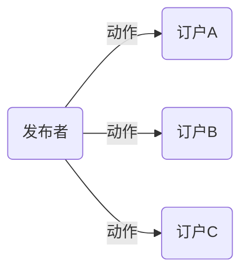

---
title: "C#中的委托与事件"
date: "2019/04/02 17:04:00"
updated: "2019/07/11 10:53:05"
permalink: "delegate-and-event-in-csharp/"
tags:
 - 委托
categories:
 - [开发, C#]
---

## 委托

### 关于委托

`delegate` 关键字创建的类型就是 `System.MuticastDelegate` (多播委托)，使用反编译工具可以查看， `System.MuticastDelegate` 是保留类不允许继承。本质上委托都是多播委托，后期定义委托只有添加了多个方法才称为多播委托。

```csharp
public delegate void NoReturnNoParametersDelegate();
```

### 常见实例化方式

```csharp
//new关键字实例化
NoReturnNoParametersDelegate delegate1 = new NoReturnNoParametersDelegate(DoNothing);
//赋值一个方法
NoReturnNoParametersDelegate delegate2 = DoNothing;
//lambda表达式
NoReturnNoParametersDelegate delegate3 = () =>Console.WriteLine("This is a do nothing method.");
```

### 常见调用方式

```csharp
delegate1.Invoke();//常规调用
delegate2();//像方法一样调用
delegate3.BeginInvoke(null, null);//异步调用
```

### 委托的意义

逻辑和行为作为参数来传递

```csharp
//公用的SQL执行方法
public T ExcuteSql<T>(string sql, Func<IDbCommand, T> func)
{
    using(SqlConnection conn = new SqlConnection(""))
	 {
	     conn.Open();
		 IDbCommand cmd = conn.CreateCommand();
		 cmd.CommandText = sql;
		 cmd.CommandType = CommandType.Text;
		 return func(cmd);
	 }
}
//执行查询
Func<IDbCommand, Student> func = (cmd) => 
{
    IDataReader reader = cmd.ExecuteReader();
	 Student student = null;
	 if(reader.Read())
	 {
	     //对student赋值
	     student = new Student();
	 }
	 return student;
};
Student student = ExcuteSql<Student>("select top 1 * from [Student]", func);
//公用异常处理方法
public static void SafeInvoke(Action act)
{
    try
	 {
	     act.Invoke();
	 }
	 catch(Exception exc)
	 {
	     Console.WriteLine(exc.Message);
	 }
}
//调用
SafeInvoke(() => ExcuteSql<Student>("select top 1 * from [Student]", func));
```

### 多播委托

- `+=` 就是在委托的实例后面增加注册更多的方法，像一个链子，执行的时候按添加顺序执行
- `-=` 就是在委托的实例后面移除注册的方法，从链子的尾部开始匹配，找到一个完全匹配的移除，没有不异常

```csharp
NoReturnNoParametersDelegate @delegate = DoNothing;
@delegate += DoNothing;
@delegate += DoNothing;
@delegate += DoNothing;
@delegate -= DoNothing;
@delegate.Invoke();
```

### 观察者模式

```csharp
//观察者模式的标准做法就是将内容抽象 实现抽象接口方法DoAction() 添加到集合后遍历执行DoAction()方法
Action miaoAction = () => Console.WriteLine("Cat miao!");//多播委托做法
miaoAction += () => Console.WriteLine("Mourse run!");
miaoAction += () => Console.WriteLine("Dog wang!");
miaoAction += () => Console.WriteLine("Baby cry!");
miaoAction += () => Console.WriteLine("Brother turn!");
miaoAction += () => Console.WriteLine("Mother whisper!");
miaoAction += () => Console.WriteLine("Father roar!");
miaoAction += () => Console.WriteLine("Neighbor awake!");
miaoAction += () => Console.WriteLine("Thief hide!");
```

## 事件

### 事件定义

委托的实例，加一个 `event` 关键字（一组方法）

### 使用示例

```csharp
//定义一个事件
public class EventTestClass
{
    //事件的发布者
    public event Action TestEvent;
    public void TestEventMethod()
    {
        Console.WriteLine("TestEventMethod invoke.");
        TestEvent?.Invoke();//非空才执行
        //if (TestEvent!=null)
        //{
        //    TestEvent.Invoke();
        //}
    }
}

//事件注册
EventTestClass eventTest = new EventTestClass();
eventTest.TestEvent += () => Console.WriteLine("Cat miao!");//绑定方法 订户的订阅动作
eventTest.TestEvent += () => Console.WriteLine("Mourse run!");
eventTest.TestEvent += () => Console.WriteLine("Dog wang!");
eventTest.TestEvent += () => Console.WriteLine("Baby cry!");
eventTest.TestEvent += () => Console.WriteLine("Brother turn!");
eventTest.TestEvent += () => Console.WriteLine("Mother whisper!");
eventTest.TestEvent += () => Console.WriteLine("Father roar!");
eventTest.TestEvent += () => Console.WriteLine("Neighbor awake!");
eventTest.TestEvent += () => Console.WriteLine("Thief hide!");

//事件“EventTestClass.TestEvent”只能出现在 += 或 -= 的左边(从类型“EventTestClass”中使用时除外)
//eventTest.TestEvent = null;
//eventTest.TestEvent?.Invoke();

eventTest.TestEventMethod();
```

### 事件与委托的关系

委托是一种类型，事件是委托的一个实例。  

`event` 关键字限制了权限，保证安全。  

事件只能由发布者调用，外部不能调用也不能赋值，但是可以使用 `+=` 和 `-=` 向事件注册方法。  

这个流程可以理解为解耦


