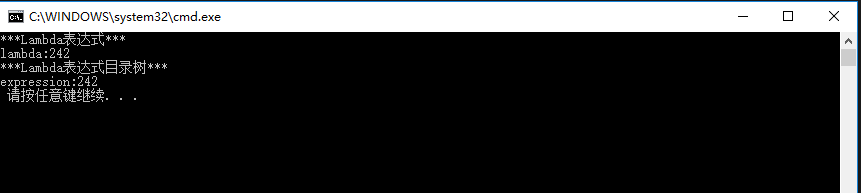
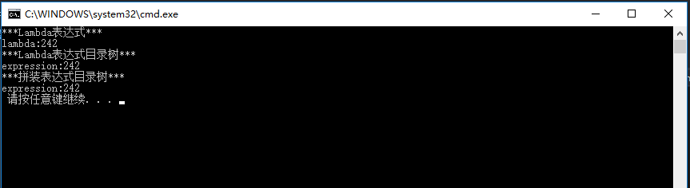
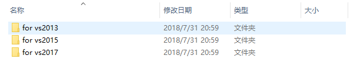
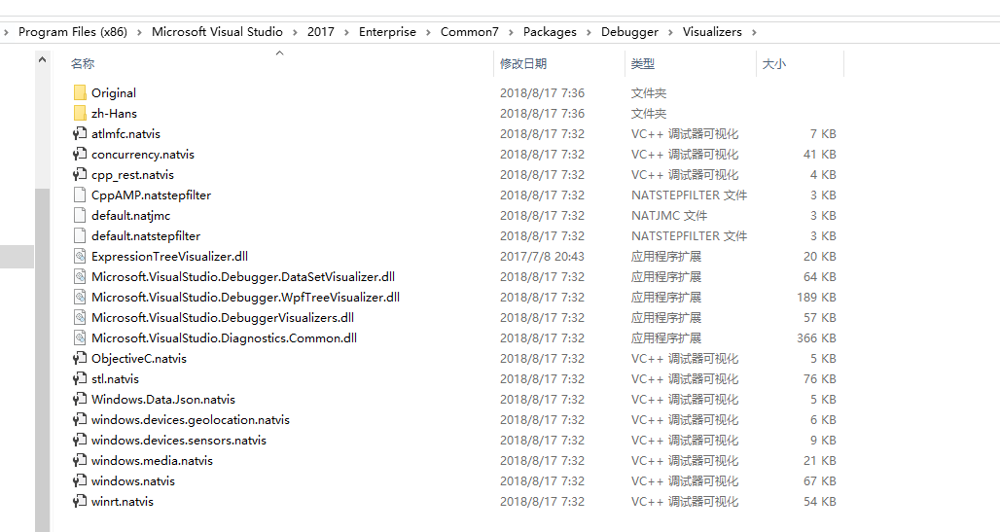
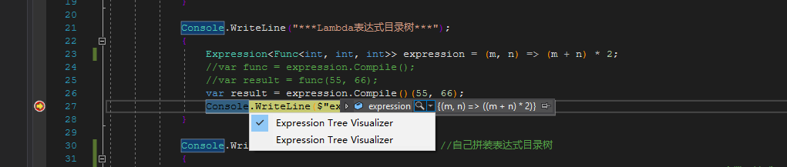
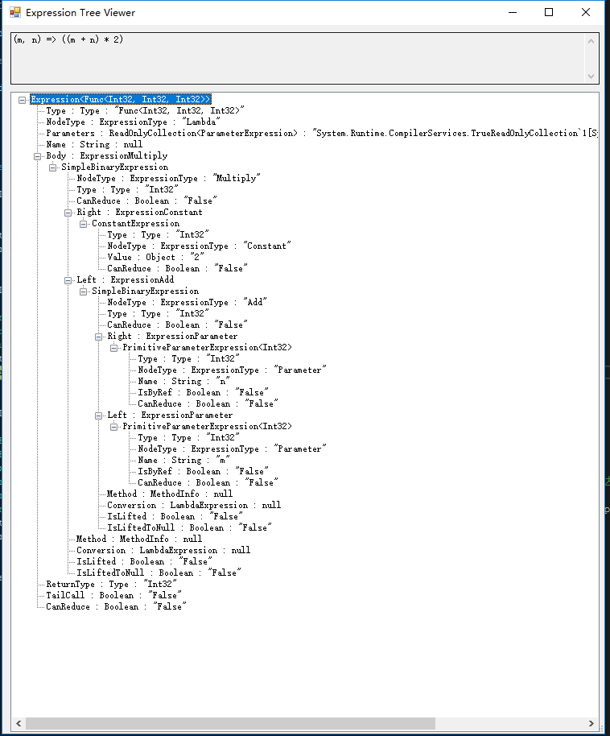
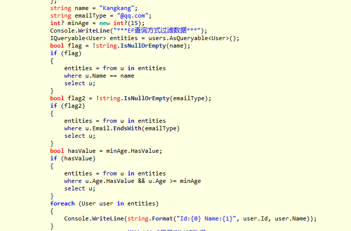
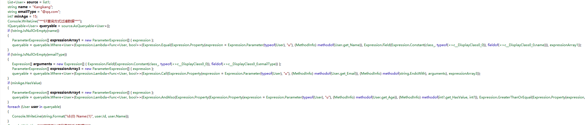
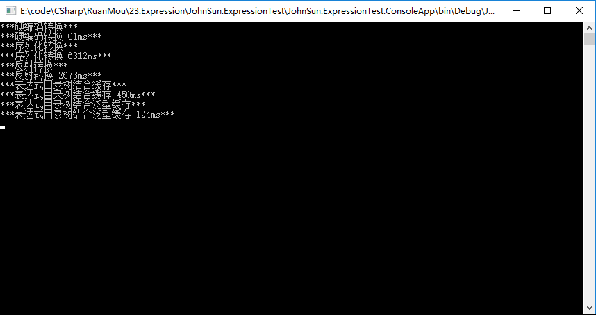

---
title: "Expression 表达式目录树"
date: "2019/05/31 16:44:31"
updated: "2020/02/11 20:17:33"
permalink: "expression-catalog-tree/"
tags:
 - Expression
categories:
 - [开发, C#]
---

## 简述表达式目录树

### 简单的表达式树实现以及声明方式

下面的代码分别是 Lambda 表达式与表达式目录树的 Lambda 表达方式：

```csharp
Console.WriteLine("***Lambda表达式***");
{
    Func<int, int, int> func = (m, n) => (m + n) * 2;
    var result = func(55, 66);
    Console.WriteLine($"lambda:{result}");
}

Console.WriteLine("***Lambda表达式目录树***");
{
    Expression<Func<int, int, int>> expression = (m, n) => (m + n) * 2;
    // var func = expression.Compile();
    // var result = func(55, 66);
    var result = expression.Compile()(55, 66);
    Console.WriteLine($"expression:{result}");
}
```

执行结果：  



同样我们也可以拼装一个表达式目录树：

```csharp
Console.WriteLine("***拼装表达式目录树***"); // 自己拼装表达式目录树
{
    ParameterExpression parameterExpression1 = Expression.Parameter(typeof(int), "m");// 参数表达式
    ParameterExpression parameterExpression2 = Expression.Parameter(typeof(int), "n");
    ConstantExpression constantExpression = Expression.Constant(2);// 常量表达式
    BinaryExpression binaryExpression1 = Expression.Add(parameterExpression1, parameterExpression2);// 二元表达式
    BinaryExpression binaryExpression2 = Expression.Multiply(binaryExpression1, constantExpression);
    Expression<Func<int, int, int>> expression = Expression.Lambda<Func<int, int, int>>(binaryExpression2, parameterExpression1, parameterExpression2);// 将表达式翻译生 lambda 表达式 并将参数表达式传入
    var result = expression.Compile()(55, 66);
    Console.WriteLine($"expression:{result}");
}
```

执行结果：  



### 使用工具查看表达式目录树结构

首先安装 ExpressionTreeVisualizer 工具，将不同版本的 `ExpressionTreeVisualizer.dll` 文件放置到对应版本的 VS 调试工具目录下，比如 Visual Studio 2017 需要放置到：`C:\Program Files (x86)\Microsoft Visual Studio\2017\Enterprise\Common7\Packages\Debugger\Visualizers`目录下。




  
文件拷贝到指定目录后，需要重启 Visual Studio，重启后调试程序，表达式目录树的监视工具会有一个 Expression Tree Visualizer 的选项。



选择该工具进行查看，可以看到表达式目录树的结构。



我们通过该工具的目录树结构，对 Lambda 表达式目录树进行分拆。

### 表达式目录树过滤对象

实体 User 类：

```csharp
using System;

namespace JohnSun.ExpressionTest.ConsoleApp
{
    public class User
    {
        public int Id { get; set; }
        public string Name { get; set; }
        public string Email { get; set; }
        public int? Age { get; set; }
        public DateTime? CreateDate { get; set; }
    }
}
```

使用 EF 查询：

```csharp
List<User> users = new List<User>()
{
    new User() { Id = 1, Name = "Kangkang", Email = "kangkang@qq.com", Age = 17 },
    new User() { Id = 2, Name = "Jane", Email = "jane@yahoo.com", Age = 16 },
    new User() { Id = 3, Name = "Mike", Email = "mike@google.com", Age = 17 },
    new User() { Id = 4, Name = "John", Email = "john@outlook.com", Age = 19 },
    new User() { Id = 5, Name = "Lili", Email = "lili@163.com", Age = 18 },
};
string name = "Kangkang";
string emailType = "@qq.com";
int? minAge = 15;
Console.WriteLine("***EF查询方式过滤数据***");
{
    var entities = users.AsQueryable();
    if (!string.IsNullOrEmpty(name))
    {
        entities = entities.Where(u => u.Name == name);
    }
    if (!string.IsNullOrEmpty(emailType))
    {
        entities = entities.Where(u => u.Email.EndsWith(emailType));
    }
    if (minAge.HasValue)
    {
        entities = entities.Where(u => u.Age.HasValue && u.Age >= minAge);
    }
    foreach (var user in entities)
    {
        Console.WriteLine($"Id:{user.Id} Name:{user.Name}");
    }
}
```

拼装表达式目录树：

```csharp
Console.WriteLine("***拼接表达式目录树过滤数据***");
{
    ParameterExpression parameterExpression = Expression.Parameter(typeof(User), "u");
    Expression<Func<User, bool>> expression = Expression.Lambda<Func<User, bool>>(Expression.Constant(true), parameterExpression);
    if (!string.IsNullOrEmpty(name))
    {
        MemberExpression memberExpression = Expression.Property(parameterExpression, typeof(User).GetProperty("Name"));
        ConstantExpression constantExpression = Expression.Constant(name);

        // 使用 Equal 方法
        BinaryExpression binaryExpression = Expression.Equal(memberExpression, constantExpression);
        Expression<Func<User, bool>> expressionName = Expression.Lambda<Func<User, bool>>(binaryExpression, parameterExpression);
        // // 使用 Call 方法            
        // MethodInfo methodInfo = typeof(string).GetMethod("Equals", new Type[] { typeof(string) });
        // MethodCallExpression methodCallExpression = Expression.Call(memberExpression, methodInfo, constantExpression);
        // Expression<Func<User, bool>> expressionName = Expression.Lambda<Func<User, bool>>(methodCallExpression, parameterExpression);

        // 合并表达式目录树
        expression = expression.And(expressionName);
    }
    if (!string.IsNullOrEmpty(emailType))
    {
        MemberExpression memberExpression = Expression.Property(parameterExpression, typeof(User).GetProperty("Email"));
        ConstantExpression constantExpression = Expression.Constant(emailType);
        // 使用 Call 方法
        MethodInfo methodInfo = typeof(string).GetMethod("EndsWith", new Type[] { typeof(string) });
        MethodCallExpression methodCallExpression = Expression.Call(memberExpression, methodInfo, constantExpression);
        Expression<Func<User, bool>> expressionEmailType = Expression.Lambda<Func<User, bool>>(methodCallExpression, parameterExpression);

        // 合并表达式目录树
        expression = expression.And(expressionEmailType);
    }
    if (minAge.HasValue)
    {
        Expression<Func<User, bool>> expressionAge = Expression.Lambda<Func<User, bool>>(Expression.Property(Expression.Property(Expression.Parameter(typeof(User), "u"), typeof(User).GetProperty("Age")), typeof(int?).GetProperty("HasValue")), Expression.Parameter(typeof(User), "u"));
        // 合并表达式目录树
        expression = expression.And(expressionAge);

        BinaryExpression binaryExpression = Expression.GreaterThanOrEqual(Expression.Property(Expression.Property(Expression.Parameter(typeof(User), "u"), typeof(User).GetProperty("Age")), typeof(int?).GetProperty("Value")), Expression.Constant(minAge, typeof(int)));
        expressionAge = Expression.Lambda<Func<User, bool>>(binaryExpression, parameterExpression);
        // 合并表达式目录树
        expression = expression.And(expressionAge);
    }

    foreach (var user in users.AsQueryable().Where(expression))
    {
        Console.WriteLine($"Id:{user.Id} Name:{user.Name}");
    }
}
```

上面拼装涉及到的合并表达式目录树：

```csharp
using System.Linq.Expressions;

namespace JohnSun.ExpressionTest.ConsoleApp
{
    /// <summary>
    /// 遍历表达式类型 当遇到参数类型表达式时 替换为我们自己定义的参数
    /// </summary>
    public class ExpressionVisitorExtend : ExpressionVisitor
    {
        public ParameterExpression Parameter { get; private set; }
        public ExpressionVisitorExtend(ParameterExpression param)
        {
            this.Parameter = param;
        }
        public Expression Replace(Expression exp)
        {
            return this.Visit(exp);
        }
        protected override Expression VisitParameter(ParameterExpression node)
        {
            return this.Parameter;
        }
    }
}
```

```csharp
using System;
using System.Linq.Expressions;

namespace JohnSun.ExpressionTest.ConsoleApp
{
    public static class ExpressionExtend
    {
        public static Expression<Func<T, bool>> And<T>(this Expression<Func<T, bool>> expr1, Expression<Func<T, bool>> expr2)
        {
            if (expr1 == null)
                return expr2;
            else if (expr2 == null)
                return expr1;
            ParameterExpression parameterExpression = Expression.Parameter(typeof(T), "t");
            ExpressionVisitorExtend visitor = new ExpressionVisitorExtend(parameterExpression);

            var left = visitor.Replace(expr1.Body);
            var right = visitor.Replace(expr2.Body);
            var body = Expression.And(left, right);
            return Expression.Lambda<Func<T, bool>>(body, parameterExpression);
        }
        public static Expression<Func<T, bool>> Or<T>(this Expression<Func<T, bool>> expr1, Expression<Func<T, bool>> expr2)
        {
            if (expr1 == null)
                return expr2;
            else if (expr2 == null)
                return expr1;

            ParameterExpression parameterExpression = Expression.Parameter(typeof(T), "t");
            ExpressionVisitorExtend visitor = new ExpressionVisitorExtend(parameterExpression);

            var left = visitor.Replace(expr1.Body);
            var right = visitor.Replace(expr2.Body);
            var body = Expression.Or(left, right);
            return Expression.Lambda<Func<T, bool>>(body, parameterExpression);
        }
        public static Expression<Func<T, bool>> Not<T>(this Expression<Func<T, bool>> expr)
        {
            if (expr == null)
                return null;

            var candidateExpr = expr.Parameters[0];
            var body = Expression.Not(expr.Body);

            return Expression.Lambda<Func<T, bool>>(body, candidateExpr);
        }
    }
}
```

**注意：** EF 中使用 Lambda 表达式目录树其实是语法糖，通过 ILSpy 或者 Reflactor 等反编译工具我们可以看到实际的代码，比如：

```csharp
entities = entities.Where(u => u.Age.HasValue && u.Age >= minAge);
```

反编译后内容是：

```csharp
ParameterExpression[] expressionArray4 = new ParameterExpression[] { expression };
queryable = queryable.Where<User>(Expression.Lambda<Func<User, bool>>(Expression.AndAlso(Expression.Property(Expression.Property(expression = Expression.Parameter(typeof(User), "u"), (MethodInfo) methodof(User.get_Age)), (MethodInfo) methodof(int?.get_HasValue, int?)), Expression.GreaterThanOrEqual(Expression.Property(expression, (MethodInfo) methodof(User.get_Age)), Expression.Field(Expression.Constant(class_, typeof(<>c__DisplayClass0_0)), fieldof(<>c__DisplayClass0_0.minAge)))), expressionArray4));
```

当然上面代码中有些变量被反编译到其他位置，这里不再一一写出，而且这些内容在 VS 并不能被编译通过，所以如果想通过反编译工具将 Lambda 表达式目录树反拆出拼装的语句，需要再“翻译”一下。

另外这些语法糖并不是所有的反编译工具都能识别到，比如我在一个版本的 ILSpay 中打开这个项目的代码，还是语法糖的形式，但是在 `.NET Reflector` 中就可以查看到反编译后的内容。

ILSpy 中查看到的反编译内容：



`.NET Reflector` 中查看的反编译内容：



更多内容可以查看文章：[http://www.cnblogs.com/jesse2013/p/expressiontree-part1.html](http://www.cnblogs.com/jesse2013/p/expressiontree-part1.html)

## 类型转换

### 需求描述

日常工作中经常会有需求，将一个类型的属性和字段值赋值给另外一个类型，两个类型的结构基本一致。例如：

*User.cs*

```csharp
public class User
{
    public int Id { get; set; }
    public string Name { get; set; }
    public string Email { get; set; }
    public int? Age { get; set; }
    public DateTime? CreateDate { get; set; }
}
```

*UserCopy.cs*

```csharp
public class UserCopy
{
    public int Id { get; set; }
    public string UserName { get; set; }
    public string Email { get; set; }
}
```

### 实现方案

**硬编码**

简单粗暴的方式：

```csharp
using System;
using System.Collections.Generic;
using System.Linq;
using System.Text;

namespace JohnSun.ExpressionTest.ConsoleApp
{
    public class ObjectMapper
    {
        /// <summary>
        /// 硬编码的类型转换方案
        /// </summary>
        /// <param name="user"></param>
        /// <returns></returns>
        public static UserCopy TransUserCopy(User user)
        {
            return new UserCopy()
            {
                Id = user.Id,
                Name = user.Name,
                Email = user.Email
            };
        }
    }
}
```

调用：

```csharp
User user = new User() { Id = 1, Name = "Kangkang", Email = "kangkang@qq.com", Age = 17, CreateDate = new DateTime(2015, 1, 1) };
Console.WriteLine("***硬编码做法***");
{
    // 效率最高但是最不灵活 比如其他类型的转换需要新建方法 属性值变化或者属性值较多比较麻烦
    UserCopy copy = ObjectMapper.TransUserCopy(user);
    Console.WriteLine($"Id:{copy.Id} Name:{copy.Name} Email:{copy.Email}");
}
```

**序列化**

需要引用 `Newtonsoft.Json`：

```csharp
using Newtonsoft.Json;

namespace JohnSun.ExpressionTest.ConsoleApp
{
    public class SerializeMapper
    {
        /// <summary>
        /// 序列化方式实现类型转换
        /// </summary>
        /// <typeparam name="TIn"></typeparam>
        /// <typeparam name="TOut"></typeparam>
        /// <param name="tIn"></param>
        /// <returns></returns>
        public static TOut Trans<TIn, TOut>(TIn tIn)
        {
            return JsonConvert.DeserializeObject<TOut>(JsonConvert.SerializeObject(tIn));
        }
    }
}
```

调用：

```csharp
User user = new User() { Id = 1, Name = "Kangkang", Email = "kangkang@qq.com", Age = 17, CreateDate = new DateTime(2015, 1, 1) };
Console.WriteLine("***序列化转换***");
{
    UserCopy copy = SerializeMapper.Trans<User, UserCopy>(user);
    Console.WriteLine($"Id:{copy.Id} Name:{copy.Name} Email:{copy.Email}");
}
```

**反射**

反射是常用做法：

```csharp
using System;
using System.Collections.Generic;
using System.Linq;
using System.Reflection;

namespace JohnSun.ExpressionTest.ConsoleApp
{
    public class ReflectionMapper
    {
        /// <summary>
        /// 反射方式实现类型转换
        /// </summary>
        /// <typeparam name="TIn"></typeparam>
        /// <typeparam name="TOut"></typeparam>
        /// <param name="tIn"></param>
        /// <returns></returns>
        public static TOut Trans<TIn, TOut>(TIn tIn)
        {
            List<FieldInfo> tInFields = typeof(TIn).GetFields().ToList();
            List<PropertyInfo> tInProps = typeof(TIn).GetProperties().ToList();
            List<FieldInfo> tOutFields = typeof(TOut).GetFields().ToList();
            List<PropertyInfo> tOutProps = typeof(TOut).GetProperties().ToList();
            TOut tOut = Activator.CreateInstance<TOut>();
            
            foreach (var field in tOutFields)
            {
                var tempField = tInFields.Find(f => f.Name == field.Name && f.FieldType == field.FieldType);
                if (tempField != null)
                {
                    field.SetValue(tOut, tempField.GetValue(tIn));
                }
            }
            
            foreach (var prop in tOutProps)
            {
                var tempProp = tInProps.Find(p => p.Name == prop.Name && p.PropertyType == prop.PropertyType);
                if (tempProp != null)
                {
                    prop.SetValue(tOut, tempProp.GetValue(tIn, null), null);
                }
            }

            return tOut;
        }
    }
}
```

调用：

```csharp
User user = new User() { Id = 1, Name = "Kangkang", Email = "kangkang@qq.com", Age = 17, CreateDate = new DateTime(2015, 1, 1) };
Console.WriteLine("***反射转换***");
{
    UserCopy copy = ReflectionMapper.Trans<User, UserCopy>(user);
    Console.WriteLine($"Id:{copy.Id} Name:{copy.Name} Email:{copy.Email}");
}
```

**表达式目录树**

首先需要理解一下表达式目录树如何实现转换：

```csharp
User user = new User() { Id = 1, Name = "Kangkang", Email = "kangkang@qq.com", Age = 17, CreateDate = new DateTime(2015, 1, 1) };
Console.WriteLine("***Lambda表达式目录树模仿硬编码***");
{
    Expression<Func<User, UserCopy>> expression = u => new UserCopy() { Id = u.Id, Name = u.Name, Email = u.Email };
    UserCopy copy = expression.Compile()(user);
    Console.WriteLine($"Id:{copy.Id} Name:{copy.Name} Email:{copy.Email}");
}
```

将 Lambda 表达式目录树进行拆解，观察是否有规律可循：

```csharp
Console.WriteLine("***拼装表达式目录树模仿硬编码***");
{
    // 可以通过反编译工具模仿 Lambda 表达式目录树
    ParameterExpression parameterExpression = Expression.Parameter(typeof(User), "u");
    MemberBinding[] bindings = new MemberBinding[] { Expression.Bind(typeof(UserCopy).GetProperty("Id"), Expression.Property(parameterExpression, typeof(User).GetProperty("Id"))), Expression.Bind(typeof(UserCopy).GetProperty("Name"), Expression.Property(parameterExpression, typeof(User).GetProperty("Name"))), Expression.Bind(typeof(UserCopy).GetProperty("Email"), Expression.Property(parameterExpression, typeof(User).GetProperty("Email"))) };
    Expression<Func<User, UserCopy>> expression = Expression.Lambda<Func<User, UserCopy>>(Expression.MemberInit(Expression.New(typeof(UserCopy)), bindings), parameterExpression);
    UserCopy copy = expression.Compile()(user);
    Console.WriteLine($"Id:{copy.Id} Name:{copy.Name} Email:{copy.Email}");
}
```

结合反射组装表达式目录树：

```csharp
Console.WriteLine("***通过反射拼接表达式目录树***");
{
    ParameterExpression parameterExpression = Expression.Parameter(typeof(User), "u");
    List<MemberBinding> bindings = new List<MemberBinding>();

    List<FieldInfo> tUserFields = typeof(User).GetFields().ToList();
    List<PropertyInfo> tUserProps = typeof(User).GetProperties().ToList();
    List<FieldInfo> tCopyFields = typeof(UserCopy).GetFields().ToList();
    List<PropertyInfo> tCopyProps = typeof(UserCopy).GetProperties().ToList();
    foreach (var field in tCopyFields)
    {
        var tempField = tUserFields.Find(f => f.Name == field.Name && f.FieldType == field.FieldType);
        if (tempField != null)
        {
            bindings.Add(Expression.Bind(field, Expression.Field(parameterExpression, tempField)));
        }
    }
    foreach (var prop in tCopyProps)
    {
        var tempProp = tUserProps.Find(p => p.Name == prop.Name && p.PropertyType == prop.PropertyType);
        if (tempProp != null)
        {
            bindings.Add(Expression.Bind(prop, Expression.Property(parameterExpression, tempProp)));
        }
    }

    Expression<Func<User, UserCopy>> expression = Expression.Lambda<Func<User, UserCopy>>(Expression.MemberInit(Expression.New(typeof(UserCopy)), bindings), parameterExpression);
    UserCopy copy = expression.Compile()(user);
    Console.WriteLine($"Id:{copy.Id} Name:{copy.Name} Email:{copy.Email}");
}
```

表达式目录树编译后的委托类型可以缓存，提高程序效率：

```csharp
using System;
using System.Collections.Generic;
using System.Linq;
using System.Linq.Expressions;
using System.Reflection;

namespace JohnSun.ExpressionTest.ConsoleApp
{
    public class ExpressionMapper
    {
        private static Dictionary<string, Delegate> _Dic = new Dictionary<string, Delegate>();
        public static TOut Trans<TIn, TOut>(TIn tIn)
        {
            string funcKey = $"{typeof(TIn).GetType().FullName}${typeof(TOut).FullName}";
            if (!_Dic.ContainsKey(funcKey))
            {
                ParameterExpression parameterExpression = Expression.Parameter(typeof(TIn), "t");
                List<MemberBinding> bindings = new List<MemberBinding>();

                List<FieldInfo> tUserFields = typeof(TIn).GetFields().ToList();
                List<PropertyInfo> tUserProps = typeof(TIn).GetProperties().ToList();
                List<FieldInfo> tCopyFields = typeof(TOut).GetFields().ToList();
                List<PropertyInfo> tCopyProps = typeof(TOut).GetProperties().ToList();
                foreach (var field in tCopyFields)
                {
                    var tempField = tUserFields.Find(f => f.Name == field.Name && f.FieldType == field.FieldType);
                    if (tempField != null)
                    {
                        bindings.Add(Expression.Bind(field, Expression.Field(parameterExpression, tempField)));
                    }
                }
                foreach (var prop in tCopyProps)
                {
                    var tempProp = tUserProps.Find(p => p.Name == prop.Name && p.PropertyType == prop.PropertyType);
                    if (tempProp != null)
                    {
                        bindings.Add(Expression.Bind(prop, Expression.Property(parameterExpression, tempProp)));
                    }
                }

                Expression<Func<TIn, TOut>> expression = Expression.Lambda<Func<TIn, TOut>>(Expression.MemberInit(Expression.New(typeof(TOut)), bindings), parameterExpression);
                _Dic[funcKey] = expression.Compile();
            }

            return ((Func<TIn, TOut>)_Dic[funcKey]).Invoke(tIn);
        }
    }
}
```

结合泛型部分学习到的泛型缓存知识，使用泛型作为缓存载体取代字典：

```csharp
using System;
using System.Collections.Generic;
using System.Linq;
using System.Linq.Expressions;
using System.Reflection;

namespace JohnSun.ExpressionTest.ConsoleApp
{
    public class ExpressionGenericMapper<TIn, TOut>
    {
        private static Func<TIn, TOut> _Func = null;
        static ExpressionGenericMapper()
        {
            ParameterExpression parameterExpression = Expression.Parameter(typeof(TIn), "t");
            List<MemberBinding> bindings = new List<MemberBinding>();

            List<FieldInfo> tUserFields = typeof(TIn).GetFields().ToList();
            List<PropertyInfo> tUserProps = typeof(TIn).GetProperties().ToList();
            List<FieldInfo> tCopyFields = typeof(TOut).GetFields().ToList();
            List<PropertyInfo> tCopyProps = typeof(TOut).GetProperties().ToList();
            foreach (var field in tCopyFields)
            {
                var tempField = tUserFields.Find(f => f.Name == field.Name && f.FieldType == field.FieldType);
                if (tempField != null)
                {
                    bindings.Add(Expression.Bind(field, Expression.Field(parameterExpression, tempField)));
                }
            }
            foreach (var prop in tCopyProps)
            {
                var tempProp = tUserProps.Find(p => p.Name == prop.Name && p.PropertyType == prop.PropertyType);
                if (tempProp != null)
                {
                    bindings.Add(Expression.Bind(prop, Expression.Property(parameterExpression, tempProp)));
                }
            }

            Expression<Func<TIn, TOut>> expression = Expression.Lambda<Func<TIn, TOut>>(Expression.MemberInit(Expression.New(typeof(TOut)), bindings), parameterExpression);
            _Func = expression.Compile();
        }

        public static TOut Trans(TIn tIn)
        {
            return _Func.Invoke(tIn);
        }
    }
}
```

调用：

```csharp
Console.WriteLine("***通过反射拼接表达式目录树(缓存扩展)***");
{
    // 第一次调用生成对应类型转换的委托后面再调用直接使用委托转换 提高转换效率
    UserCopy copy = ExpressionMapper.Trans<User, UserCopy>(user);
    copy = ExpressionMapper.Trans<User, UserCopy>(user);
    Console.WriteLine($"Id:{copy.Id} Name:{copy.Name} Email:{copy.Email}");
}
Console.WriteLine("***通过反射拼接表达式目录树(泛型缓存扩展)***");
{
    // 泛型类由于类型不同 会生成一个全新的副本 实现缓存的效果
    UserCopy copy = ExpressionGenericMapper<User, UserCopy>.Trans(user);
    copy = ExpressionGenericMapper<User,UserCopy>.Trans(user);
    Console.WriteLine($"Id:{copy.Id} Name:{copy.Name} Email:{copy.Email}");
}
```

### 测试不同方法进行类型转换的效率

测试部分代码：

```csharp
long time = 0;
User user = new User() { Id = 1, Name = "Kangkang", Email = "kangkang@qq.com", Age = 17, CreateDate = new DateTime(2015, 1, 1) };
Console.WriteLine("***硬编码转换***");
{
    Stopwatch watch = new Stopwatch();
    int sum = 0;
    watch.Start();
    for (int i = 0; i < 1000000; i++)
    {
        UserCopy copy = ObjectMapper.TransUserCopy(user);
        sum += copy.Id;
    }
    watch.Stop();
    time = watch.ElapsedMilliseconds;
}
Console.WriteLine($"***硬编码转换 {time}ms***");
Console.WriteLine("***序列化转换***");
{
    Stopwatch watch = new Stopwatch();
    int sum = 0;
    watch.Start();
    for (int i = 0; i < 1000000; i++)
    {
        UserCopy copy = SerializeMapper.Trans<User, UserCopy>(user);
        sum += copy.Id;
    }
    watch.Stop();
    time = watch.ElapsedMilliseconds;
}
Console.WriteLine($"***序列化转换 {time}ms***");
Console.WriteLine("***反射转换***");
{
    Stopwatch watch = new Stopwatch();
    int sum = 0;
    watch.Start();
    for (int i = 0; i < 1000000; i++)
    {
        UserCopy copy = ReflectionMapper.Trans<User, UserCopy>(user);
        sum += copy.Id;
    }
    watch.Stop();
    time = watch.ElapsedMilliseconds;
}
Console.WriteLine($"***反射转换 {time}ms***");
Console.WriteLine("***表达式目录树结合缓存***");
{
    Stopwatch watch = new Stopwatch();
    int sum = 0;
    watch.Start();
    for (int i = 0; i < 1000000; i++)
    {
        UserCopy copy = ExpressionMapper.Trans<User, UserCopy>(user);
        sum += copy.Id;
    }
    watch.Stop();
    time = watch.ElapsedMilliseconds;
}
Console.WriteLine($"***表达式目录树结合缓存 {time}ms***");
Console.WriteLine("***表达式目录树结合泛型缓存***");
{
    Stopwatch watch = new Stopwatch();
    int sum = 0;
    watch.Start();
    for (int i = 0; i < 1000000; i++)
    {
        UserCopy copy = ExpressionGenericMapper<User,UserCopy>.Trans(user);
        sum += copy.Id;
    }
    watch.Stop();
    time = watch.ElapsedMilliseconds;
}
Console.WriteLine($"***表达式目录树结合泛型缓存 {time}ms***");
```

执行结果：



结合结果，明显可取的方案为表达式目录树结合泛型缓存进行转换，其耗时与硬编码最接近。
