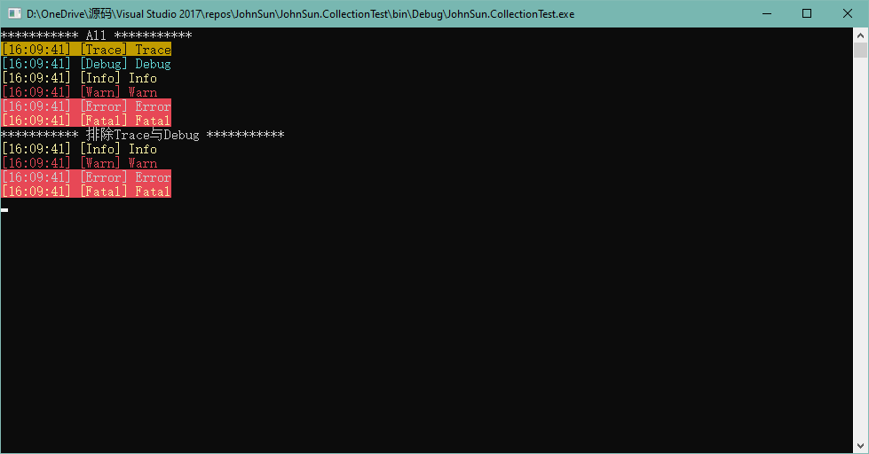

---
title: "C# 中的枚举类型与标志枚举的使用"
date: "2019/07/17 08:41:35"
updated: "2020/02/11 14:04:09"
permalink: "enum-and-flags-enum-in-csharp/"
tags:
 - 枚举
categories:
 - [开发, C#]
---

枚举类型（也称为枚举）提供了一种有效的方式来定义可能分配给变量的一组已命名整数常量。

例如，假设你需要定义一个变量，其值表示一周内的某一天。 该变量只会存储七个有意义的值。 

若要定义这些值，可以使用枚举类型，该类型是使用 `enum` 关键字声明的。

```csharp
enum Day { Sunday, Monday, Tuesday, Wednesday, Thursday, Friday, Saturday };
enum Month : byte { Jan, Feb, Mar, Apr, May, Jun, Jul, Aug, Sep, Oct, Nov, Dec }; 
```

## 枚举类型的转换

默认情况下枚举的基类为 `int`，可以使用冒号指定其基类为其他整数类型。

如上例中，如果我们需要转换为基类型，可以直接进行强制转换：

```csharp
Day today = Day.Monday;
int dayNumber = (int)today;
Console.WriteLine("{0} is day number #{1}.", today, dayNumber);

Month thisMonth = Month.Dec;
byte monthNumber = (byte)thisMonth;
Console.WriteLine("{0} is month number #{1}.", thisMonth, monthNumber);

// Output:
// Monday is day number #1.
// Dec is month number #11.
```

而假如我们想指定其基类型为一个非整数类型，例如 `string` 类型，编译器会提示以下错误：

```html
CS1008	应输入类型 byte、sbyte、short、ushort、int、uint、long 或 ulong
```

除可以将枚举类型转换为基类型以外，我们可以将基类型的数值直接赋值给枚举类型的值，或者直接将枚举的值与基类的值做比较等。

```csharp
Day restDay = 0;
bool isRestDay = Day.Sunday == 0;
```

另外，我们还可以将枚举值转换为有语义的内容，或者将语义内容的结果转换为枚举类型，例如枚举值 `Day.Sunday` 与字符串 `Sunday` 的相互转换：

```csharp
// Rest days for 996 employees
Day restDay = Day.Sunday;

Console.WriteLine($"The rest day for 996 employees is {restDay.ToString()}.");
Console.WriteLine($"996 employees can only rest on {restDay} is {(Day)Enum.Parse(typeof(Day), "Sunday") == restDay}.");

// Output:
// The rest day for 996 employees is Sunday.
// 996 employees can only rest on Sunday is True.
```

需要注意的是，进行类型转换时，不能像 `int` 等类型使用关键字调用，只能用 `Enum` 来调用。另外建议如果不能确定是否能转换成功时，还是使用 `TryParse` 方法比较好，而且该方法是一个泛型的方法，可以直接指定返回的枚举类型。

```csharp
// The working day of 997 employees is every day.
string workDay = "Everyday";
Console.WriteLine($"997 employees can rest is {Enum.TryParse<Day>(workDay, out _)}.");

// Output:
// 997 employees can rest is False.
```

> 默认情况下枚举是从 `0` 开始，我们也可以指定任意一个位置的实际指向的基类型的数值是多少，例如：
> ```csharp
> enum Month : byte { Jan = 1, Feb, Mar, Apr, May, Jun, Jul, Aug, Sep, Oct, Nov, Dec }; 
> ```

## 标志枚举

标志枚举实际的翻译应该为 `作为位标志的枚举类型`，标志枚举只是因为个人学习后的习惯性简称。从 MSDN 上的名字可以很容易的了解到，这种枚举类型可以参与位运算，例如 `AND`、`OR`、`NOT` 和 `XOR`。

可能你会问这有什么好处呢，这个就从我们基础类库中一个简单的例子来学习。

### NumberStyles

工作中我们可能会经常接触到需要将字符串转换成数值型或日期型，一般我们都会用 `Parse` 或 `TryParse` 方法来进行转换。

有时我们可能有非常明确的要求，比如转换小数点数字、带有正负号的数字、科学计数法的数字、HEX 数字等等，而这时我们可以关注一下以下两个方法：

```csharp
public static Double Parse(string s, NumberStyles style, IFormatProvider provider);
public static bool TryParse(string s, NumberStyles style, IFormatProvider provider, out Double result);
```

其中 `NumberStyles` 就是我们可以指定的样式，我们可以指定字符串包含哪些规则，我们才进行转换。

例如，我们用 `TryParse` 方法做一个测试，字符串 `100.00` 与字符串 `1e-10`，在什么使用什么样式时可以被转换成数字：

```csharp
string num = "100.00";
bool isNumber = double.TryParse(num, System.Globalization.NumberStyles.None, null, out _);
Console.WriteLine($"Number styles {System.Globalization.NumberStyles.None} {num} is number: {isNumber}");
isNumber = double.TryParse(num, System.Globalization.NumberStyles.AllowDecimalPoint, null, out _);
Console.WriteLine($"Number styles {System.Globalization.NumberStyles.AllowCurrencySymbol} {num} is number: {isNumber}");
isNumber = double.TryParse(num, System.Globalization.NumberStyles.AllowExponent, null, out _);
Console.WriteLine($"Number styles {System.Globalization.NumberStyles.AllowExponent} {num} is number: {isNumber}");

num = "1e-10";
isNumber = double.TryParse(num, System.Globalization.NumberStyles.None, null, out _);
Console.WriteLine($"Number styles {System.Globalization.NumberStyles.None} {num} is number: {isNumber}");
isNumber = double.TryParse(num, System.Globalization.NumberStyles.AllowDecimalPoint, null, out _);
Console.WriteLine($"Number styles {System.Globalization.NumberStyles.AllowCurrencySymbol} {num} is number: {isNumber}");
isNumber = double.TryParse(num, System.Globalization.NumberStyles.AllowExponent, null, out _);
Console.WriteLine($"Number styles {System.Globalization.NumberStyles.AllowExponent} {num} is number: {isNumber}");

// Output:
// Number styles None 100.00 is number: False
// Number styles AllowCurrencySymbol 100.00 is number: True
// Number styles AllowExponent 100.00 is number: False
// Number styles None 1e-10 is number: False
// Number styles AllowCurrencySymbol 1e-10 is number: False
// Number styles AllowExponent 1e-10 is number: True
```

参考以上代码的输出，当样式为 `None` 时，这两个字符串都不能识别为数字。而允许小数形式时，`100.00` 可以识别成数字但是 `1e-10` 不能。而如果使用科学计数法的形式时，`100.00` 不能识别成数字但是 `1e-10` 可以。而这样的控制还有很多，例如 HEX 样式或者带有正负号的数字等。

这样好像很人性化，我们可以控制哪些样式的字符串可以被识别为数字，但是如果我们将这些样式进行组合呢，例如我们允许带有正负号的小数，那么就即要使用 `AllowDecimalPoint`，又要使用 `AllowLeadingSign`，但是这个方法好像不能传入一个枚举类型的数组，那么正常情况下我们应该怎么做呢？

```csharp
string num = "100";
bool isNumber = double.TryParse(num, System.Globalization.NumberStyles.AllowDecimalPoint | System.Globalization.NumberStyles.AllowLeadingSign, null, out _);
Console.WriteLine($"{num} is number: {isNumber}");
num = "100.00";
isNumber = double.TryParse(num, System.Globalization.NumberStyles.AllowDecimalPoint | System.Globalization.NumberStyles.AllowLeadingSign, null, out _);
Console.WriteLine($"{num} is number: {isNumber}");
num = "-100";
isNumber = double.TryParse(num, System.Globalization.NumberStyles.AllowDecimalPoint | System.Globalization.NumberStyles.AllowLeadingSign, null, out _);
Console.WriteLine($"{num} is number: {isNumber}");
num = "-100.00";
isNumber = double.TryParse(num, System.Globalization.NumberStyles.AllowDecimalPoint | System.Globalization.NumberStyles.AllowLeadingSign, null, out _);
Console.WriteLine($"{num} is number: {isNumber}");

// Output:
// 100 is number: True
// 100.00 is number: True
// -100 is number: True
// -100.00 is number: True
```

如上所示，我们可以使用 `OR` 操作符进行运算，其返回的值可以作为入参传入。

而如果我想将所有类型的格式都支持，这样写也会很繁琐，而枚举中我们可以将值进行组合，具体我们可以使用 `F12` 转到定义查看：

```csharp
[ComVisible(true)]
[Flags]
public enum NumberStyles
{
    None = 0,
    AllowLeadingWhite = 1,
    AllowTrailingWhite = 2,
    AllowLeadingSign = 4,
    Integer = 7,
    AllowTrailingSign = 8,
    AllowParentheses = 16,
    AllowDecimalPoint = 32,
    AllowThousands = 64,
    Number = 111,
    AllowExponent = 128,
    Float = 167,
    AllowCurrencySymbol = 256,
    Currency = 383,
    Any = 511,
    AllowHexSpecifier = 512,
    HexNumber = 515
}
```

其可以写作：

```csharp
[ComVisible(true)]
[Flags]
public enum NumberStyles
{
    None = 0,
    AllowLeadingWhite = 1,
    AllowTrailingWhite = 2,
    AllowLeadingSign = 4,
    Integer = AllowLeadingWhite | AllowTrailingWhite | AllowLeadingSign,
    AllowTrailingSign = 8,
    AllowParentheses = 16,
    AllowDecimalPoint = 32,
    AllowThousands = 64,
    Number = Integer | AllowTrailingSign | AllowDecimalPoint | AllowThousands,
    AllowExponent = 128,
    Float = Integer | AllowDecimalPoint | AllowExponent,
    AllowCurrencySymbol = 256,
    Currency = Integer | AllowTrailingSign | AllowParentheses | AllowThousands | AllowCurrencySymbol,
    Any = Integer | AllowTrailingSign | AllowParentheses | AllowThousands | AllowExponent | AllowCurrencySymbol,
    AllowHexSpecifier = 512,
    HexNumber = AllowLeadingWhite | AllowTrailingWhite | AllowHexSpecifier
}
```

为方便理解也可以写作：

```csharp
[ComVisible(true)]
[Flags]
public enum NumberStyles
{
    None = 0x0,                 //000000000000
    AllowLeadingWhite = 0x1,    //000000000001
    AllowTrailingWhite = 0x2,   //000000000010
    AllowLeadingSign = 0x4,     //000000000100
    Integer = 0x7,              //000000000111
    AllowTrailingSign = 0x8,    //000000001000
    AllowParentheses = 0x10,    //000000010000
    AllowDecimalPoint = 0x20,   //000000100000
    AllowThousands = 0x40,      //000001000000
    Number = 0x6f,              //000001101111
    AllowExponent = 0x80,       //000010000000
    Float = 0xa7,               //000010100111
    AllowCurrencySymbol = 0x100,//000100000000
    Currency = 0x17f,           //000101111111
    Any = 0x1ff,                //000111111111
    AllowHexSpecifier = 0x200,  //001000000000
    HexNumber = 0x203           //001000000011
}
```

除 `NumberStyles` 外，我们在进行 `DataTime` 与 `TimeSpan` 转换时也可以使用 `System.Globalization.DateTimeStyles` 与 `System.Globalization.TimeSpanStyles`。

可以看到系统的标志枚举使用了 `[Flags]` 特性，而具体该类型的内容可以参考：[FlagsAttribute Class](https://docs.microsoft.com/en-us/dotnet/api/system.flagsattribute)

### LogLevel

`LogLevel` 也就是输出日志的级别，在常见的日志框架中都可以见到，如果有使用过应该都知道我们是可以配置输出日志的级别，方便我们控制在开发环境或生产环境下输出的日志，而这是怎么实现的，可以参考以下例子：

```csharp
/// <summary>
/// 日志输出方式
/// </summary>
[Flags]
public enum LogType
{
    None = 0,
    File = 1,
    Console = 2,
    All = 3
}

/// <summary>
/// 日志 严重性
/// </summary>
[Flags]
public enum LogLevel
{
    None = 0,
    Trace = 1,
    Debug = 2,
    Info = 4,
    Warn = 8,
    Error = 16,
    Fatal = 32,
    All = 63
}

/// <summary>
/// 日志
/// </summary>
public class Logger
{
    /// <summary>
    /// 设置日志记录等级
    /// </summary>
    public static LogLevel LogLevel { get; set; } = LogLevel.All;

    /// <summary>
    /// 日志输出方式
    /// </summary>
    public static LogType LogType { get; set; } = LogType.Console;

    private static void LogToConsole(string message, ConsoleColor textColor)
    {
        Console.OutputEncoding = Encoding.UTF8;
        Console.ForegroundColor = textColor;
        Console.WriteLine(message);
        Console.ResetColor();

        Console.OutputEncoding = Encoding.Default;
    }

    private static void LogToConsole(string message, ConsoleColor textColor, ConsoleColor backColor)
    {
        Console.OutputEncoding = Encoding.UTF8;
        Console.ForegroundColor = textColor;
        Console.BackgroundColor = backColor;
        Console.Write(message);
        Console.ResetColor();
        Console.WriteLine();

        Console.OutputEncoding = Encoding.Default;
    }

    static void LogToConsole(LogLevel v, string message)
    {
        switch (v)
        {
            case LogLevel.Trace:
                LogToConsole(message, ConsoleColor.Black, ConsoleColor.DarkYellow);
                break;
            case LogLevel.Debug:
                LogToConsole(message, ConsoleColor.Cyan);
                break;
            case LogLevel.Info:
                LogToConsole(message, ConsoleColor.Yellow);
                break;
            case LogLevel.Warn:
                LogToConsole(message, ConsoleColor.Red);
                break;
            case LogLevel.Error:
                LogToConsole(message, ConsoleColor.Gray, ConsoleColor.Red);
                break;
            case LogLevel.Fatal:
                LogToConsole(message, ConsoleColor.Yellow, ConsoleColor.Red);
                break;
        }
    }

    private static readonly object _sync = new object();

    static void LogToFile(LogLevel v, string message)
    {
        string directory = Path.Combine(Directory.GetCurrentDirectory(), "Logs");
        string path = Path.Combine(directory, DateTime.Now.ToString("yyyy-MM-dd") + ".txt");
        lock (_sync)
        {
            if (!Directory.Exists(directory))
            {
                Directory.CreateDirectory(directory);
            }
            File.AppendAllText(path, message, System.Text.Encoding.UTF8);
        }
    }
    /// <summary></summary>
    static void Log(LogLevel v, string message)
    {
        if ((v & LogLevel) == 0)
            return;
        if ((LogType & LogType.Console) != 0)
            LogToConsole(v, $"[{DateTime.Now.ToString("HH:mm:ss")}] [{v.ToString()}] {message}");
        if ((LogType & LogType.File) != 0)
            LogToFile(v, $"[{DateTime.Now.ToString("HH:mm:ss")}] [{v.ToString()}] {message}\r\n");
        LogEvent?.Invoke(v, message);
    }

    public static void Trace(string message) => Log(LogLevel.Trace, message);

    public static void Debug(string message) => Log(LogLevel.Debug, message);

    public static void Info(string message) => Log(LogLevel.Info, message);

    public static void Warn(string message) => Log(LogLevel.Warn, message);

    public static void Error(string message) => Log(LogLevel.Error, message);

    public static void Fatal(string message) => Log(LogLevel.Fatal, message);

    /// <summary>
    /// 日志记录
    /// </summary>
    /// <param name="v">日志等级</param>
    /// <param name="message">消息</param>
    public delegate void LogAction(LogLevel v, string message);

    /// <summary>
    /// 日志记录事件
    /// </summary>
    public static event LogAction LogEvent;
}
```

以上例子简单实现了日志输出功能，其中 `LogType` 枚举是指定日志输出的类型，用来限定日志是输出到控制台还是文件，而 `LogLevel` 可以限定哪些类型的日志可以被输出。

默认情况下日志信息会输出到控制台，并且是将所有的日志都打印到控制台，下面简单测试一下默认情况下日志的打印输出以及我们控制打印输出的日志类型后再进行日志输出的效果：

```csharp
Console.WriteLine("*********** All ***********");
Logger.Trace(LogLevel.Trace.ToString());
Logger.Debug(LogLevel.Debug.ToString());
Logger.Info(LogLevel.Info.ToString());
Logger.Warn(LogLevel.Warn.ToString());
Logger.Error(LogLevel.Error.ToString());
Logger.Fatal(LogLevel.Fatal.ToString());

// 重新设定输出日志的级别 再次测试输出
Logger.LogLevel = LogLevel.All ^ LogLevel.Trace ^ LogLevel.Debug;
Console.WriteLine("*********** 排除Trace与Debug ***********");
Logger.Trace(LogLevel.Trace.ToString());
Logger.Debug(LogLevel.Debug.ToString());
Logger.Info(LogLevel.Info.ToString());
Logger.Warn(LogLevel.Warn.ToString());
Logger.Error(LogLevel.Error.ToString());
Logger.Fatal(LogLevel.Fatal.ToString());

Console.ReadKey();
```



### AgeUnit

`AgeUnit` 即年龄单位，在系统中我们可能需要存储一些“标签”信息，那么如果需要存储到数据库中，那么可能就需要设计一个明细表来存储或者加字段。

但是如果这些信息如果比较固定，那么我们就可以用标志枚举的来进行存储，具体怎么使用这里不再赘述，可以参考我之前计算年龄的文章：[年龄的计算问题 C# 篇](https://www.hd2y.net/archives/the-problem-of-calculating-age-at-csharp)

## 总结

一些很基础的数据类型，如果仔细研究一下 MSDN 上的说明，也可以开发出很多有意思并且很实用的用法，所以还是要多读文档啊！

> 参考：
> + MSDN：[Enumeration types (C# Programming Guide)](https://docs.microsoft.com/en-us/dotnet/csharp/programming-guide/enumeration-types)
