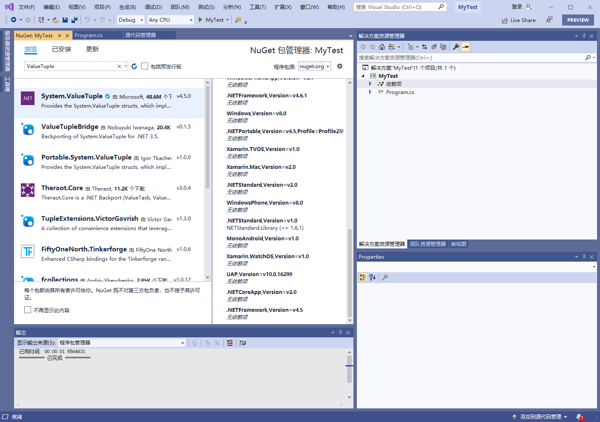

---
title: "C# 中的元组"
date: "2019/08/13 19:24:15"
updated: "2020/02/11 13:41:53"
permalink: "tuple-and-value-tuple-in-csharp/"
tags:
 - 元组
 - Tuple
 - ValueTuple
categories:
 - [开发, C#]
---

## 什么是元组

元组是 C# 提供的简单定义的类型，早期版本为 `System.Tuple`，使用该类型可以简化类型的定义。

```csharp
// 姓名 性别 出生日期
Tuple<string, bool, DateTime> person = new Tuple<string, bool, DateTime>("John", true, new DateTime(1990, 01, 01));
Console.WriteLine($"{person.Item1} is a good {(person.Item2 ? "boy" : "girl")} and {(person.Item2 ? "his" : "her")} birthday is on {person.Item3.ToString("MM.dd")}");
```

如上，可以组装多个类型成为一个新的类型，可以应用在多返回值或一些数组集合场景下。

```csharp
// 多返回值：是否执行成功 错误信息
public Tuple<bool, string> Execute(string sql)
{
    bool result = false;
    string message = null;
    try
    {
        result = SqlHelper.Excute(sql);
    }
    catch (Exception exc)
    {
        message = $"错误信息：{exc.Message}\n堆栈信息：{exc.StackTrace}";
    }
    return new Tuple<bool, string>(result, message);
}

// 特殊类型集合
public void Test()
{
    List<Tuple<string, bool, DateTime>> people = new List<Tuple<string, bool, DateTime>>();
	people.Add(new Tuple<string, bool, DateTime>("John", true, new DateTime(1990, 01, 01)));
	people.Add(new Tuple<string, bool, DateTime>("Jane", false, new DateTime(1992, 02, 02)));
	foreach (var item in people)
	{
	    Console.WriteLine($"{item.Item1} is a good {(item.Item2 ? "boy" : "girl")} and {(item.Item2 ? "his" : "her")} birthday is on {item.Item3.ToString("MM.dd")}");
	}
}
```

但是该类型使用时还是有一些缺陷，特别是通过 `Item{n}` 标记元素，没有具体的含义在使用中就比较容易出错。

另外，其泛型参数只提供了 7 个，如果超过 7 个，我们就要使用第 8 个泛型参数使用 `System.Tuple` 类型进行嵌套，例如：

```csharp
// 定义多个参数
Tuple<int, int, int, int, int, int, int, Tuple<int>> nums = new Tuple<int, int, int, int, int, int, int, Tuple<int>>(1, 2, 3, 4, 5, 6, 7, new Tuple<int>(8));
```

所以微软在后来提供了 `System.ValueTuple` 类型，取代了 `System.Tuple`，我们可以通过 `NuGet` 引用 `System.ValueTuple` 使用。



如上图所示，其标记的支持 `.NET Framework` 的最低版本为 `.NET Framework 4.5`，但实际上我们给 `.NET Framework 4.0` 的项目引用依然是可以正常使用的。另外如果想在 `.NET Framework 3.5` 的项目中使用，可以引用上图中的 `ValueTupleBridge`。

## ValueTuple 的语法

首先我们使用 `NuGet` 添加对 `System.ValueTuple` 的引用，我们可以将以上 Tuple 部分定义的内容进行简单的重写：

```csharp
// 多返回值：是否执行成功 错误信息
public (bool result, string message) Execute(string sql)
{
    bool result = false;
    string message = null;
    try
    {
        result = SqlHelper.Excute(sql);
    }
    catch (Exception exc)
    {
        message = $"错误信息：{exc.Message}\n堆栈信息：{exc.StackTrace}";
    }
    return (result, message);
}

// 特殊类型集合
public void Test()
{
    List<(string name, bool sex, DateTime birthday)> people = new List<(string name, bool sex, DateTime birthday)>();
    people.Add(("John", true, new DateTime(1990, 01, 01)));
    people.Add(("Jane", false, new DateTime(1992, 02, 02)));
    foreach (var item in people)
    {
        Console.WriteLine($"{item.name} is a good {(item.sex ? "boy" : "girl")} and {(item.sex ? "his" : "her")} birthday is on {item.birthday.ToString("MM.dd")}");
    }
}
```

```csharp
// 定义多个参数
(int num1, int num2, int num3, int num4, int num5, int num6, int num7, int num8) nums = (1, 2, 3, 4, 5, 6, 7, 8);
```

此外我们还可以用多种方式来声明 `System.ValueTuple`：

1. 将元组赋给单独声明的变量
   ```csharp
   (string name, bool sex, DateTime birthday) = ("John", true, new DateTime(1992, 02, 02));
   Console.WriteLine($"{name} is a good {(sex ? "boy" : "girl")} and {(sex ? "his" : "her")} birthday is on {birthday.ToString("MM.dd")}");
   ```
2. 将元组赋给预声明的变量
   ```csharp
   string name;
   bool sex;
   DateTime birthday;
   (name, sex, birthday) = ("John", true, new DateTime(1992, 02, 02));
   Console.WriteLine($"{name} is a good {(sex ? "boy" : "girl")} and {(sex ? "his" : "her")} birthday is on {birthday.ToString("MM.dd")}");
   ```
3. 将元组赋给单独声明和隐式类型的变量
   ```csharp
   (var name, var sex, var birthday) = ("John", true, new DateTime(1992, 02, 02));
   Console.WriteLine($"{name} is a good {(sex ? "boy" : "girl")} and {(sex ? "his" : "her")} birthday is on {birthday.ToString("MM.dd")}");
   ```
4. 将元组赋给单独声明和隐式类型的变量，但只用一个`var`
   ```csharp
   var (name, sex, birthday) = ("John", true, new DateTime(1992, 02, 02));
   Console.WriteLine($"{name} is a good {(sex ? "boy" : "girl")} and {(sex ? "his" : "her")} birthday is on {birthday.ToString("MM.dd")}");
   ```
5. 声明具名元组，将元组值赋给它，按名称访问元组项
   ```csharp
   (string name, bool sex, DateTime birthday) person = ("John", true, new DateTime(1992, 02, 02));
   Console.WriteLine($"{person.name} is a good {(person.sex ? "boy" : "girl")} and {(person.sex ? "his" : "her")} birthday is on {person.birthday.ToString("MM.dd")}");
   ```
6. 声明包含具名元组项的元组，将其赋给隐式类型的变量，按名称访问元组项
   ```csharp
   var person = (name: "John", sex: true, birthday: new DateTime(1992, 02, 02));
   Console.WriteLine($"{person.name} is a good {(person.sex ? "boy" : "girl")} and {(person.sex ? "his" : "her")} birthday is on {person.birthday.ToString("MM.dd")}");
   ```
7. 将元组项未具名的元组赋给隐式类型的变量，通过项编号属性访问单独的元素
   ```csharp
   var person = ("John", true, new DateTime(1992, 02, 02));
   Console.WriteLine($"{person.Item1} is a good {(person.Item2 ? "boy" : "girl")} and {(person.Item2 ? "his" : "her")} birthday is on {person.Item3.ToString("MM.dd")}");
   ```
8. 将元组项具名的元组赋给隐式类型的变量，但还是通过项编号
   ```csharp
   var person = (name: "John", sex: true, birthday: new DateTime(1992, 02, 02));
   Console.WriteLine($"{person.Item1} is a good {(person.Item2 ? "boy" : "girl")} and {(person.Item2 ? "his" : "her")} birthday is on {person.Item3.ToString("MM.dd")}");
   ```
9. 赋值时使用下划线丢弃元组的一部分（弃元）
   ```csharp
   (string name, bool sex, DateTime birthday, _) = ("John", true, new DateTime(1992, 02, 02), "China");
   ```
1. 通过变量和属性名推断元组项名称（`C# 7.1` 新增）
   ```csharp
   string name = "John";
   bool sex = true;
   DateTime birthday = new DateTime(1990, 01, 01);
   var person = (name, sex, birthday);
   Console.WriteLine($"{person.name} is a good {(person.sex ? "boy" : "girl")} and {(person.sex ? "his" : "her")} birthday is on {person.birthday.ToString("MM.dd")}");
   ```

> 注意：
> 1. 元组是在对象中封装数据的轻量级方案，元组数据项的类型没有限制，但是他们的类型是由编译器决定，不能在运行时改变。
> 2. 如果需要对封装的数据关联行为（事件、方法），应该创建一个类而不是使用元组。
> 3. 元组 `System.ValueTuple` 类似结构体，如果将一个元组赋值给另外一个元组，其是值传递而非引用传递。
