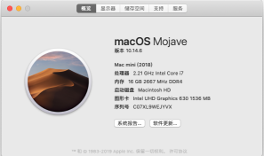
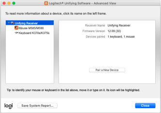

---
title: "罗技鼠标使用蓝牙连接的延迟问题"
date: "2019/10/24 08:26:44"
updated: "2020/02/11 13:19:11"
permalink: "delay-problem-of-using-bluetooth-connection-in-logit-mouse/"
categories:
 - [操作系统, MacOS]
---

最近购置了一个迷你主机，体验了一下“黑苹果”，为了追求简约，看着桌面上的线材也比较窝心，所以重新购置了一套无线键鼠。

最开始打算使用蓝牙连接，避免占用 USB 接口，但是实际使用发现，可能由于无线网卡的问题，蓝牙模块非常卡顿，无论是接蓝牙耳机听歌，还是连接使用键鼠。键盘还可以接受，但是蓝牙鼠标卡顿非常明显。

## 解决方案

换无线模块大概是不可能了，mini 主机可以用的无线模块现在价格炒得很高。

但是两个都通过 USB 连接，占用两个接口又不好接受，这个时候我想起来之前鼠标无线接收器和鼠标丢失连接，可以使用过优联重新配对。那么优联可不可以将一个无线接收器配对两个设备呢？

查找了一下资料，得到的是肯定的答案，下载链接：[Logitech Unifying™ 优联软件](https://support.logi.com/hc/zh-cn/articles/360025297913)

系统信息：

我的 MacOS 版本是 10.14.6，网上没有这个版本，但是我下载的 10.15 版本的软件可以完美安装使用。

