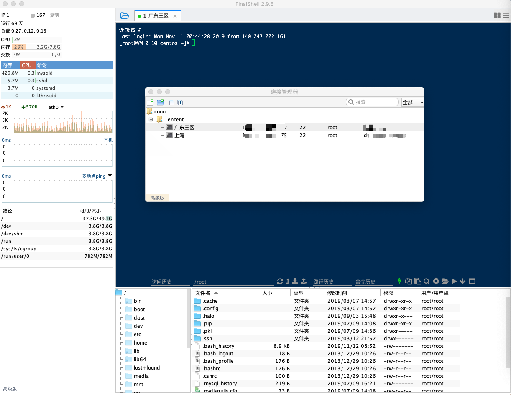

---
title: "Mac 下使用 FinalShell 取代 XShell"
date: "2019/11/12 09:08:38"
updated: "2020/02/11 13:14:57"
permalink: "use-finalshell-instead-of-xshell-under-mac/"
tags:
 - Shell
 - SSH
categories:
 - [操作系统, 软件]
---

Xshell 个人感觉是 Windows 下功能最好用的 ssh 客户端软件了，但是不能跨平台，所以在 Mac 下就要找一个替代品。

简单检索了一些网上的资料，最终被 FinalShell 吸引，感觉比 Xshell 还要好用一些（对于我这种小白来说）。

下载地址：[http://www.hostbuf.com/](http://www.hostbuf.com/)

免费版完全够用了，如果想赞助一下使用高级版这里是传送门：[35 软妹币赞助传送门](http://www.hostbuf.com/manage/pay_advanced.jsp)

需要注意的是，赞助需要注册登录，同样软件高级版升级也是通过登录用户实现的。

预览：

