---
title: "SOA —— WCF 知识点小结"
date: "2019/11/25 20:01:11"
updated: "2019/12/25 18:42:08"
permalink: "soa-wcf-knowlege-points/"
tags:
 - WCF
 - SOA
categories:
 - [开发, C#]
---

`WCF` 相较于 `WebService` 更加灵活，支持多种宿主、多种协议，并且支持双工。

印象中读书时也开过 `WCF` 的课程，但是那本讲 `WCF` 的书实在是太厚了，所以其实并没有学进去，混个学分后来不了了之。

工作中，使用更多的是 `WebService` 或者 `Socket`，所以仅凭偶尔接触的一些小例子，来总结一些简单的使用场景。

## 创建服务端

不同于 `WebService` 只能托管在 `IIS` 上，`WCF` 可以托管在任意的程序上，可以是网站，也可以是控制台、`WinForm`、`WPF`、`Windows Service` 等。

> 注意：`Visual Studio 2019` 安装时默认没有勾选 `WPF` 的模板，可以通过 `Visual Studio Installer` 安装，点击 `修改` -> `单个组件` -> `开发活动` -> `Windows Communication Foundation`。<br>
> 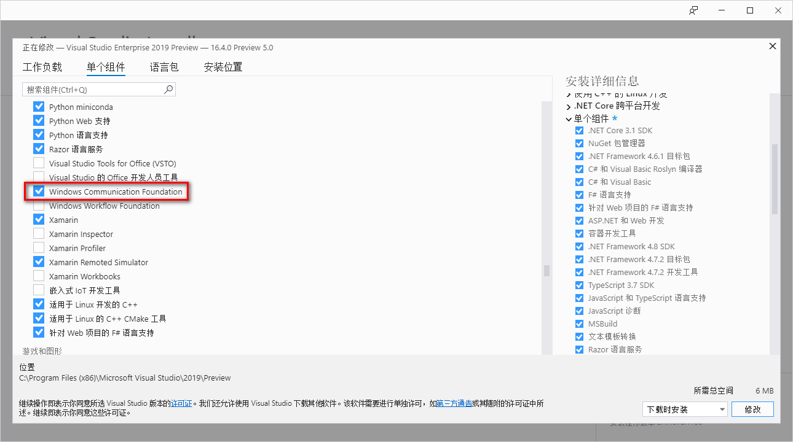

### 定义并实现服务协定

`WCF` 创建服务端第一步是创建一个服务协定，这样我们就可以很方便的将服务与宿主分离。

后期创建服务端时，可以指定服务运行在不同的宿主上，而不需要调整服务本身的代码，这里我们创建一个 `WCF 服务库`。

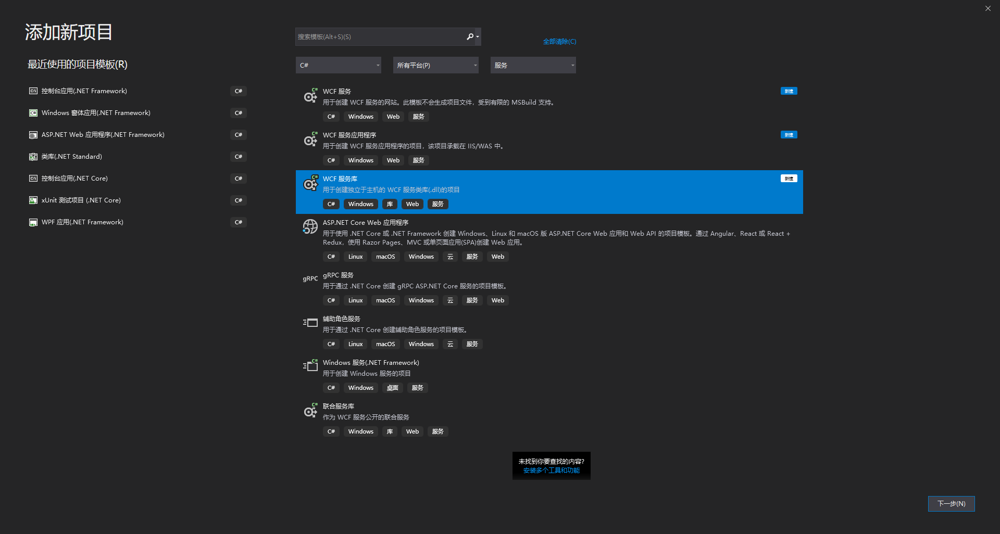

创建完成以后完善一下服务协定中的代码，需要在接口中指定方法，然后再实现。

`IMyService.cs` 文件：

```csharp
using System;
using System.Collections.Generic;
using System.Linq;
using System.Runtime.Serialization;
using System.ServiceModel;
using System.Text;

namespace JohnSun.SOA.WCF.Service
{
    // 注意: 使用“重构”菜单上的“重命名”命令，可以同时更改代码和配置文件中的接口名“IService1”。
    [ServiceContract]
    public interface IMyService
    {
        [OperationContract]
        string GetData(int value);

        [OperationContract]
        CompositeType GetDataUsingDataContract(CompositeType composite);

        // TODO: 在此添加您的服务操作

        [OperationContract]
        decimal Sum(decimal x, decimal y);

        [OperationContract]
        UserInfo GetUser(int id);

        [OperationContract]
        UserInfo[] GetUsers(string country);

        [OperationContract]
        List<UserInfo> GetAllUsers();
    }
}
```

`MyService.cs` 文件：

```csharp
using System;
using System.Collections.Generic;
using System.Linq;
using System.Runtime.Serialization;
using System.ServiceModel;
using System.Text;

namespace JohnSun.SOA.WCF.Service
{
    // 注意: 使用“重构”菜单上的“重命名”命令，可以同时更改代码和配置文件中的类名“Service1”。
    public class MyService : IMyService
    {
        private static List<UserInfo> _users = new List<UserInfo>()
        {
            new UserInfo(){ Id = 1, Name = "Kangkang", Country = "China" },
            new UserInfo(){ Id = 2, Name = "John", Country = "America" },
            new UserInfo(){ Id = 3, Name = "Jane", Country = "France" },
            new UserInfo(){ Id = 4, Name = "Han Meimei", Country = "China" },
        };

        public List<UserInfo> GetAllUsers()
        {
            return _users;
        }

        public string GetData(int value)
        {
            return string.Format("You entered: {0}", value);
        }

        public CompositeType GetDataUsingDataContract(CompositeType composite)
        {
            if (composite == null)
            {
                throw new ArgumentNullException("composite");
            }
            if (composite.BoolValue)
            {
                composite.StringValue += "Suffix";
            }
            return composite;
        }

        public UserInfo GetUser(int id)
        {
            return _users.Find(u => u.Id == id);
        }

        public UserInfo[] GetUsers(string country)
        {
            return _users.FindAll(u => u.Country == country).ToArray();
        }

        public decimal Sum(decimal x, decimal y)
        {
            return x + y;
        }
    }
}
```

### 使用宿主运行服务端

`WCF` 的服务协定创建好以后，就可以使用控制台或窗体程序等将该服务托管并运行起来。

这里以控制台为例，创建一个控制台应用程序，并添加以下代码：

```csharp
static void Main(string[] args)
{
    ServiceHost selfHost = null;

    try
    {
        // 定义服务运行的 URL 并实例化服务主机
        Uri baseAddress = new Uri("http://localhost:7895/MyService/");
        selfHost = new ServiceHost(typeof(MyService), baseAddress);

        // 指定服务协定
        selfHost.AddServiceEndpoint(typeof(IMyService), new WSHttpBinding(), "MyService");

        // 指定服务可以使用 HTTP 访问
        ServiceMetadataBehavior smb = new ServiceMetadataBehavior
        {
            HttpGetEnabled = true,
        };
        selfHost.Description.Behaviors.Add(smb);

        // 开启服务
        selfHost.Open();
        Log(LogLevel.Info, "服务开启成功，你可以点击 <Enter> 终止服务。");

        Console.ReadLine();
        selfHost.Close();
    }
    catch (CommunicationException ce)
    {
        Log(LogLevel.Error, $"开启服务失败 {ce.Message}");
        if (selfHost != null)
            selfHost.Abort();
        Console.ReadKey();
    }
}
```

> 注意：服务端如果需要运行，需要使用管理员身份，否则可能出现下图错误，可以使用管理员身份运行 `Visual Studio`，或者到 `bin` 目录下右键可执行程序，使用右键菜单中的 `以管理员身份运行`。<br>
> 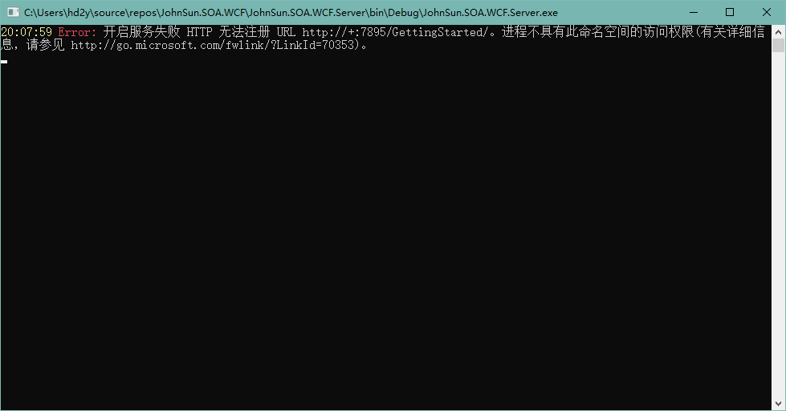

成功运行，控制台输出如下：

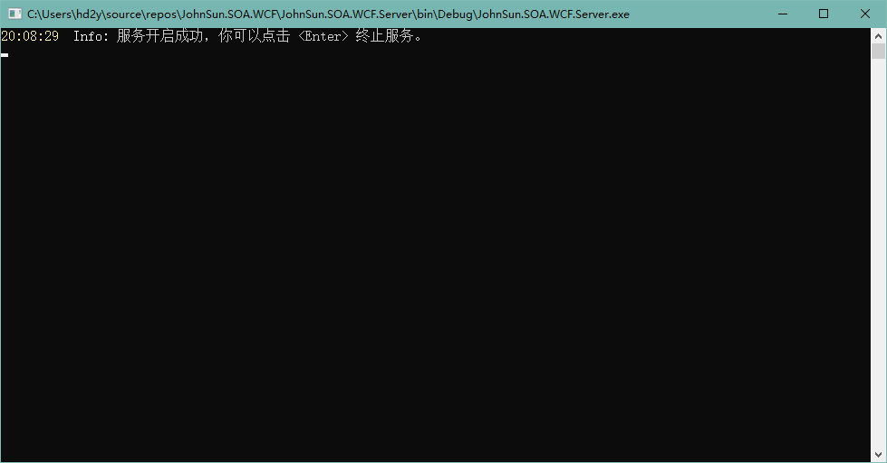

我们可以在浏览器中访问设置的链接：

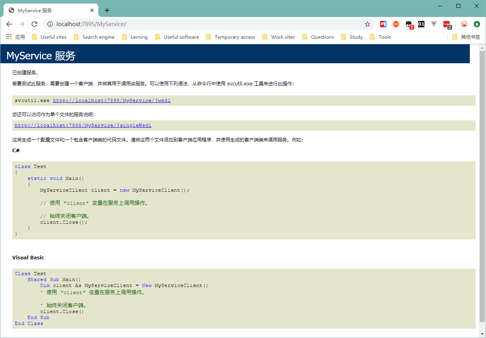

## 新建客户端调用服务

服务端创建完成以后，就可以创建一个客户端连接服务，执行简单的调用。

首先创建一个控制台应用程序用于演示，和 `WebService` 一样，直接在 `引用` 上右键添加 `服务引用` 即可。

引用完成以后，会生成一个配置文件 `app.config` ，里面记录着连接服务端的配置信息：

```xml
<?xml version="1.0" encoding="utf-8" ?>
<configuration>
    <system.serviceModel>
        <bindings>
            <wsHttpBinding>
                <binding name="WSHttpBinding_IMyService" />
            </wsHttpBinding>
        </bindings>
        <client>
            <endpoint address="http://localhost:7895/MyService/" binding="wsHttpBinding"
                bindingConfiguration="WSHttpBinding_IMyService" contract="MyWcfService.IMyService"
                name="WSHttpBinding_IMyService">
                <identity>
                    <userPrincipalName value="DESKTOP-V2RPVP4\hd2y" />
                </identity>
            </endpoint>
        </client>
    </system.serviceModel>
</configuration>
```

修改控制台的 `Program.cs` 文件进行调用：

```csharp
MyServiceClient client = null;
try
{
    client = new MyServiceClient();
    decimal x = 1m;
    decimal y = 2m;
    decimal d = client.Sum(x, y);
    Log(LogLevel.Info, $"调用 Sum 方法成功：Sum({x}, {y}) = {d}");
    int id = 1;
    UserInfo info = client.GetUser(id);
    JavaScriptSerializer serializer = new JavaScriptSerializer();
    Log(LogLevel.Info, $"调用 GetUserInfo 方法成功：GetUserInfo({id}) = {serializer.Serialize(info)}");
    string country = "China";
    UserInfo[] users = client.GetUsers(country);
    Log(LogLevel.Info, $"调用 GetUsers 方法成功：GetUsers({country}) 获取到用户数量： {users.Length}");
    UserInfo[] allUsers = client.GetAllUsers();
    Log(LogLevel.Info, $"调用 GetAllUsers 方法成功，获取到用户数量： {allUsers.Length}");
    client.Close();
}
catch (Exception exc)
{
    if (client != null)
        client.Abort();
    Log(LogLevel.Error, "测试服务失败：" + exc.Message);
}
Console.ReadKey();
```

注意，同 `WebService` 一样，连接的释放不能依托于 `using` 块。

### 自定义连接

如果不想通过自动生成的服务配置连接服务，可以调整客户端初始化为以下代码：

```csharp
client = new MyServiceClient(new WSHttpBinding(), new EndpointAddress("http://localhost:7895/MyService/"));
```

运行的结果和配置文件式初始化的执行结果一致：

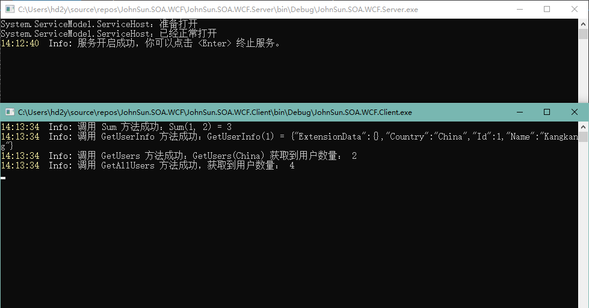

## WCF 进阶

以上只是类似 `WebService` 服务的创建与调用，还不能体现 WCF 的优越性，下面一些简单的例子将展示 WCF 的配置，将 WCF 服务承载于 TCP 上。并且演示 WCF 的双工如何使用。

### 通过配置文件设定服务

除了直接在代码中配置托管服务外，我们也可以通过配置文件来进行设定，配置信息可以参考 [WCF 配置架构](https://docs.microsoft.com/zh-cn/dotnet/framework/configure-apps/file-schema/wcf/media/index/windows-communication-foundation-configuration-schema.gif)。

我们可以通过一个 [简化配置](https://docs.microsoft.com/zh-cn/dotnet/framework/wcf/simplified-configuration) ，来配置我们的客户端，以下是服务端控制台 `App.config` 的文件内容。

```xml
<?xml version="1.0" encoding="utf-8" ?>
<configuration>
  <system.serviceModel>
    <behaviors>
      <serviceBehaviors>
        <behavior name="MyWcfServiceBehavior">
          <serviceMetadata httpGetEnabled="true" />
          <serviceDebug includeExceptionDetailInFaults="false" httpHelpPageEnabled="false" />
          <serviceTimeouts transactionTimeout="00:10:00" />
          <serviceThrottling maxConcurrentCalls="1000" maxConcurrentInstances="1000" maxConcurrentSessions="1000" />
        </behavior>
      </serviceBehaviors>
    </behaviors>
    
    <bindings>
      <basicHttpBinding>
        <binding name="MyBindingConfig" maxBufferSize="1024" maxReceivedMessageSize="1024" closeTimeout="00:01:00" />
        <!-- Default binding for basicHttpBinding -->
        <binding closeTimeout="00:03:00" />
      </basicHttpBinding>
    </bindings>
    
    <services>
      <service behaviorConfiguration="MyWcfServiceBehavior" name="JohnSun.SOA.WCF.Service.MyService">
        <host>
          <baseAddresses>
            <add baseAddress="http://localhost:7895/MyService/" />
          </baseAddresses>
        </host>
        <endpoint address="" binding="basicHttpBinding" contract="JohnSun.SOA.WCF.Service.IMyService" bindingConfiguration="MyBindingConfig" />
      </service>
    </services>
  </system.serviceModel>
</configuration>
```

配置完成后就可以通过重新生成并由客户端调用，注意之前绑定的协议为 `wsHttpBinding`，配置文件配置的为 `basicHttpBinding`，所以客户端需要 `更新服务引用`。

> 需要调整为 `wsHttpBinding` 也很简单，只需要 `bindings` 节点下的 `basicHttpBinding` 节点以及 `endpoint` 中的 `binding` 属性修改为 `wsHttpBinding` 即可。

更新后执行效果如下图：

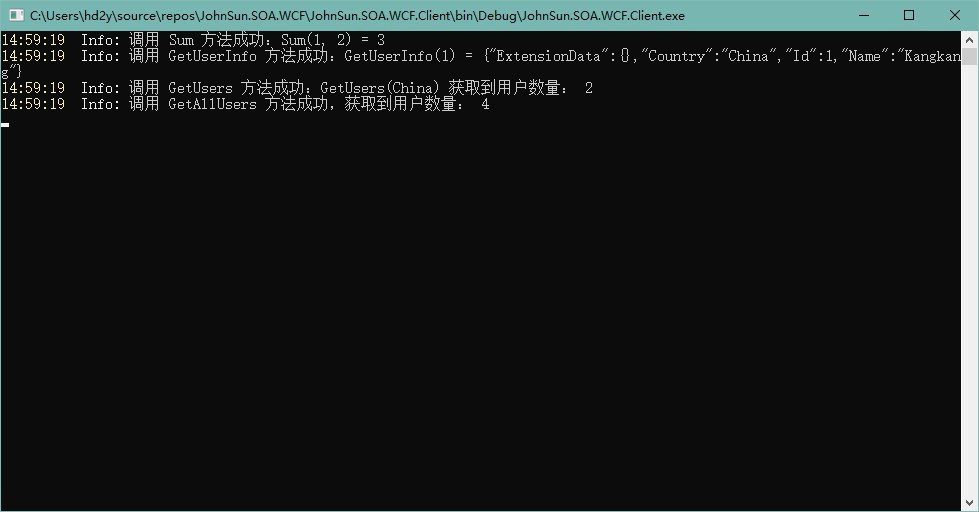

### 使用 TCP 协议

WCF 除支持 HTTP 协议外还支持多种协议，例如：TCP、MSMQ、命名管道等。

这里仅演示 TCP 协议，首先需要修改配置文件，调整 `serviceBehaviors` 中的 `serviceMetadata` 指定 `httpGetEnabled` 必须为 `false`。

然后我们修改配置文件中的 `bindings` 节点，将之前的 `basicHttpBinding` 或 `wsHttpBinding` 修改为：

```xml
<netTcpBinding>
  <binding name="MyBindingConfig" closeTimeout="00:01:00" >
    <security mode="None">
      <transport clientCredentialType="None" protectionLevel="None" />
    </security>
  </binding>
</netTcpBinding>
```

调整 `baseAddresses` 节点下绑定的链接，将 `http` 协议修改为 `net.tcp` 协议：

```xml
<add baseAddress="net.tcp://localhost:7895/MyService/" />
```

最后调整 `endpoint` 中的 `binding` 属性即可：

```xml
<endpoint address="" binding="netTcpBinding" contract="JohnSun.SOA.WCF.Service.IMyService" bindingConfiguration="MyBindingConfig" />
```

调整完成后重新生成即可运行服务，我们可以调整以下客户端的服务引用，可以右键对应的服务，选择 `配置服务引用`，修改服务地址，修改为 `net.tcp` 协议。

当然之前我们已经删除了配置文件，所以这里直接修改服务端的初始化代码：

```csharp
client = new MyServiceClient(new NetTcpBinding(securityMode: SecurityMode.None), new EndpointAddress("net.tcp://localhost:7895/MyService/"));
```

如果调用服务报错，可以添加服务引用，这时可能出现如下图的错误：

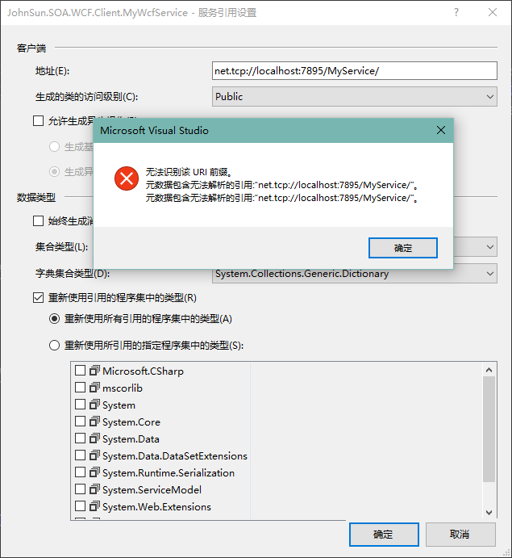

无法识别该 URI 前缀。

网上搜索了很多解决方案，包括 `启用或关闭 Windows 功能` 中有关 `WCF` 的选项，以及 `服务` 中 `Net.Tcp Listener Adapter` 是否启动，均正常。

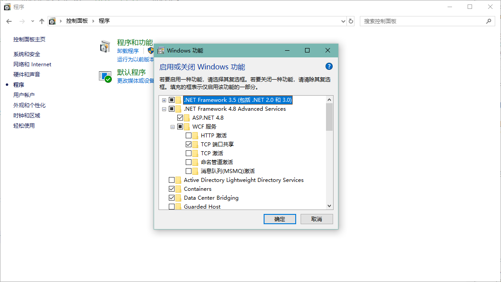

然后调整增加 `mexTcpBinding` 节点，仍然无法调用（此处必须配置）：

```xml
<endpoint address="mex" binding="mexTcpBinding" bindingConfiguration="" contract="IMetadataExchange" />
```

后看到一篇文章发现可能是序列化问题，之前我们增加的类型 `UserInfo` ，均未配置 `DataContract` 和 `DataMember` 特性，增加对应特性后，重新生成并运行服务端，客户端可以正常添加服务引用。

```csharp
[DataContract]
public class UserInfo
{
    [DataMember]
    public int Id { get; set; }
    [DataMember]
    public string Name { get; set; }
    [DataMember]
    public string Country { get; set; }
}
```

但是，在可以正常添加以后，移除对应特性，重新编译，无法再重现这个问题，所以建议是添加该特性，并按照以上内容检查所有信息，避免出现这个问题。

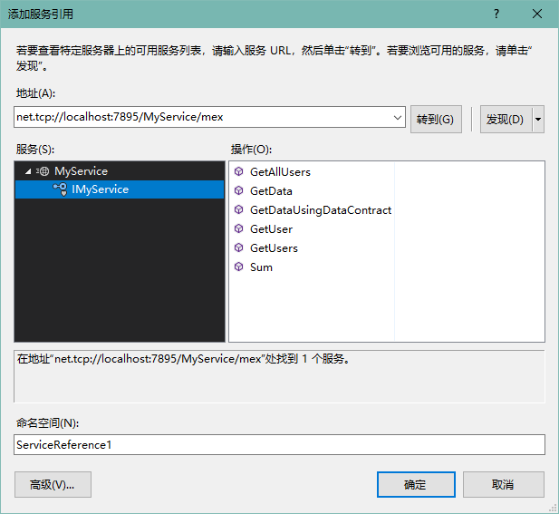

### 使用双工

因为 `WebService` 是基于 `HTTP协议`，其是无状态的，所以无法使用双工，但是 `WCF` 还支持有状态的 `TCP` 协议，所以可以实现双工通讯。

WCF 中双工的设计是通过回调来实现：
+ 定义一个用于回调的接口 `ICallback`，供客户端实现；
+ 添加服务协定 `ICallbackService` ，指定用于回调的协定 `ICallback`；
+ 实现服务协定，可以通过服务上下文获取回调的通道并调用；

```csharp
using System;
using System.Collections.Generic;
using System.Linq;
using System.ServiceModel;
using System.Text;
using System.Threading;

namespace JohnSun.SOA.WCF.Service
{
    [ServiceContract(CallbackContract = typeof(ICallback))]
    public interface ICallbackService
    {
        [OperationContract(IsOneWay = true)]
        void TestConnect(string message);
    }

    /// <summary>
    /// 不需要协议，是一个约束由客户端实现
    /// </summary>
    public interface ICallback
    {
        [OperationContract(IsOneWay = true)]
        void Reply(string message);
    }

    public class CallbackService : ICallbackService
    {
        public void TestConnect(string message)
        {
            Logger.Log(LogLevel.Info, message);
            Thread.Sleep(2000);
            ICallback callback = OperationContext.Current.GetCallbackChannel<ICallback>();
            callback.Reply(message);
        }
    }

    public class Logger
    {
        public static void Log(LogLevel level, string message)
        {
            Console.ForegroundColor = ConsoleColor.Yellow;
            Console.Write($"{DateTime.Now:HH:mm:ss} ");
            Console.ForegroundColor = level == LogLevel.Info ? ConsoleColor.White : ConsoleColor.Red;
            Console.Write($"{level,5}: ");
            Console.ForegroundColor = ConsoleColor.Gray;
            Console.Write($"{message}\r\n");
        }
    }

    [Flags]
    public enum LogLevel
    {
        Info = 1,
        Error = 2,
    }
}
```

这样服务协定我们就创建好了，然后就是修改服务托管的代码：

```csharp
ServiceHost host = null;
try
{
    // 定义服务运行的 URL 并实例化服务主机
    Uri baseAddress = new Uri("net.tcp://localhost:7895/MyDuplexService/");
    host = new ServiceHost(typeof(CallbackService), baseAddress);

    // 指定服务协定
    host.AddServiceEndpoint(typeof(ICallbackService), new NetTcpBinding(securityMode: SecurityMode.None), "CallbackService");
    // 不指定客户端将无法添加服务引用
    host.Description.Behaviors.Add(new ServiceMetadataBehavior());
    host.AddServiceEndpoint(typeof(IMetadataExchange), MetadataExchangeBindings.CreateMexTcpBinding(), "mex");

    // 开启服务
    host.Open();
    Log(LogLevel.Info, "服务开启成功，你可以点击 <Enter> 终止服务。");

    Console.ReadLine();
    host.Close();
}
catch (Exception exc)
{
    Log(LogLevel.Error, $"开启服务失败 {exc.Message} {exc.StackTrace}");
    if (host != null)
        host.Abort();
    Console.ReadKey();
}
```

之后我们就可以在客户端添加一个新的服务引用 `MyDuplexWcfService`，初始化服务连接并调用服务中定义的方法：

```csharp
CallbackServiceClient client = null;
try
{
    InstanceContext callbackInstance = new InstanceContext(new Callback());
    client = new CallbackServiceClient(callbackInstance);

    for (int i = 0; i < 10; i++)
    {
        string message = $"{i:00} {DateTime.Now:HH:mm:ss.fff}";
        client.TestConnect(message);
        Log(LogLevel.Info, $"调用 TestConnect 方法成功：{message}");
        Thread.Sleep(50);
    }
    Console.WriteLine("服务调用成功，你可以点击 <Enter> 关闭客户端。");
    Console.ReadLine();
    client.Close();
}
catch (Exception exc)
{
    if (client != null)
        client.Abort();
    Log(LogLevel.Error, "测试服务失败：" + exc.Message);
    Console.ReadLine();
}
```

需要注意的是，带有回调的服务，需要初始化一个`InstanceContext`，构造函数传递的是一个回调类型 `ICallback` 的实现类型的实例化对象。

我们引用的服务有一个 `ICallbackServiceCallback` 类型，这个其实就是 `ICallback`，需要添加实现：

```csharp
public class Callback : ICallbackServiceCallback
{
    public void Reply(string message)
    {
        Program.Log(LogLevel.Info, $"回调：{message}");
    }
}
```

实现以后的客户端与服务端执行效果如下：

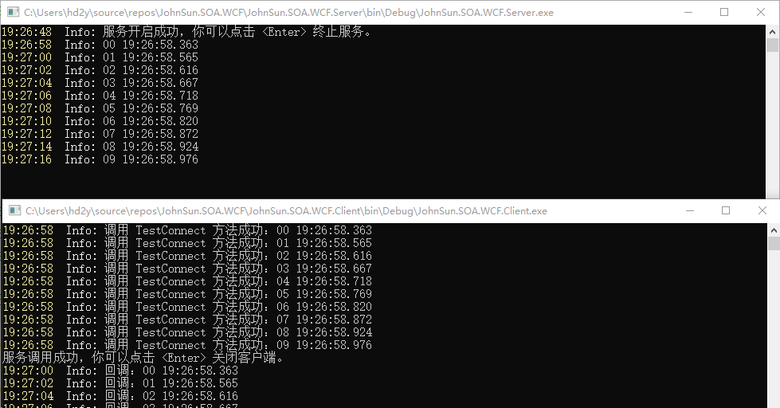

同样的针对服务端与客户端调整实现方式，以上服务端展示的是使用代码实现的托管，下面增加一个使用配置文件来进行托管的方案，首先在配置文件的 `services` 节点内增加以下内容：

```xml
<service behaviorConfiguration="MyWcfServiceBehavior" name="JohnSun.SOA.WCF.Service.CallbackService">
  <host>
    <baseAddresses>
      <add baseAddress="net.tcp://localhost:7895/MyDuplexService/" />
    </baseAddresses>
  </host>
  <endpoint address="" binding="netTcpBinding" contract="JohnSun.SOA.WCF.Service.ICallbackService" bindingConfiguration="MyBindingConfig" />
  <endpoint address="mex" binding="mexTcpBinding" bindingConfiguration="" contract="IMetadataExchange" />
</service>
```

然后服务开启的代码可以调整为以下内容：

```csharp
ServiceHost host = null;
try
{
    host = new ServiceHost(typeof(CallbackService));

    // 开启服务
    host.Open();
    Log(LogLevel.Info, "服务开启成功，你可以点击 <Enter> 终止服务。");

    Console.ReadLine();
    host.Close();
}
catch (Exception exc)
{
    Log(LogLevel.Error, $"开启服务失败 {exc.Message} {exc.StackTrace}");
    if (host != null)
        host.Abort();
    Console.ReadKey();
}
```

服务调整好以后，我们可能需要更新一下客户端的服务引用才能使用，因为以上配置文件指定与代码实现的并不完全一致。

客户端目前使用的是配置文件初始化，同样的我们可以删除客户端下的 `App.config` 文件，客户端实例化修改为以下代码：

```csharp
client = new CallbackServiceClient(callbackInstance, new NetTcpBinding(securityMode: SecurityMode.None), new EndpointAddress("net.tcp://localhost:7895/MyDuplexService/"));
```

## 后记

WCF 的知识点比较多，这里仅仅是简单的实现与使用，更多的内容建议还是查看 MSDN 文档。

基本以上内容学习以后，工作中一些常见的场景都可以实现，身份认证建议使用 Token 会简单一些，如果有兴趣可以研究一下 `x509证书`。

> 参考：<br>
> + MSDN - `利用 WCF 开发面向服务的应用程序`：[https://docs.microsoft.com/zh-cn/dotnet/framework/wcf/](https://docs.microsoft.com/zh-cn/dotnet/framework/wcf/)<br>
> + MSDN - `WCF 配置架构`：[https://docs.microsoft.com/zh-cn/dotnet/framework/configure-apps/file-schema/wcf/](https://docs.microsoft.com/zh-cn/dotnet/framework/configure-apps/file-schema/wcf/)<br>
> + Wiki - `雙工`：[https://zh.wikipedia.org/zh-hans/%E9%9B%99%E5%B7%A5](https://zh.wikipedia.org/zh-hans/%E9%9B%99%E5%B7%A5)<br>

> 源码下载：<br>
> + Git：https://git.hd2y.net/hd2y/JohnSun.SOA.WCF.git<br>
> + 百度网盘：https://pan.baidu.com/s/1QXsDYxWehCGgVupgpmgvpQ 提取码：`crbu`<br>
