---
title: "SOA —— ASP.NET Web API 知识点小结"
date: "2019/11/28 15:46:22"
updated: "2019/12/25 18:41:17"
permalink: "soa-asp-dot-net-web-api-knowledge-points/"
tags:
 - SOA
 - WebApi
categories:
 - [开发, C#]
---

`ASP.NET Web API` 是一个框架，可以轻松地构建包含浏览器和移动设备在内的广泛客户端的 `HTTP` 服务。

`ASP.NET Web API` 是在 `.NET Framework` 框架上构建 `REST` 风格应用程序的理想平台。

## 什么是 RESTful

表现层状态转换（英语： Representational State Transfer ，缩写： REST ）是一种架构风格，方便不同软件或程序在网络中互相传递消息。表现层状态转换是基于 HTTP 之上而确定的一组约定和属性，是一种设计提供全球资讯网络服务的软件构建风格。

符合或兼容这种架构风格（简称为 REST 或 RESTful ）的网络服务，目前主流的 Web 服务实现方案中，因为 REST 模式与复杂的 SOAP 和 XML-RPC 相比更加简洁，所以越来越多的服务开始采用 REST 风格设计和实现。

### REST 架构的要点

需要注意的是， REST 是设计风格而不是标准。 REST 通常基于使用 HTTP ， URI ，和 XML 以及 HTML 这些现有的广泛流行的协议和标准。
+ 资源是由URI来指定。
+ 对资源的操作包括获取、创建、修改和删除资源，这些操作正好对应 HTTP 协议提供的 GET 、 POST 、 PUT 和 DELETE 方法。
+ 通过操作资源的表现形式来操作资源。
+ 资源的表现形式则是 XML 或者 HTML ，取决于读者是机器还是人，是消费 web 服务的客户软件还是 web 浏览器。当然也可以是任何其他的格式，例如 JSON 。

### REST 架构的约束条件

REST 架构风格最重要的架构约束有 6 个：
+ 客户端-服务器（Client-Server）
+ 无状态（Stateless）
+ 缓存（Cacheability）
+ 统一接口（Uniform Interface）
+ 分层系统（Layered System）
+ 按需代码（Code-On-Demand，可选）

### 应用于 Web 服务

符合 REST 设计风格的 Web API 称为 RESTful API 。它从以下三个方面资源进行定义：
+ 直观简短的资源地址：URI，比如：`http://example.com/resources`。
+ 传输的资源：Web 服务接受与返回的互联网媒体类型，比如：JSON，XML，YAML等。
+ 对资源的操作：Web服务在该资源上所支持的一系列请求方法（比如：POST，GET，PUT或DELETE）。

下表列出了实现 RESTful API 时 HTTP 请求方法的典型用途。

| 资源   | 一组资源的URI，比如`https://example.com/resources` | 单个资源的URI，比如`https://example.com/resources/142` |
|:-------|:---------------------------------------------------|:-------------------------------------------------------|
| GET    | **列出**URI，以及该资源组中每个资源的详细信息（后者可选）。 | **获取**指定的资源的详细信息，格式可以自选一个合适的网络媒体类型（比如：XML、JSON等） |
| PUT    | 使用给定的一组资源**替换**当前整组资源。 | **替换/创建**指定的资源。并将其追加到相应的资源组中。 |
| POST   | 在本组资源中**创建/追加**一个新的资源。该操作往往返回新资源的URL。 | 把指定的资源当做一个资源组，并在其下**创建/追加**一个新的元素，使其隶属于当前资源。 |
| DELETE | **删除**整组资源。 | **删除**指定的元素。 |

## 创建 ASP.NET Web API

使用 Visual Studio 可以直接创建 `ASP.NET Web API`，不过需要注意的是框架需要选择 `.NET Framework 4.5+` 。

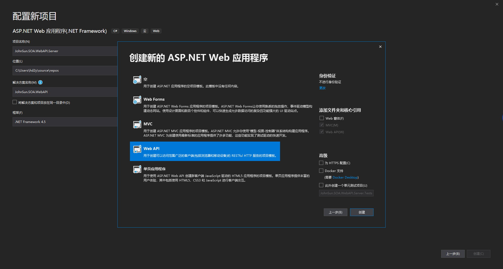

创建成功以后，可以直接找到视图中的 `Home/Index.cshtml` 将项目运行起来：

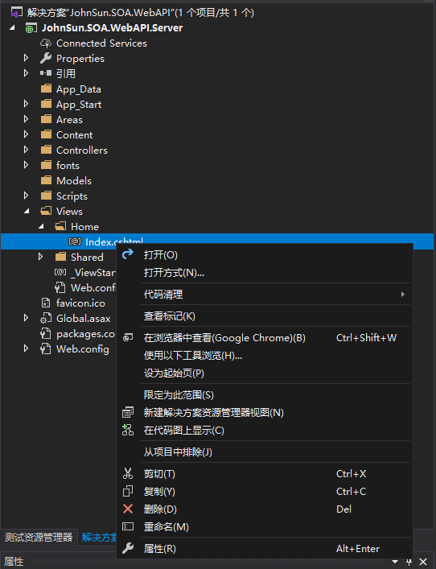

可以注意到 `Controllers` 文件夹中，创建了一个默认的 `ValuesController`，其继承自 `ApiController`：

```csharp
using System;
using System.Collections.Generic;
using System.Linq;
using System.Net;
using System.Net.Http;
using System.Web.Http;

namespace JohnSun.SOA.WebAPI.Server.Controllers
{
    public class ValuesController : ApiController
    {
        // GET api/values
        public IEnumerable<string> Get()
        {
            return new string[] { "value1", "value2" };
        }

        // GET api/values/5
        public string Get(int id)
        {
            return "value";
        }

        // POST api/values
        public void Post([FromBody]string value)
        {
        }

        // PUT api/values/5
        public void Put(int id, [FromBody]string value)
        {
        }

        // DELETE api/values/5
        public void Delete(int id)
        {
        }
    }
}

```

我们可以通过浏览器来直接访问 `http://localhost:58683/api/values`：

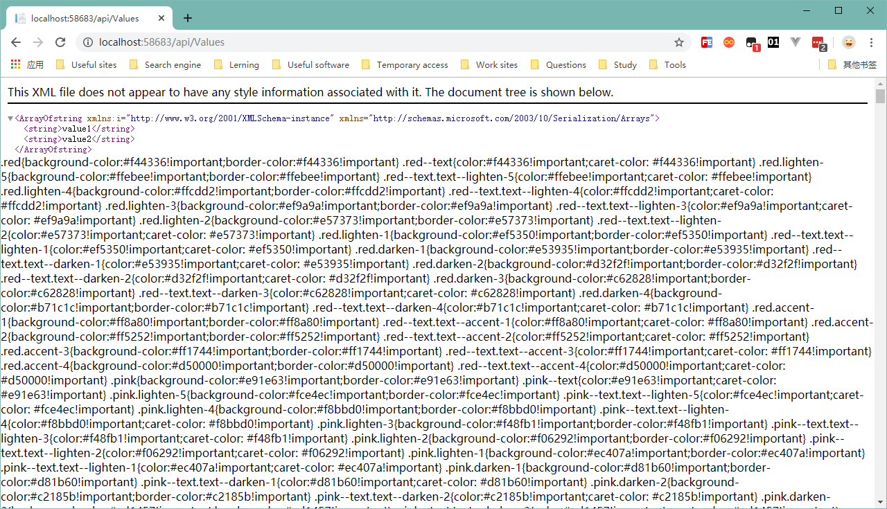

浏览器是 GET 请求，所以返回的是如上内容，如果需要使用其他请求，可以使用 `postman` 进行调试。

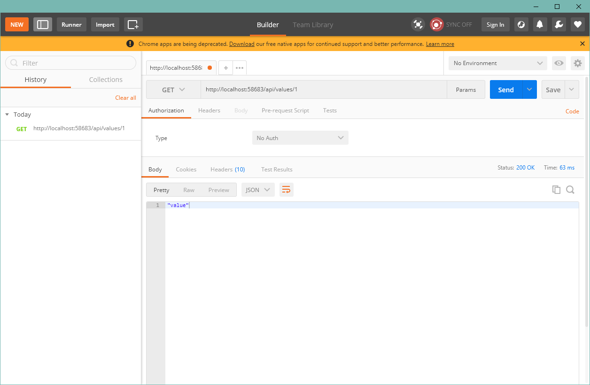

### 路由

首先我们自定义一个控制器用于测试：

```csharp
using System;
using System.Collections.Generic;
using System.Linq;
using System.Net;
using System.Net.Http;
using System.Web.Http;

namespace JohnSun.SOA.WebAPI.Server.Controllers
{
    public class UsersController : ApiController
    {
        public static List<User> Users = new List<User>
        {
            new User{ Id = 1, Type = UserType.Admin, Name = "Admin" },
            new User{ Id = 2, Type = UserType.Admin, Name = "John", Sex = UserSex.Male },
            new User{ Id = 3, Name = "Kangkang", Sex = UserSex.Male },
            new User{ Id = 4, Name = "Micheal", Sex = UserSex.Male },
            new User{ Id = 5, Name = "Jane", Sex = UserSex.Female },
            new User{ Id = 6, Name = "Meimei", Sex = UserSex.Female },
            new User{ Id = 7, Name = "Xiaoli", Sex = UserSex.Female },
        };

        public List<User> GetAll() 
        {
            return Users;
        }

        public User GetUser(int id) 
        {
            return Users.Find(u => u.Id == id);
        }
    }
    public class User
    {
        public int Id { get; set; }
        public UserType Type { get; set; }
        public string Name { get; set; }
        public UserSex Sex { get; set; }
    }

    public enum UserType
    {
        Normal,
        Admin,
    }

    public enum UserSex
    {
        Unknown,
        Male,
        Female,
    }
}
```

同默认创建的控制器啊一样，可以直接通过 `postman` 或浏览器访问：

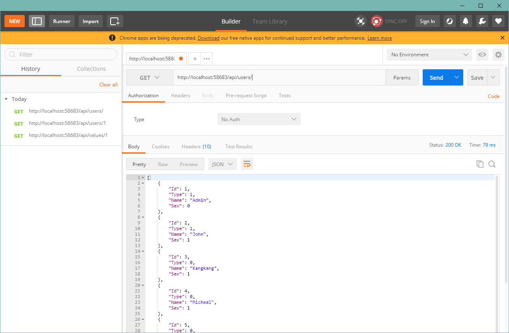

### 模板路由

同 `MVC` 项目一样，如果需要了解项目的配置，可以找到程序的入口进行了解，打开 `Global.asax.cs` 文件，查看 `Application_Start()` 方法，其中有这么一段：

```csharp
GlobalConfiguration.Configure(WebApiConfig.Register);
```

转到 `WebApiConfig.Register` 方法：

```csharp
public static void Register(HttpConfiguration config)
{
    // Web API 配置和服务

    // Web API 路由
    config.MapHttpAttributeRoutes();

    config.Routes.MapHttpRoute(
        name: "DefaultApi",
        routeTemplate: "api/{controller}/{id}",
        defaults: new { id = RouteParameter.Optional }
    );
}
```

由上可以看到注册了路由规则，`api` 代表在资源前面要带上 `api` 目录，`{controller}` 为请求资源的控制器名称，`{id}` 为代表一个资源的 `ID` ，而下面指定的 `RouteParameter.Optional` 则表示这个参数是可选的。

默认的路由就是模板路由，路由规则是遵循 `REST` 风格的，可以理解为一个控制器代表一类资源。如果没有特殊的需求，不建议修改该路由规则。

特殊占位符除了默认的 `{controller}` ，还支持 `{action}` ，如果模板中配置，则该位置标志对应控制器中的方法。

例如我们将模板路由修改为 `routeTemplate: api/{controller}/{action}/{id}` ，如果我们仍然需要调用 `UsersController` 中的方法就需要指定调用的方法名，如果我们不调整将出现报错 `http://localhost:58683/api/users` ：

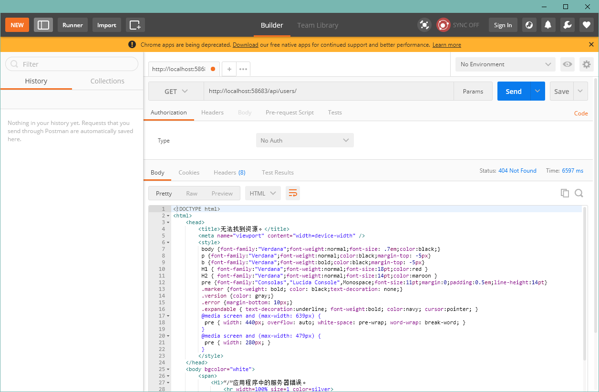

这时就需要我们指定需要调用的控制器的方法 `http://localhost:58683/api/users/getall` ：

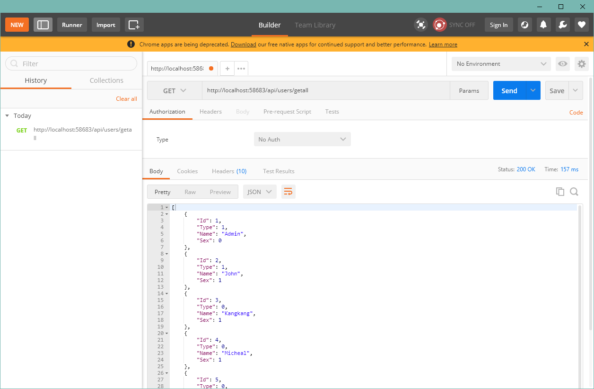

默认控制器中占位符 `{id}` 为自定义占位符，`defaults: new { id = RouteParameter.Optional }` 指定了其默认值，表示其为一个可选参数。

除可以指定默认值以外，还可以通过正则指定录入值的规则，可以通过入参 `constraints` 指定，如下：

```csharp
config.Routes.MapHttpRoute(
    name: "DefaultApi",
    routeTemplate: "api/{controller}/{id}",
    defaults: new { id = RouteParameter.Optional },
    constraints: new { id = @"\d{1,2}" }
);
```

需要注意的是， `constraints` 优先级要比 `RouteParameter.Optional` 高，例如以上设定的路由模板，如果不传输ID，将返回 `404`：

但是如果指定是默认值，例如 `defaults: new { id = 1 }`，未录入也可以访问到资源。

### 特性路由

除路由模板外，还可以在控制器与控制器方法上标记 `RouteAttribute` 来定义特性路由，例如我们在 `UsersController` 增加两个带有特性路由的方法：

```csharp
[Route("api/admins")]
public List<User> GetAllAdmin()
{
    return Users.FindAll(u => u.Type == UserType.Admin);
}

[Route("api/admins/{id}")]
public User GetAdmin(int id)
{
    return Users.Find(u => u.Type == UserType.Admin && u.Id == id);
}
```

这样我们就可以通过 `http://localhost:58683/api/admins` 来请求管理员身份的用户信息。

特性路由除了上文中演示的重载我们的 `URI` 外，还可以实现 `API` 的版本控制，例如定义为： `api/v1/users` 、 `api/v2/users` 。

另外还可以用于传输多个参数，例如：

```csharp
[Route("api/users/type/{type}/sex/{sex}")]
public User GetUser(UserType type, UserSex sex)
{
    return Users.Find(u => u.Type == type && u.Sex == sex);
}
```

我们可以使用 `http://localhost:58683/api/users/type/admin/sex/male` 来访问：

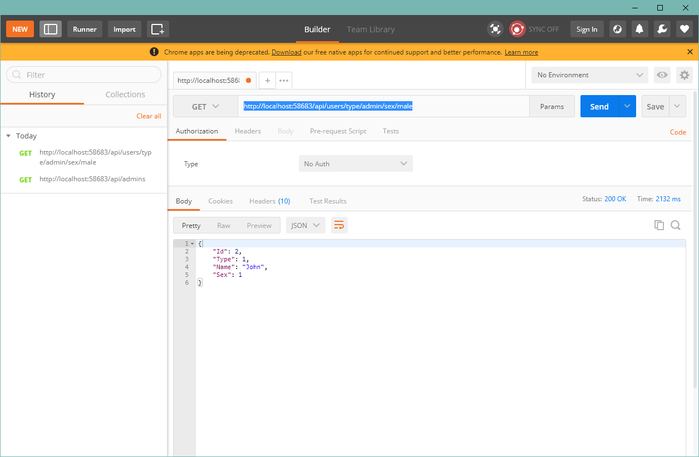

#### HTTP 方法

`Web API` 除匹配路由规则外，还将选择操作请求 （ `GET` 、  `POST` 等） 的 `HTTP` 方法。 默认情况下，`Web API` 将查找与控制器方法名称的开头的不区分大小写匹配。 例如，名为的控制器方法 `PutCustomers` 匹配 `HTTP` `PUT` 请求。

以下属性来修饰的方法与任何替代此约定：
+ **[HttpDelete]**
+ **[HttpGet]**
+ **[HttpHead]**
+ **[HttpOptions]**
+ **[HttpPatch]**
+ **[HttpPost]**
+ **[HttpPut]**

以下代码测试了标记了 `HTTP` 方法特性的 `GetTest` 方法，如果没有标记 `[HttpPost]` ，该方法只能使用 `GET` 请求，但是标记之后将只能使用 `POST` 请求。

```csharp
[HttpPost]
[Route("api/users/test")]
public string GetTest() 
{
    return "test";
}
```

`GET` 请求：

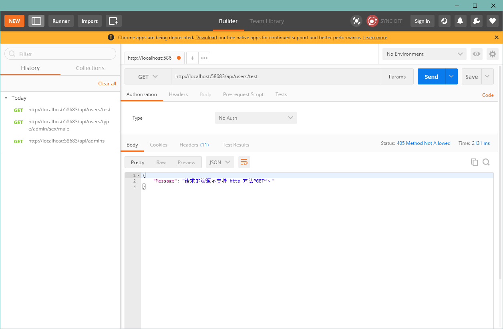

`POST` 请求：

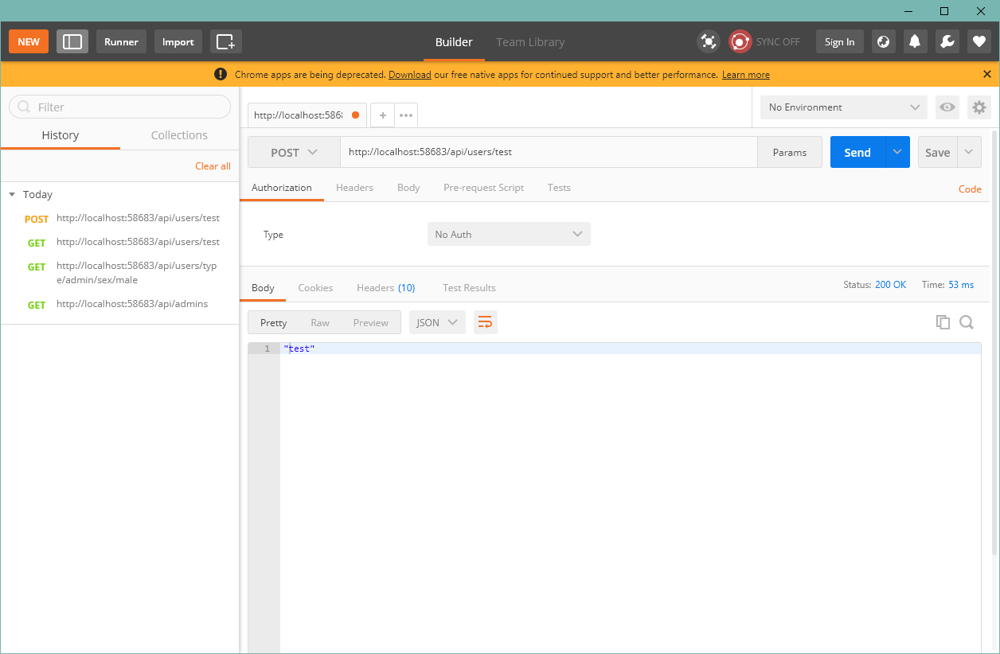

如果两种都需要，可以标记多个，在添加一个 `[HttpGet]` 特性即可。

对于其他的 `HTTP` 方法，包括非标准的方法，使用 `AcceptVerbs` 特性：

```csharp
[AcceptVerbs("View")]
[Route("api/users/test")]
public string GetTest()
{
    return "test";
}
```

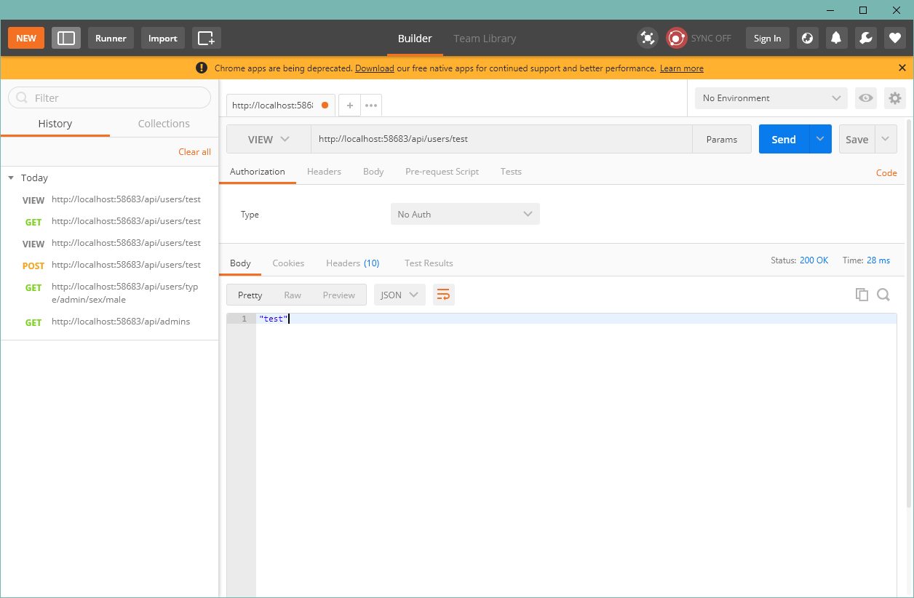

#### 路由前缀

通常情况下，所有以相同前缀开头的控制器中的路由，可以通过使用针对整个控制器设置公共前缀 `[RoutePrefix]` 特性：

```csharp
public class BooksController : ApiController
{
    [Route("api/books")]
    public IEnumerable<Book> GetBooks() { ... }

    [Route("api/books/{id:int}")]
    public Book GetBook(int id) { ... }

    [Route("api/books")]
    [HttpPost]
    public HttpResponseMessage CreateBook(Book book) { ... }
}

// 资源请求链接与上一段代码一致
[RoutePrefix("api/books")]
public class BooksController : ApiController
{
    // GET api/books
    [Route("")]
    public IEnumerable<Book> Get() { ... }

    // GET api/books/5
    [Route("{id:int}")]
    public Book Get(int id) { ... }

    // POST api/books
    [Route("")]
    public HttpResponseMessage Post(Book book) { ... }
}
```

如果不想使用路由前缀，可以使用 `~` 符号：

```csharp
[RoutePrefix("api/books")]
public class BooksController : ApiController
{
    // GET /api/authors/1/books
    [Route("~/api/authors/{authorId:int}/books")]
    public IEnumerable<Book> GetByAuthor(int authorId) { ... }

    // ...
}
```

路由前缀可以包含参数：

```csharp
[RoutePrefix("customers/{customerId}")]
public class OrdersController : ApiController
{
    // GET customers/1/orders
    [Route("orders")]
    public IEnumerable<Order> Get(int customerId) { ... }
}
```

#### 路由约束

路由约束让你限制如何匹配路由模板中的参数。 常规语法 `{参数名:约束}` 。 例如：

```csharp
[Route("api/users/{id:int}")]
public User GetUserById(int id) { ... }

[Route("api/users/{name}")]
public User GetUserByName(string name) { ... }
```

在这里，第一个路由将仅选择 `URI` 段中 `id` 是一个整数，例如 `http://localhost:58683/api/users/1001` 。否则，将选择第二个路由，例如 `http://localhost:58683/api/users/John` 。

下表列出了支持的约束：

| 约束       | 描述                             | 示例            |
|:----------:|:--------------------------------:|:---------------:|
| alpha      | 匹配大写或小写字符 `(a-z、 A-Z)` | `{x: alpha}`    |
| bool       | 匹配一个布尔值。                 | `{x: bool} `    |
| datetime   | 匹配项DateTime值。               | `{x: datetime}` |
| decimal    | 匹配十进制值。                   | `{x:decimal}`   |
| double     | 与 `64` 位浮点值匹配。           | `{x:double}`    |
| float      | 与 `32` 位浮点值匹配。           | `{x: float}`    |
| guid       | 匹配的 `GUID` 值。               | `{x: guid}`     |
| int        | 与 `32` 位整数值匹配。           | `{x: int}`      |
| length     | 与具有指定长度或长度的指定范围内的字符串匹配。 | `{x:length(6)} {x:length(1,20)}` |
| long       | 与 `64` 位整数值匹配。           | `{x: long}`          |
| max        | 匹配一个整数，其最大值。         | `{x:max(10)}`        |
| maxlength  | 与最大长度的字符串匹配。         | `{x:maxlength(10)}`  |
| min        | 匹配一个整数，其最小值。         | `{x: min(10)}`       |
| minlength  | 与最小长度的字符串相匹配。       | `{x: minlength(10)}` |
| range      | 一个整数值的范围内的匹配项。     | `{x: range(10,50)}`  |
| 正则表达式 | 与正则表达式匹配。               | `{x:regex(^\d{3}-\d{3}-\d{4}$)}` |


> 注意：某些约束，如 `min` ，在括号中采用自变量。可以将多个约束应用于参数，用冒号分隔。
> ```csharp
> [Route("api/users/{id:int:min(1)}")]
> public User GetUserById(int id) { ... }
> ```

除通过以上约束限制入参外，还可以通过实现 `IHttpRouteConstraint` 接口来创建自定义路由约束。例如，以下将限制参数为非零的整数值：

```csharp
public class NonZeroConstraint : IHttpRouteConstraint
{
    public bool Match(HttpRequestMessage request, IHttpRoute route, string parameterName, 
        IDictionary<string, object> values, HttpRouteDirection routeDirection)
    {
        object value;
        if (values.TryGetValue(parameterName, out value) && value != null)
        {
            long longValue;
            if (value is long)
            {
                longValue = (long)value;
                return longValue != 0;
            }

            string valueString = Convert.ToString(value, CultureInfo.InvariantCulture);
            if (Int64.TryParse(valueString, NumberStyles.Integer, 
                CultureInfo.InvariantCulture, out longValue))
            {
                return longValue != 0;
            }
        }
        return false;
    }
}
```

下面的代码演示如何注册该约束：

```csharp
public static class WebApiConfig
{
    public static void Register(HttpConfiguration config)
    {
        var constraintResolver = new DefaultInlineConstraintResolver();
        constraintResolver.ConstraintMap.Add("nonzero", typeof(NonZeroConstraint));

        config.MapHttpAttributeRoutes(constraintResolver);
    }
}
```

现在可以将约束应用在路由中：

```csharp
[Route("{id:nonzero}")]
public HttpResponseMessage GetNonZero(int id) { ... }
```

> 注：也可以替换整个 `DefaultInlineConstraintResolver` 类的实现 `IInlineConstraintResolver` 接口。执行此操作将替换的所有内置的约束，除非你实现 `IInlineConstraintResolver` 接口再将它们添加。

#### 路由顺序

当框架尝试匹配路由的 `URI` 时，它会按特定的顺序匹配路由。若要指定顺序，可以设置 `Route` 特性的 `RouteOrder` 的值，默认顺序值为零。

下面是确认最终排序的方式：
+ 比较 `Route` 特性的 `RouteOrder` 属性。
+ 查看路由模板中的每个 `URI` 段。为每个段进行排序，如下所示：
   1. 文本内容。
   2. 受路由约束限制的路由参数。
   3. 不受限制的路由参数。
   4. 受路由约束的通配符路由参数。
   5. 不受限制的通配符路由参数。
+ 一个对路由排序的路由模板，使用不区分大小写的字符串序列进行比较 (OrdinalIgnoreCase) 。

假设定义以下控制器：

```csharp
[RoutePrefix("orders")]
public class OrdersController : ApiController
{
    [Route("{id:int}")] // constrained parameter
    public HttpResponseMessage Get(int id) { ... }

    [Route("details")]  // literal
    public HttpResponseMessage GetDetails() { ... }

    [Route("pending", RouteOrder = 1)]
    public HttpResponseMessage GetPending() { ... }

    [Route("{customerName}")]  // unconstrained parameter
    public HttpResponseMessage GetByCustomer(string customerName) { ... }

    [Route("{*date:datetime}")]  // wildcard
    public HttpResponseMessage Get(DateTime date) { ... }
}
```

这些路由匹配顺序如下所示：
1. `orders/details`
2. `orders/{id}`
3. `orders/{customerName}`
4. `orders/{*date}`
5. `orders/pending`

> 注：`details` 是一个文本段所以会出现在 `{id}` 之前，但 `pending` 设置了 `RouteOrder` 为 `1` ，所以会显示在其他未设置该属性，默认 `RouteOrder` 为 `0` 的路由之后。 （本示例假定没有客户名为 `details` 或 `pending` 的客户。一般情况下，应该避免不明确的路由。在此示例中，更适合 `GetByCustomer` 的路由模板是 `customers/{customerName}` ）


> 参考：<br>
> + Wiki - `REST`：[https://zh.wikipedia.org/wiki/表现层状态转换](https://zh.wikipedia.org/wiki/%E8%A1%A8%E7%8E%B0%E5%B1%82%E7%8A%B6%E6%80%81%E8%BD%AC%E6%8D%A2)<br>
> + MSDN - `ASP.NET Web API`：[https://docs.microsoft.com/zh-cn/aspnet/web-api/](https://docs.microsoft.com/zh-cn/aspnet/web-api/)
