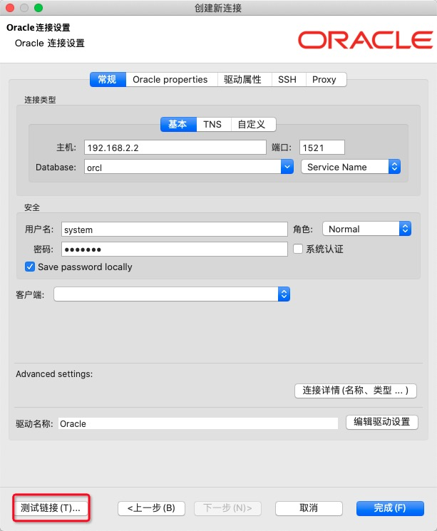
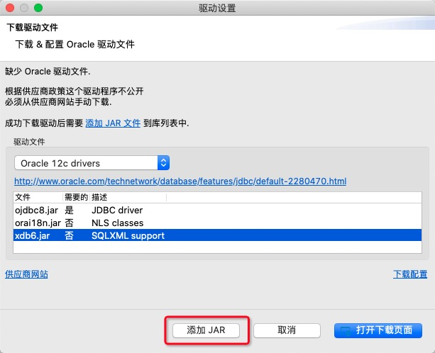
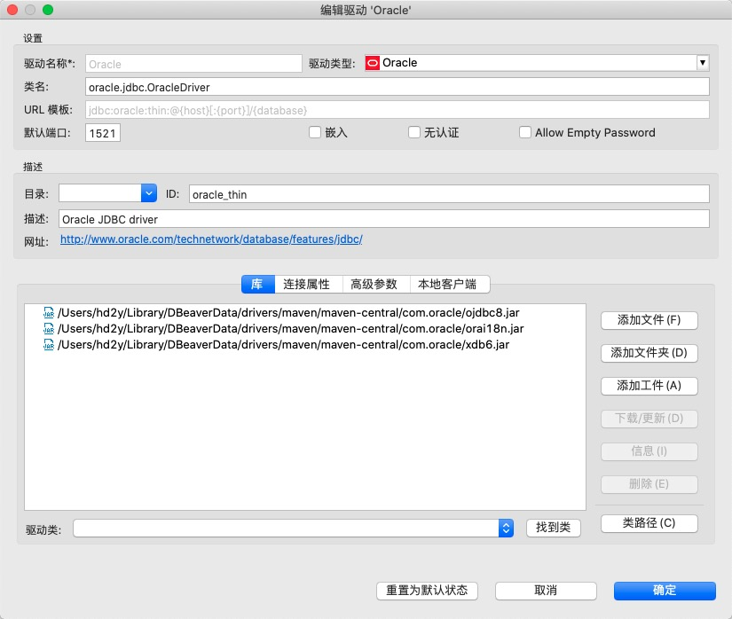
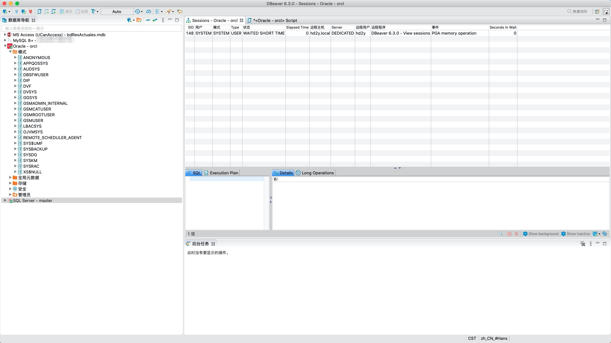

---
title: "MacOS 使用 DBeaver 连接 Oracle 数据库"
date: "2019/12/02 10:58:25"
updated: "2019/12/25 18:39:39"
permalink: "macos-use-dbeaver-to-connect-to-oracle-databases/"
tags:
 - MacOS
 - Oracle
 - jdbc
 - DBeaver
categories:
 - [开发, 数据库, Oracle]
---

作为“专业”的商业数据库，Oracle 不允许第三方公司私自集成 Oracle 数据库的 jdbc 连接驱动，所以 DBeaver 不能像其他数据库那样，自动的为我们下载驱动文件。

## DBeaver 添加连接

添加 Oracle 连接会出现如下配置：

如上图，点击“测试连接”会提示让我们配置连接驱动：

## 下载 jar 包

如果数据库服务器是 `11g` 或 `12c`，根据数据库版本选择框下的连接，到 Oracle 官网登录下载即可。

这里我安装的是 `19c`，直接到根据指引下载最新的 jar 包：[18.3 JDBC and UCP Downloads page](https://www.oracle.com/database/technologies/appdev/jdbc-ucp-183-downloads.html)

其他的一些指引信息可以参考：[Quick Start with JDBC](https://www.oracle.com/cn/database/technologies/develop-java-apps-using-jdbc.html)

## 配置驱动

点击弹出缺少驱动文件窗体中的 `添加 jar 包` 或点击 Oracle 连接设置界面的 `编辑驱动设置` 可以进入以下页面：

按如图所示，将我们下载的文件解压到一个合适的位置，点击 `添加文件` 将如图所示的三个文件添加进列表即可。

完成后点击确定可能会报错，可以忽略报错信息，直接从连接配置界面，重新点击 `测试连接` 即可确认驱动是否正常。

当然还可能会仍然无法连接，但是需要确认的是驱动是否正常，例如提示网络错误或登录用户密码错误等信息，就是另外一个问题了，解决即可。

