---
title: "C# 打包引用程序集与动态链接库"
date: "2019/12/28 15:07:36"
updated: "2019/12/28 15:11:14"
permalink: "csharp-package-reference-assemblies-and-dynamic-link-libraries/"
tags:
 - Fody
 - 动态链接库
categories:
 - [开发, C#]
---

## 前言

记得刚接触 C# 开发那会儿，因为经验不足经常犯一些很幼稚的错误，其中发布程序忘记将引用打包就是其中一个。

但是截止到现在，桌面应用程序做的都是一些“玩具”，打包安装感觉使用体验不好，所以现在仍然喜欢使用“绿色免安装”。

虽然免安装了，但是如果引用了一些程序集或者动态链接库，使用起来体验总不太好，特别是拿给别人用，要知道有些电脑小白拷贝可是连快捷方式和可执行文件都分不清。

所以，这里主要总结以下程序集打包、动态链接库的打包方法，而且网上关于程序集打包的文章很常见，但是动态链接库比较少，所以还是值得拿出来分享一下的。

## 打包引用程序集

这里和网上一样，主要从两方面来说，首先是将程序集作为资源嵌入到主程序中，然后在程序运行时从资源中加载。

另外一种是网上比较常见的，使用 Fody 来管理程序集打包与打包程序集的加载，但本质上两种方案是一样的。

### 使用 AssemblyResolve 事件打包

了解过反射知识应该都知道 `Assembly` 的 `Load` 方法可以动态加载程序集，实现一些插件的效果。

首先我们创建一个控制台项目，并通过 NuGet 引用我们常用的 Newtonsoft.Json 程序集，入口函数代码如下：

```csharp
static void Main(string[] args)
{
    var obj = new { name = "hd2y", gender = "M", hobby = "coding", website = "https://hd2y.net" };
    string json = JsonConvert.SerializeObject(obj);
    Console.WriteLine(json);
    Console.ReadKey();
}

// 程序运行输入：
// {"name":"hd2y","gender":"M","hobby":"coding","website":"https://hd2y.net"}
```

这时可以正常运行，是因为我们生成后，我们引用的程序集会自动复制到运行目录下：

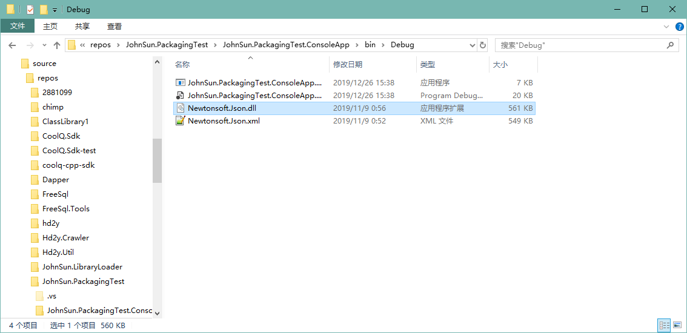

这时因为默认情况下，引用属性中“复制本地”被设置为 `True`，我们可以进行调整：

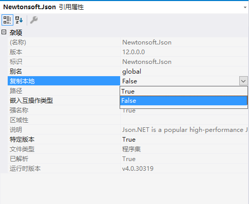

然后我们重新生成项目，可以发现 `Newtonsoft.Json.dll` 从我们的运行目录中消失，并且程序无法再正常执行：

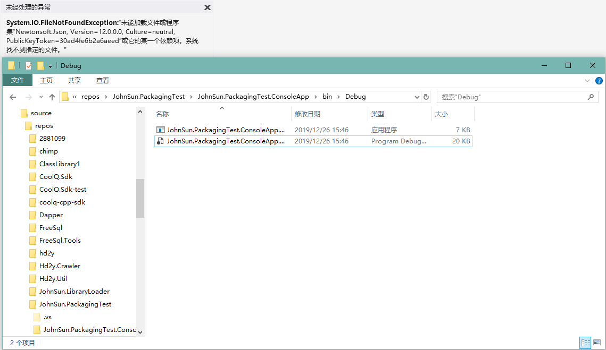

这时我们只需要将程序集打包到程序中，并在程序开始运行时，从资源文件中将程序集加载即可。

**（一）将程序集打包到主程序中**

首先在项目中添加一个 Assets 文件夹，通过查看 `Newtonsoft.Json` 的引用属性查看程序集所在路径，将程序集拷贝到新建的 Assets 文件夹，并设置 `Newtonsoft.Json.dll` 的属性，`复制到输出路径` 设置为 `不复制`；`生成操作` 修改为 `嵌入的资源`。

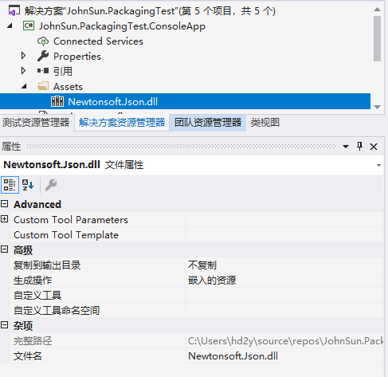

这时，我们可以通过反编译工具查看我们嵌入的资源文件：

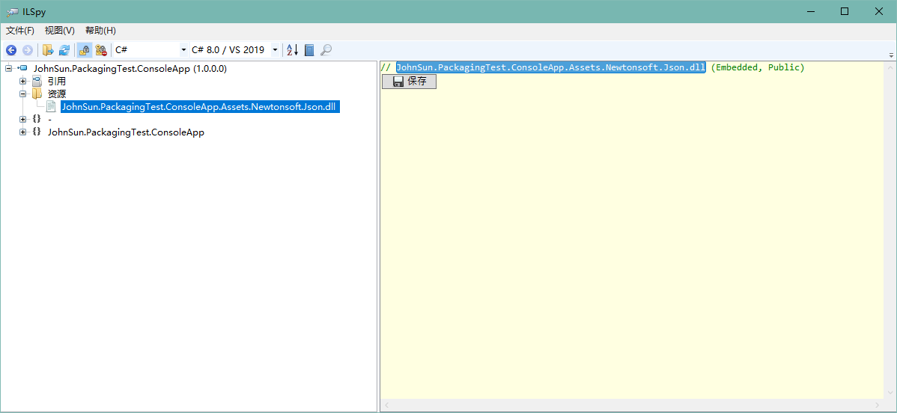

**（二）程序运行时从嵌入资源中加载程序集**

然后我们在程序入口添加静态构造函数，注册 `AssemblyResolve` 事件，使程序集加载失败，我们能正常从嵌入资源中加载。

```csharp
class Program
{
    static Program()
    {
        // 添加静态构造函数 注册程序集解析失败事件 定义从嵌入资源中加载
        AppDomain.CurrentDomain.AssemblyResolve += (sender, args) =>
        {
            if (args.Name.StartsWith("Newtonsoft.Json,"))
            {
                using (Stream stream = typeof(Program).Assembly.GetManifestResourceStream("JohnSun.PackagingTest.ConsoleApp.Assets.Newtonsoft.Json.dll"))
                {
                    byte[] rawAssembly = new byte[stream.Length];
                    stream.Read(rawAssembly, 0, rawAssembly.Length);
                    return Assembly.Load(rawAssembly);
                }
            }
            return null;
        };
    }

    static void Main(string[] args)
    {
        var obj = new { name = "hd2y", gender = "M", hobby = "coding", website = "https://hd2y.net" };
        string json = JsonConvert.SerializeObject(obj);
        Console.WriteLine(json);
        Console.ReadKey();
    }
}
```

这时我们重新运行程序，程序即可正常运行。

### 使用 Fody.Costura

Fody 为我们提供了一个简单的方式，只需要通过 NuGet 引用 `Fody.Costura`，然后生成项目就会自动将程序集打包。

我们可以新创建一个项目 `JohnSun.PackagingTest.FodyCostura` 进行测试，首先使用 NuGet 添加 `Newtonsoft.Json` 与 `Fody.Costura` 的引用。

同样我们修改入口，序列化一个对象，并打印到控制台：

```csharp
class Program
{
    static void Main(string[] args)
    {
        var obj = new { name = "hd2y", gender = "M", hobby = "coding", website = "https://hd2y.net" };
        string json = JsonConvert.SerializeObject(obj);
        Console.WriteLine(json);
        Console.ReadKey();
    }
}
```

我们到生成目录可以查看一下生成的文件，可以看到只有一个文件，我们引用的程序集没有复制到该目录，但是生成的项目可以正常运行：

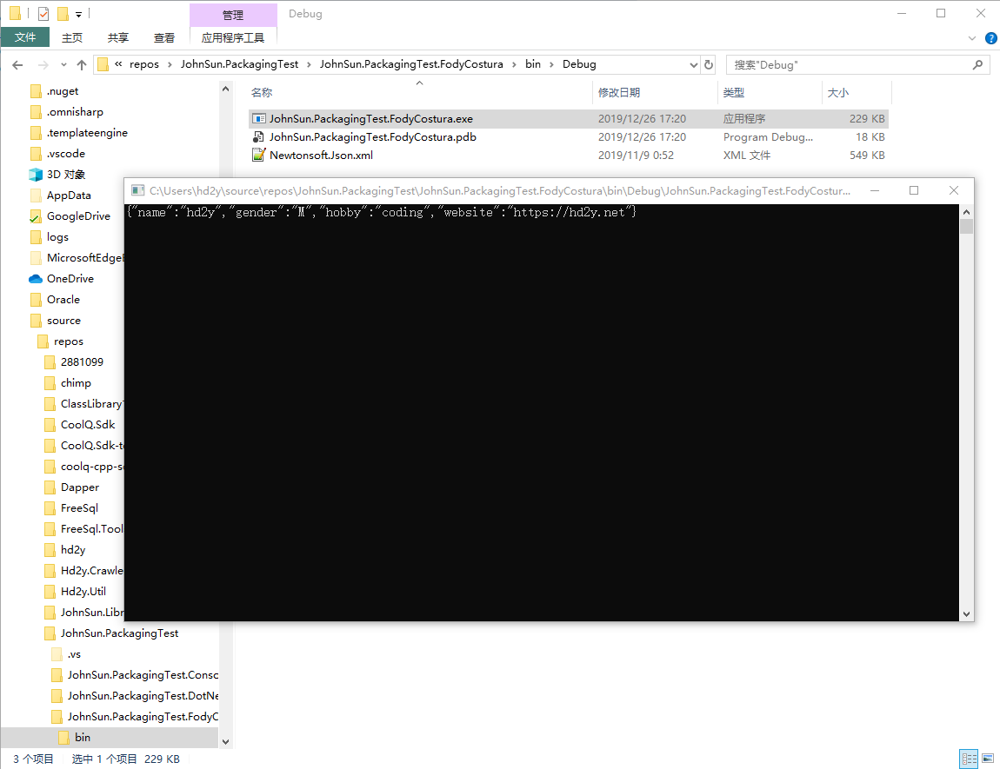

感觉挺神奇的，但是我们同样可以通过反编译，了解具体是怎么实现这个效果的：

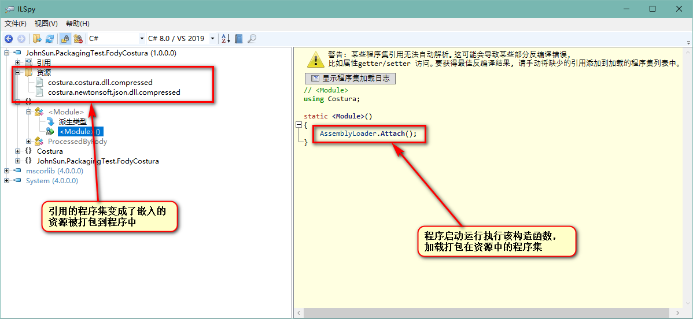

然后我们具体的看一下 `AssemblyLoader` 的代码做什么事情：

```csharp
// Costura.AssemblyLoader
using System;
using System.Collections.Generic;
using System.Globalization;
using System.IO;
using System.IO.Compression;
using System.Reflection;
using System.Runtime.CompilerServices;
using System.Threading;

[CompilerGenerated]
internal static class AssemblyLoader
{
	private static object nullCacheLock = new object();

	private static Dictionary<string, bool> nullCache = new Dictionary<string, bool>();

	private static Dictionary<string, string> assemblyNames = new Dictionary<string, string>();

	private static Dictionary<string, string> symbolNames = new Dictionary<string, string>();

	private static int isAttached;

	private static string CultureToString(CultureInfo culture)
	{
		if (culture == null)
		{
			return "";
		}
		return culture.Name;
	}

	private static Assembly ReadExistingAssembly(AssemblyName name)
	{
		Assembly[] assemblies = AppDomain.CurrentDomain.GetAssemblies();
		foreach (Assembly assembly in assemblies)
		{
			AssemblyName name2 = assembly.GetName();
			if (string.Equals(name2.Name, name.Name, StringComparison.InvariantCultureIgnoreCase) && string.Equals(CultureToString(name2.CultureInfo), CultureToString(name.CultureInfo), StringComparison.InvariantCultureIgnoreCase))
			{
				return assembly;
			}
		}
		return null;
	}

	private static void CopyTo(Stream source, Stream destination)
	{
		byte[] array = new byte[81920];
		int count;
		while ((count = source.Read(array, 0, array.Length)) != 0)
		{
			destination.Write(array, 0, count);
		}
	}

	private static Stream LoadStream(string fullName)
	{
		Assembly executingAssembly = Assembly.GetExecutingAssembly();
		if (fullName.EndsWith(".compressed"))
		{
			using (Stream stream = executingAssembly.GetManifestResourceStream(fullName))
			{
				using (DeflateStream source = new DeflateStream(stream, CompressionMode.Decompress))
				{
					MemoryStream memoryStream = new MemoryStream();
					CopyTo(source, memoryStream);
					memoryStream.Position = 0L;
					return memoryStream;
				}
			}
		}
		return executingAssembly.GetManifestResourceStream(fullName);
	}

	private static Stream LoadStream(Dictionary<string, string> resourceNames, string name)
	{
		if (resourceNames.TryGetValue(name, out string value))
		{
			return LoadStream(value);
		}
		return null;
	}

	private static byte[] ReadStream(Stream stream)
	{
		byte[] array = new byte[stream.Length];
		stream.Read(array, 0, array.Length);
		return array;
	}

	private static Assembly ReadFromEmbeddedResources(Dictionary<string, string> assemblyNames, Dictionary<string, string> symbolNames, AssemblyName requestedAssemblyName)
	{
		string text = requestedAssemblyName.Name.ToLowerInvariant();
		if (requestedAssemblyName.CultureInfo != null && !string.IsNullOrEmpty(requestedAssemblyName.CultureInfo.Name))
		{
			text = requestedAssemblyName.CultureInfo.Name + "." + text;
		}
		byte[] rawAssembly;
		using (Stream stream = LoadStream(assemblyNames, text))
		{
			if (stream == null)
			{
				return null;
			}
			rawAssembly = ReadStream(stream);
		}
		using (Stream stream2 = LoadStream(symbolNames, text))
		{
			if (stream2 != null)
			{
				byte[] rawSymbolStore = ReadStream(stream2);
				return Assembly.Load(rawAssembly, rawSymbolStore);
			}
		}
		return Assembly.Load(rawAssembly);
	}

	public static Assembly ResolveAssembly(object sender, ResolveEventArgs e)
	{
		lock (nullCacheLock)
		{
			if (nullCache.ContainsKey(e.Name))
			{
				return null;
			}
		}
		AssemblyName assemblyName = new AssemblyName(e.Name);
		Assembly assembly = ReadExistingAssembly(assemblyName);
		if (assembly != null)
		{
			return assembly;
		}
		assembly = ReadFromEmbeddedResources(assemblyNames, symbolNames, assemblyName);
		if (assembly == null)
		{
			lock (nullCacheLock)
			{
				nullCache[e.Name] = true;
			}
			if ((assemblyName.Flags & AssemblyNameFlags.Retargetable) != 0)
			{
				assembly = Assembly.Load(assemblyName);
			}
		}
		return assembly;
	}

	static AssemblyLoader()
	{
		assemblyNames.Add("costura", "costura.costura.dll.compressed");
		assemblyNames.Add("newtonsoft.json", "costura.newtonsoft.json.dll.compressed");
	}

	public static void Attach()
	{
		if (Interlocked.Exchange(ref isAttached, 1) != 1)
		{
			AppDomain.CurrentDomain.AssemblyResolve += delegate(object sender, ResolveEventArgs e)
			{
				lock (nullCacheLock)
				{
					if (nullCache.ContainsKey(e.Name))
					{
						return null;
					}
				}
				AssemblyName assemblyName = new AssemblyName(e.Name);
				Assembly assembly = ReadExistingAssembly(assemblyName);
				if (assembly != null)
				{
					return assembly;
				}
				assembly = ReadFromEmbeddedResources(assemblyNames, symbolNames, assemblyName);
				if (assembly == null)
				{
					lock (nullCacheLock)
					{
						nullCache[e.Name] = true;
					}
					if ((assemblyName.Flags & AssemblyNameFlags.Retargetable) != 0)
					{
						assembly = Assembly.Load(assemblyName);
					}
				}
				return assembly;
			};
		}
	}
}
```

实际上也是通过 `AssemblyResolve` 实现了程序集的加载，但是这个过程变成了编译时自动执行。

如果想要手动的指定在什么时候加载资源中的程序集，我们可以添加一个 `FodyWeavers.xml` 文件到项目中：

```xml
<?xml version="1.0" encoding="utf-8"?>
<Weavers></Weavers>
```

这时我们只需要生成，xml 文件的内容会发生变化：

```xml
<?xml version="1.0" encoding="utf-8"?>
<Weavers xmlns:xsi="http://www.w3.org/2001/XMLSchema-instance" xsi:noNamespaceSchemaLocation="FodyWeavers.xsd"></Weavers>
```

因为自动引入了 xsd 文件，我们编辑会 xml 时会有提示，我们可以修改以指定不在模块初始化时加载程序集：

```xml
<?xml version="1.0" encoding="utf-8"?>
<Weavers xmlns:xsi="http://www.w3.org/2001/XMLSchema-instance" xsi:noNamespaceSchemaLocation="FodyWeavers.xsd">
  <Costura LoadAtModuleInit="false" />
</Weavers>
```

这时我们生成项目会报错：

```html
Fody: Costura was not initialized. Make sure LoadAtModuleInit=true or call CosturaUtility.Initialize().	JohnSun.PackagingTest.FodyCostura			
```

从提示可以知道，我们需要通过调用 `CosturaUtility.Initialize()` 方法，手动的指定程序集加载。

```csharp
class Program
{
    static Program()
    {
        CosturaUtility.Initialize();
    }
    static void Main(string[] args)
    {
        var obj = new { name = "hd2y", gender = "M", hobby = "coding", website = "https://hd2y.net" };
        string json = JsonConvert.SerializeObject(obj);
        Console.WriteLine(json);
        Console.ReadKey();
    }
}
```

这时我们就可以顺利通过编译并可以正常的运行项目，但是需要注意的是，我们要将对应代码加在静态构造函数内，确保对象初始化前能够顺利将程序集加载。

实际上 Fody 还有很多有趣的项目，可以到 GitHub 上查看：[https://github.com/Fody](https://github.com/Fody)。

> `.NET Core 3.0` 的新特性已经支持将程序打包成独立可执行文件：[Single-file executables](https://docs.microsoft.com/zh-cn/dotnet/core/whats-new/dotnet-core-3-0#single-file-executables) 

## 打包动态链接库

动态链接库我所知道的使用方法有以下几种：
1. 使用 `Regsvr32` 命令注册动态链接库；
2. 直接将动态链接库放在执行程序所在目录；
3. 使用 `kernel32` 的 `LoadLibrary` 方法动态装载指定目录下的动态链接库；

当然平时偷懒更多是使用第二种方案，既然是要介绍将动态链接库打包，这里自然是要使用第三种动态装载的方案。

另外还有一个优势就是，因为 x86 与 x64 的动态链接库，在创建的 32 或 64 位应用程序时需要注意不能引用错误，如果动态的装载，我们就可以根据程序运行环境选择合适的动态链接库。

> 过去的解决方案是程序属性将生成目标平台修改为 `x86`，因为一般供我们调用的动态链接库也是 Win32 的。这样如果该程序集我们需要应用于网站，部署 IIS 还需要调整应用程序池，并因此还可能产生其他问题，所以不推荐。

### 创建 C++ 动态链接库供测试

如果想要调用，自然先要有一个动态链接库供我们测试，这里直接创建 C++ 的动态链接库项目，修改 `pch.h` 头文件：

```cpp
// pch.h: 这是预编译标头文件。
// 下方列出的文件仅编译一次，提高了将来生成的生成性能。
// 这还将影响 IntelliSense 性能，包括代码完成和许多代码浏览功能。
// 但是，如果此处列出的文件中的任何一个在生成之间有更新，它们全部都将被重新编译。
// 请勿在此处添加要频繁更新的文件，这将使得性能优势无效。

#ifndef PCH_H
#define PCH_H

// 添加要在此处预编译的标头
#include "framework.h"

#endif //PCH_H

//定义宏
#ifdef IMPORT_DLL
#else
#define IMPORT_DLL extern "C" _declspec(dllimport) //指的是允许将其给外部调用
#endif

IMPORT_DLL double Addition(double a, double b);
IMPORT_DLL double Subtraction(double a, double b);
IMPORT_DLL double Multiplication(double a, double b);
IMPORT_DLL double Division(double a, double b);
```

增加对应的源文件 `SimpleMath.cpp`：

```cpp
#include "pch.h"

double Addition(double a, double b)
{
    return a + b;
}

double Subtraction(double a, double b)
{
    return a - b;
}

double Multiplication(double a, double b)
{
    return a * b;
}

double Division(double a, double b)
{
    return a / b;
}
```

直接编译生成即可，但是需要注意的是，C++ 的项目生成出的动态链接库的位置与 C# 程序集的路径不太一样，我这里位置是在解决方案目录内，可以通过项目属性查看与配置。

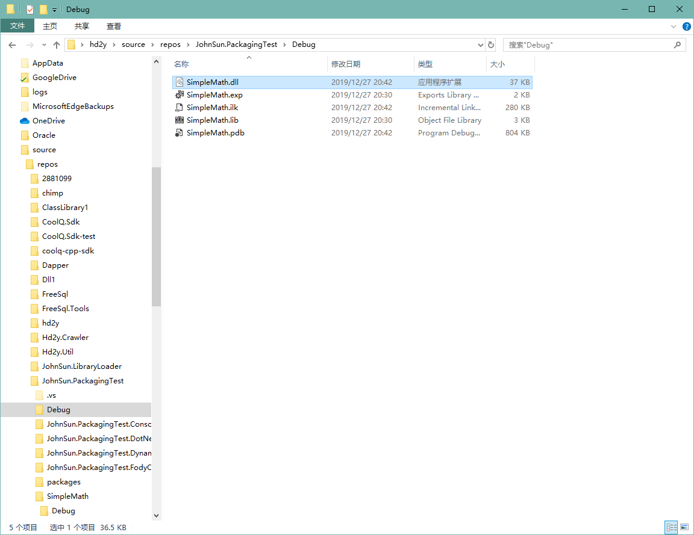

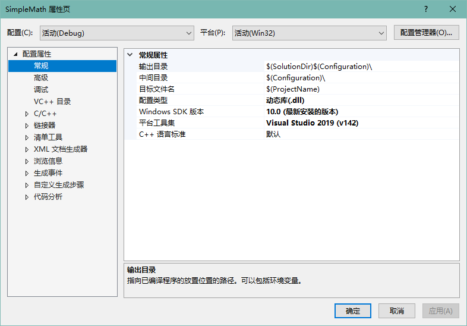

### 常规应用方案

查看 C++ 动态链接库项目属性可以注意到平台为 `活动(Win32)`，所以我们可以将该动态链接库拷贝到我们的运行目录下（这里是调试目录），但是项目无法正常运行。

```csharp
class Program
{
    static void Main(string[] args)
    {
        Console.WriteLine($"开始测试：{(Environment.Is64BitProcess ? "64" : "32")} 位进程");
        int a = 100, b = 20;
        Console.WriteLine($"{a} + {b} = {SimpleMath.Addition(a, b)}");
        Console.WriteLine($"{a} - {b} = {SimpleMath.Subtraction(a, b)}");
        Console.WriteLine($"{a} * {b} = {SimpleMath.Multiplication(a, b)}");
        Console.WriteLine($"{a} / {b} = {SimpleMath.Division(a, b)}");
        Console.ReadKey();
    }
}

public class SimpleMath
{

    [DllImport("SimpleMath", CallingConvention = CallingConvention.Cdecl)]
    public static extern double Addition(double a, double b);
    [DllImport("SimpleMath", CallingConvention = CallingConvention.Cdecl)]
    public static extern double Subtraction(double a, double b);
    [DllImport("SimpleMath", CallingConvention = CallingConvention.Cdecl)]
    public static extern double Multiplication(double a, double b);
    [DllImport("SimpleMath", CallingConvention = CallingConvention.Cdecl)]
    public static extern double Division(double a, double b);
}
```

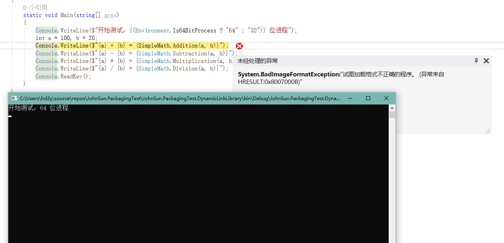

如上图所示，因为我的系统是 64 位，所以默认 Debug 是以 x64 运行，这时我们需要修改我们运行控制台的 `目标平台` 为 x86。

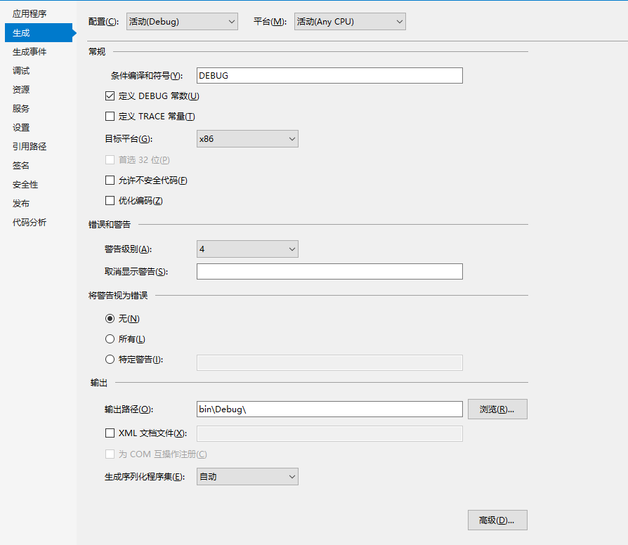

修改完成以后程序即可成功执行：

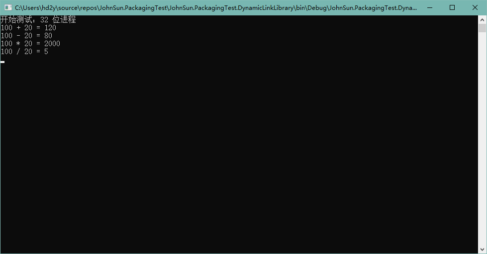

### 解决 x64 无法运行问题

默认 64 位进程无法执行的原因是因为我们没有提供 x64 的动态链接库，当然如果我们需要调用的没有提供 x64 平台的动态链接库，那么问题到这里就已经终止了，那就是没有解决方案，可以跳过以下内容。

如果我们第三方或者我们从网上，找到的一些我们需要使用的动态链接库，同时提供了 x86 和 x64 平台，那么问题就很好解决了。

我们通过批生成，将我们添加的 C++ 动态链接库项目生成出满足我们测试的版本（`VS 菜单栏` -> `生成` -> `批生成` -> `Batch 生成`）：

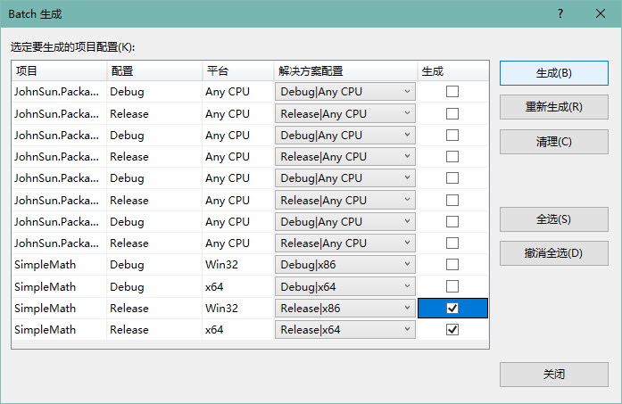

如上图所示，我们选择了 `Release|x86` 与 `Release|x64` 平台的生成，为了方便区分，我们找到生成目录，将原来的动态链接库名称修改，调整为带有目标平台的名称：

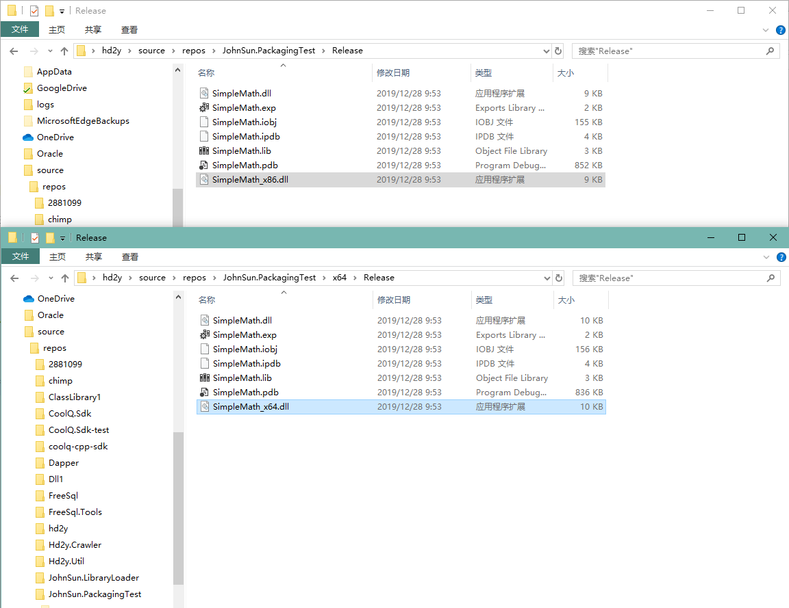

然后我们将动态链接库拷贝到我们的控制台项目中，为了方便测试，将动态链接库文件属性修改：`生成操作` 调整为 `无`，`复制到输出目录` 调整为 `始终复制`。

接下来我们修改项目 `SimpleMath` 的代码，让一份代码能够同时兼容 x86 与 x64 平台：

```csharp
public class SimpleMath
{
    [DllImport("SimpleMath_x86", EntryPoint = "Addition", CallingConvention = CallingConvention.Cdecl)]
    public static extern double Addition_x86(double a, double b);
    [DllImport("SimpleMath_x86", EntryPoint = "Subtraction", CallingConvention = CallingConvention.Cdecl)]
    public static extern double Subtraction_x86(double a, double b);
    [DllImport("SimpleMath_x86", EntryPoint = "Multiplication", CallingConvention = CallingConvention.Cdecl)]
    public static extern double Multiplication_x86(double a, double b);
    [DllImport("SimpleMath_x86", EntryPoint = "Division", CallingConvention = CallingConvention.Cdecl)]
    public static extern double Division_x86(double a, double b);
    [DllImport("SimpleMath_x64", EntryPoint = "Addition", CallingConvention = CallingConvention.Cdecl)]
    public static extern double Addition_x64(double a, double b);
    [DllImport("SimpleMath_x64", EntryPoint = "Subtraction", CallingConvention = CallingConvention.Cdecl)]
    public static extern double Subtraction_x64(double a, double b);
    [DllImport("SimpleMath_x64", EntryPoint = "Multiplication", CallingConvention = CallingConvention.Cdecl)]
    public static extern double Multiplication_x64(double a, double b);
    [DllImport("SimpleMath_x64", EntryPoint = "Division", CallingConvention = CallingConvention.Cdecl)]
    public static extern double Division_x64(double a, double b);

    public static double Addition(double a, double b)
    {
        return Environment.Is64BitProcess
            ? Addition_x64(a, b)
            : Addition_x86(a, b);
    }
    public static double Subtraction(double a, double b)
    {
        return Environment.Is64BitProcess
            ? Subtraction_x64(a, b)
            : Subtraction_x86(a, b);
    }
    public static double Multiplication(double a, double b)
    {
        return Environment.Is64BitProcess
            ? Multiplication_x64(a, b)
            : Multiplication_x86(a, b);
    }
    public static double Division(double a, double b)
    {
        return Environment.Is64BitProcess
            ? Division_x64(a, b)
            : Division_x86(a, b);
    }
}
```

这时再将控制台项目的目标平台修改为 `Any CPU`，我们的程序就不再受动态链接库的影响，无论分发到 64 位或者 32 位的系统上，都可以成功运行。

### 打包动态链接库到程序集

可以将流程归纳为以下几步：
1. 将动态链接库设置为嵌入资源；
2. 运行程序时判断进程是 32 位或 64 位，读取对应的动态链接库将文件写出到一个指定的路径；
3. 使用 LoadLibrary 方法动态加载该程序集；
4. 程序可以自由的调用由动态链接库导出的函数；

首先我们在项目中创建一个 Assets 文件夹，然后将两个动态链接库移动到该文件夹下，并将动态链接库文件的属性设置为 `嵌入的资源`。

然后我们需要从 `kernel32` 导出我们需要的函数：

```csharp
static class Kernel32
{
    [DllImport("kernel32", SetLastError = true)]
    public static extern bool FreeLibrary(IntPtr hModule);

    [DllImport("kernel32", SetLastError = true)]
    public static extern IntPtr LoadLibrary(string filename);
}
```

因我们需要根据执行进程加载动态链接库，那么执行函数时就不再需要判断当前是否位 64 位进程，`SimpleMath` 重新调整为原来的版本。

但是在程序运行时，我们需要将对应需要的文件动态加载，所以需要增加静态构造函数：

```csharp
public class SimpleMath
{
    static SimpleMath()
    {
        // 只支持 Windows 平台
        if (Environment.OSVersion.Platform != PlatformID.Win32NT)
            throw new PlatformNotSupportedException($"Platform {Enum.GetName(typeof(PlatformID), Environment.OSVersion.Platform)} is not supported");

        // 读取资源名以及写出路径
        string resourceName = $"JohnSun.PackagingTest.DynamicLinkLibrary.Assets.SimpleMath_{(Environment.Is64BitProcess ? "x64" : "x86")}.dll";
        string version = $"{System.Reflection.Assembly.GetExecutingAssembly().GetName().Version}_{(Environment.Is64BitProcess ? 64 : 32)}";
        string directory = Path.Combine(Path.GetTempPath(), nameof(SimpleMath), version);
        if (!Directory.Exists(directory))
        {
            Directory.CreateDirectory(directory);
        }
        string fileName = Path.Combine(directory, "SimpleMath.dll");

        // 将需要引用的 dll 文件从资源文件写出
        using (Stream stream = typeof(SimpleMath).Assembly.GetManifestResourceStream(resourceName))
        {
            FileInfo fileInfo = new FileInfo(fileName);
            // 文件如果不存在或文件存在但是文件大小与资源中不一致 重新将文件写出
            if (!fileInfo.Exists || fileInfo.Length != stream.Length)
            {
                byte[] binary = new byte[stream.Length];
                stream.Read(binary, 0, binary.Length);
                File.WriteAllBytes(fileName, binary);
            }
        }

        // 加载写出的文件
        Kernel32.LoadLibrary(fileName);
    }

    [DllImport("SimpleMath", CallingConvention = CallingConvention.Cdecl)]
    public static extern double Addition(double a, double b);
    [DllImport("SimpleMath", CallingConvention = CallingConvention.Cdecl)]
    public static extern double Subtraction(double a, double b);
    [DllImport("SimpleMath", CallingConvention = CallingConvention.Cdecl)]
    public static extern double Multiplication(double a, double b);
    [DllImport("SimpleMath", CallingConvention = CallingConvention.Cdecl)]
    public static extern double Division(double a, double b);
}
```

这时我们重新生成项目并运行，可以看到生成目录下已经不存在引用的动态链接库，但是程序可以正常运行（我们可以通过调试查看动态链接库被写出到什么位置）：

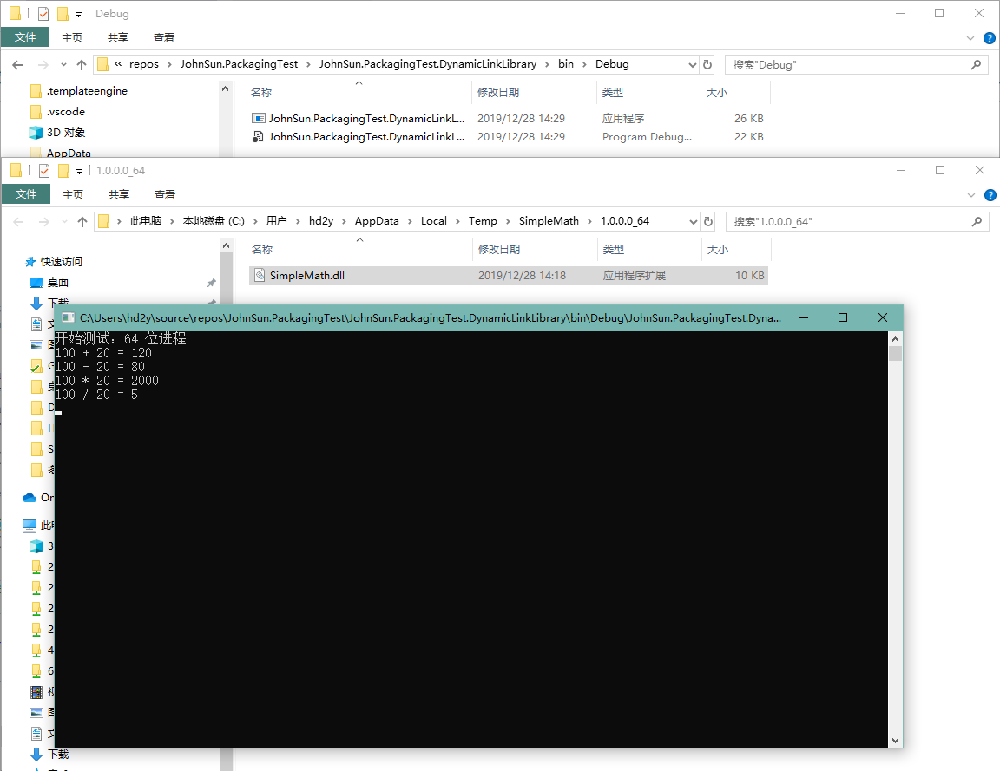

> 注：因为我没有学习过 C++，所以动态链接库打包部分代码学习自 `OpenHtmlToPdf` 开源项目，能够学习到那么多优秀的解决方案，真的要感谢开源社区的大佬们 o(*￣▽￣*)ブ。

> 参考：
> - MSDN：[AppDomain.AssemblyResolve 事件](https://docs.microsoft.com/zh-cn/dotnet/api/system.appdomain.assemblyresolve?view=netframework-4.8)
> - GitHub：[Fody/Costura](https://github.com/Fody/Costura)
> - GitHub：[vilppu/OpenHtmlToPdf](https://github.com/vilppu/OpenHtmlToPdf)
