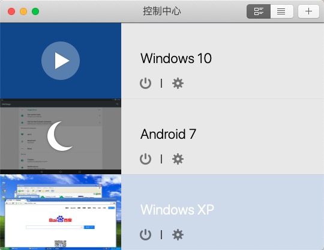

---
title: "MacOS 安装 Windows XP SP3 测试环境"
date: "2019/12/28 13:34:24"
updated: "2019/12/28 13:34:24"
permalink: "macos-installation-windows-xp-sp3-test-environment/"
tags:
 - Windows XP
 - 虚拟机
categories:
 - [操作系统, MacOS]
---

因为需要做一些兼容性的测试，所以干脆装一个虚拟机，但是有些资料整理以下，方便下次安装的时候查找。

## 虚拟机安装环境

这里使用 Parallels Desktop 安装虚拟环境。

可以打开 Parallels Link 来执行安装。



## 安装

其实都是简单的下一步下一步……所以过程不赘述。

这里整理一下安装过程中以及安装以后要使用的一些资料和软件：

首先是镜像，我这里使用的是：`zh-hans_windows_xp_professional_with_service_pack_3_x86_cd_x14-80404.iso`

```html
文件名：zh-hans_windows_xp_professional_with_service_pack_3_x86_cd_x14-80404.iso
SHA1：69DBF131116760932DCF132ADE111D6B45778098
文件大小：601.04MB
发布时间：2008-05-01
ed2k://|file|zh-hans_windows_xp_professional_with_service_pack_3_x86_cd_x14-80404.iso|630239232|CD0900AFA058ACB6345761969CBCBFF4|/
```

然后是安装许可密钥：

```html
JBJ9Q-JJG2C-DHY68-4K3VR-VX9VD
PJW84-XPMBK-P7GDG-6YBCT-2PK86
DKPHR-9PKW2-KJ6XV-BVKVW-FQ968
TCV4Y-BW62X-QQJPJ-HTXQW-KKMT3
MC4XD-VDY8T-2G9H7-4TM46-69G4M
DCJY7-2QMTB-4RBMQ-TJC9M-RY83T
VTPRF-689V6-8HY4R-XPBGH-6QR9J
HD9R6-2X672-2JJ92-64Y39-9BWPJ
B2FTG-96RH6-72W72-WXKTB-G42R6
PJYB2-QWBC4-TDFWD-WY36Q-H7DRY
BQXJ6-2V339-4M72J-66QMP-M3WDY
MVWCG-T8K4C-82Q4F-7RWPP-2DQ2Q
RRWFH-HYG6J-86XXD-87PWC-DXXWB
MK96F-X47MK-M92HP-F2QDM-CWRDY
W48J6-QJQWY-FB7HM-CB69Y-T8VKW
MPW9P-HY3P8-C6HF6-JBK73-B447Q
PJ9PH-DP2YM-RGV33-R8KFX-9XY4W
W4CY9-KKBT9-RHKF3-C63V3-B2CRD
HDP88-DQP2V-PWDWG-Y4XB6-WXJ98
C3XFT-C98TR-P34TC-TCQKJ-CQPVG
HCGVJ-TFPQJ-HQKPV-9X7HP-T8B3G
WFW8Q-W7RXQ-YHBFH-DDQD8-2XMVY
WKFVB-4BP36-69PM4-C4TM8-VPFM8
JKCPF-2FJHW-4VCK2-27B7Q-9TVVG
C2VKV-BQVXR-GHG7M-6HY6H-QXWQ3
KF9F6-TYWTC-KBXXD-PCXRV-V2T3Q
JTQV9-FG9PX-48GRV-P2H44-C6TG3
QTQMJ-DDD7P-YCGVC-GFBRD-GT2VW
MK6P8-X4PBQ-PKFV9-D277P-CC63B
P224M-2WMK8-B3HMT-6YDP2-DPVKM
HB8KM-WH7VG-H93QD-G3747-DTVMY
K89TK-9X6FR-TK6D7-QXJ79-D8RCJ
QJ769-JYMMM-F97YH-BKCJP-2BQ2T
JTWPD-3CPKB-HXRQ8-DXRWK-7VVXY
XJY7Q-9Y6TT-QP3W8-CF89G-RR9XD
KTXCY-44H4W-K8H4D-DXFGC-K46YB
F268D-F3CHM-R26GV-JRFCW-PR37D
```

建议安装的 SDK 和软件：
- Win XP Activator：激活工具
- 7z：压缩文件管理工具
- Chrome：安装最后一个支持 XP 的版本
- `.NET Framework 3.5`：唯一能向下兼容的 dotnet 版本
- `.NET Framework 4.0`：Windows XP 上 dotnet 最后一个支持的版本
- 补丁 `NDP40-KB2468871-v2-x86`：使用 `Microsoft.Bcl.Async` 以使 dotnet40 支持 `async/await`
- Notepad++：文本编辑器
- Fiddler 4：HTTP 抓包工具

## 下载

百度网盘：[https://pan.baidu.com/s/13ITHYapvSaberzPQ1wl75A](https://pan.baidu.com/s/13ITHYapvSaberzPQ1wl75A)  密码：`cqgc`


