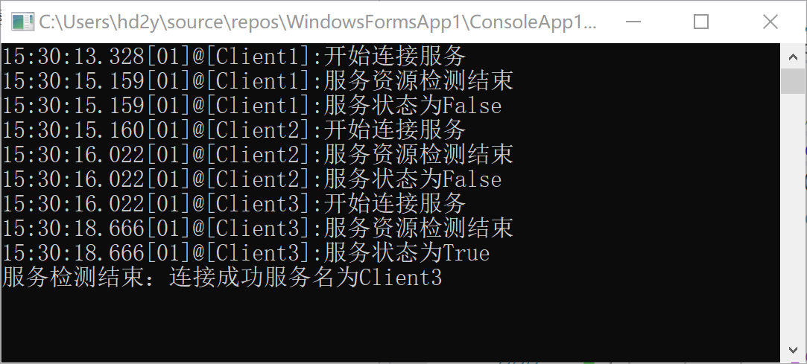

---
title: "多线程检测可用的 Web 服务"
date: "2020/01/30 14:18:54"
updated: "2020/01/30 14:51:07"
permalink: "multithread-detection-of-available-web-services/"
tags:
 - 多线程 
 - WCF
 - WebService
categories:
 - [开发, C#]
---

在日常开发中，各个系统之间进行通信，用的比较多的还是 HTTP 协议，其中 WebService 服务也是我最常用的。

因为正常我们会配置多台 Web 服务器，所以为了确保调用的服务一直是正常的状态，我们需要在服务不可用的时候，自动的将服务切换到正常的 Web 服务器上。

> 注：内容主要是以 WebService 进行举例，如果使用其他的通信方案，例如 WCF、Web Api 等等，其实也是一样的。

## 服务连接

因为搭建服务做这个测试相对繁琐，如果对 WebService 服务使用有疑问，可以看我的 SOA 系列文章中的：[
SOA —— WebService 知识点总结](/archives/soa-web-service-knowledge-summary)。

而且其实服务可用的检测，除可以 HTTP 请求通过外，其关联的其他服务例如数据库资源等也需要检测，我一般是添加一个 HelloWorld 方法，供客户端建立 SoapClient 以后调用。

这里仅仅使用以下伪代码，来模拟这个过程：

```csharp
/// <summary>
/// 服务客户端
/// </summary>
public class SoapClient
{
    /// <summary>
    /// 初始化客户端（伪）
    /// </summary>
    /// <param name="name"></param>
    public SoapClient(string name)
    {
        Name = name;
    }

    /// <summary>
    /// 当前客户端名称
    /// </summary>
    public string Name { get; set; }

    private static Random Random = new Random();
    
    /// <summary>
    /// 检测服务状态
    /// </summary>
    /// <returns>服务是否可用</returns>
    public bool HelloWorld()
    {
        // 随机休眠线程 模仿服务资源检测
        Console.WriteLine($"{DateTime.Now:HH:mm:ss.fff}[{Thread.CurrentThread.ManagedThreadId:00}]@[{Name}]:开始连接服务");
        Thread.Sleep(Random.Next(500,5000));
        Console.WriteLine($"{DateTime.Now:HH:mm:ss.fff}[{Thread.CurrentThread.ManagedThreadId:00}]@[{Name}]:服务资源检测结束");

        // 随机确认客户端连接状态
        bool result = Random.NextDouble() > 0.3;
        Console.WriteLine($"{DateTime.Now:HH:mm:ss.fff}[{Thread.CurrentThread.ManagedThreadId:00}]@[{Name}]:服务状态为{result}");
        return result;
    }
}
```

运行检测效果：

```csharp
SoapClient client = new SoapClient("Test");
client.HelloWorld();
```

## 多个服务端

如果只有一个服务端，供我们连接，那其实无论创建多少个客户端其实都没有意义，所以我们这个方案主要是针对存在多个 Web 客户端，针对每个服务端初始化一个客户端进行连接，测试服务状态。

以下的代码，我们会模拟存在 5 台 Web 服务器，需要初始化 5 个客户端，分别测试连接状态，确认客户端建立的连接是否可用。

因为服务器所执行的业务是相同的，只需要一台服务器连接建立成功，即可返回。

不考虑多线程，我们一般可以使用如下代码进行测试：

```csharp
string[] clientNames = new string[] { "Client1", "Client2", "Client3", "Client4", "Client5" };

SoapClient client = null;
for (int i = 0; i < clientNames.Length; i++)
{
    SoapClient testClient = new SoapClient(clientNames[i]);
    if (testClient.HelloWorld())
    {
        client = testClient;
        break;
    }
}
Console.WriteLine("服务检测结束：连接{0}{1}", client == null ? "失败" : "成功", string.IsNullOrEmpty(client?.Name) ? "" : $"服务名为{client.Name}");
```



这里存在的问题自然是检测返回可用服务可能会很慢，排在前面的服务如果不可用，将会长时间等待。

### 多线程建立连接

为解决单线程下，排列在前的不可用服务较多，影响服务连接速度，我们调整代码为多线程：

```csharp
string[] clientNames = new string[] { "Client1", "Client2", "Client3", "Client4", "Client5" };

List<Task<SoapClient>> clients = new List<Task<SoapClient>>();
for (int i = 0; i < clientNames.Length; i++)
{
    string name = clientNames[i];
    clients.Add(Task.Factory.StartNew(() =>
    {
        SoapClient client = new SoapClient(name);
        bool connResult = client.HelloWorld();
        return connResult ? client : null;
    }));
}

// 等待所有异步任务执行完成 打印可用的服务
Task.WaitAll(clients.ToArray());
clients.ForEach(client =>
{
    if (client.Result != null)
        Console.WriteLine($"检测到可用服务：{client.Result.Name}");
});
```

运行代码得到以下结果：


好像这样已经解决了我们前文提到的问题，通过异步建立服务连接，检测可用的服务。

但是其实以上例子并不是合理的方案，因为如果第一个服务是可用的，理论上我们很快就可以建立连接，返回可用的连接供程序使用。

但是以上多线程的版本，需要等待所有的连接都测试后，才会返回结果，如果后续的连接有错误，检测耗时较长，反而影响了这个过程的执行效率。

## 多线程建立连接进阶

解决上述多线程连接的问题其实很简单，前文提到 `WaitAll` 会等待所有的任务执行完成。但是其实我们还有一个 `WaitAny` 方法可以使用，该方法是任务队列中任意任务执行完成后返回。

那么我们可以将以上代码进行如下调整：

```csharp
string[] clientNames = new string[] { "Client1", "Client2", "Client3", "Client4", "Client5" };

List<Task<SoapClient>> clients = new List<Task<SoapClient>>();
for (int i = 0; i < clientNames.Length; i++)
{
    string name = clientNames[i];
    clients.Add(Task.Factory.StartNew(() =>
    {
        SoapClient client = new SoapClient(name);
        bool connResult = client.HelloWorld();
        return connResult ? client : null;
    }));
}

// 等待任意任务执行完成，获取执行完成的任务返回
int index;
do
{
    index = Task.WaitAny(clients.ToArray());
    if (clients[index].Result != null)
    {
        Console.WriteLine($"检测到可用服务：{clients[index].Result.Name}");
        break;
    }
    else
    {
        Console.WriteLine($"检测到一个不可用的服务。");
        clients.RemoveAt(index);
    }
} while (clients.Count > 0);
```

执行效果如下，可以看到我们可以快速的获取到可用的服务以便供客户端使用。


## 多线程建立连接优化

接下来，我们还需要对以上代码进行优化，主要是在检测到可用服务以后，其他的检测任务就没必要再继续执行了，我们可以使用 Token 取消任务的执行。

但是这里我们就需要对之前用于服务连接的伪代码进行调整，主要是因为 `Thread.Sleep()` 方法是不可取消的，我们使用 `CancellationToken` 对执行该方法的代码进行标记，取消时将没有效果。

例如以下代码：

```csharp
// 开始的示例使用 .NET Framework 4.0 框架
using (CancellationTokenSource source = new CancellationTokenSource())
{
    Task task = Task.Factory.StartNew(() =>
    {
        Console.WriteLine("任务开始执行，需要等待 5 秒钟。");
        Thread.Sleep(5000);
        Console.WriteLine("任务执行结束。");
    }, source.Token);

    Thread.Sleep(1000);
    source.Cancel();
    task.Wait();
}
```

该段代码仍然会正常执行，并打印“任务执行结束”。

我们需要的效果应该是，当执行 `task.Wait()` 方法时，如果任务被取消，抛出 `TaskCanceledException` 异常，控制台无法打印出“任务执行结束”。

所以我们需要将 `Thread.Sleep()` 方法，调整为可取消的 `Task.Delay()` 方法。

```csharp
// Task.Delay() 为 .NET Framework 4.5 框架的方法
using (CancellationTokenSource source = new CancellationTokenSource())
{
    Task task = Task.Run(() =>
    {
        Console.WriteLine("任务开始执行，需要等待 5 秒钟。");
        Task.Delay(5000).Wait(source.Token);
        Console.WriteLine("任务执行结束。");
    }, source.Token);

    Thread.Sleep(1000);
    source.Cancel();
    try
    {
        task.Wait();
    }
    catch (AggregateException ae)
    {
        foreach (Exception e in ae.InnerExceptions)
        {
            if (e is TaskCanceledException)
                Console.WriteLine("执行的任务被取消！");
            else
                Console.WriteLine("其他异常：" + e.GetType().Name);
        }
    }
}
```

基于此我们需要调整我们 `SoapClient` 中的 `HelloWorld` 方法：

```csharp
/// <summary>
/// 检测服务状态
/// </summary>
/// <returns>服务是否可用</returns>
public bool HelloWorld(CancellationToken cancellationToken)
{
    // 随机休眠线程 模仿服务资源检测
    Console.WriteLine($"{DateTime.Now:HH:mm:ss.fff}[{Thread.CurrentThread.ManagedThreadId:00}]@[{Name}]:开始连接服务");
    Task.Delay(Random.Next(500, 5000)).Wait(cancellationToken);
    Console.WriteLine($"{DateTime.Now:HH:mm:ss.fff}[{Thread.CurrentThread.ManagedThreadId:00}]@[{Name}]:服务资源检测结束");

    // 随机确认客户端连接状态
    bool result = Random.NextDouble() > 0.3;
    Console.WriteLine($"{DateTime.Now:HH:mm:ss.fff}[{Thread.CurrentThread.ManagedThreadId:00}]@[{Name}]:服务状态为{result}");
    return result;
}
```

那么测试连接的代码段则如下：

```csharp
string[] clientNames = new string[] { "Client1", "Client2", "Client3", "Client4", "Client5" };

List<Task<SoapClient>> tasks = new List<Task<SoapClient>>();
using (var cancelTokenSource = new CancellationTokenSource())
{
    for (int i = 0; i < clientNames.Length; i++)
    {
        string name = clientNames[i];
        tasks.Add(Task.Factory.StartNew(() =>
        {
            SoapClient client = new SoapClient(name);
            bool connResult = client.HelloWorld(cancelTokenSource.Token);
            return connResult ? client : null;
        }, cancelTokenSource.Token));
    }

    // 等待任意任务执行完成，获取执行完成的任务返回
    int index;
    do
    {
        index = Task.WaitAny(tasks.ToArray());
        if (tasks[index].Result != null)
        {
            cancelTokenSource.Cancel();
            Console.WriteLine($"检测到可用服务：{tasks[index].Result.Name}，取消其他测试任务的执行");
            break;
        }
        else
        {
            Console.WriteLine($"检测到一个不可用的服务。");
            tasks[index].Dispose();
            tasks.RemoveAt(index);
        }
    } while (tasks.Count > 0);

    // 等待所有任务执行结束
    try
    {
        Task.WaitAll(tasks.ToArray());
    }
    catch (AggregateException ae)
    {
        foreach (Exception e in ae.InnerExceptions)
        {
            if (e is TaskCanceledException)
                Console.WriteLine("执行的任务被取消！");
            else
                Console.WriteLine("其他异常：" + e.GetType().Name);
        }
    }
}
```

执行效果如下：


## WebService 服务检测方法

基于以上内容的测试，我们可以尝试建立一个 `LISWebServiceSoapClient` 的 WebService 客户端，用于与服务器进行通信，该方法内容如下：

```csharp
/// <summary>
/// 尝试建立服务连接
/// </summary>
/// <param name="urls">服务地址</param>
/// <returns>是否成功与服务建立连接</returns>
protected virtual LISWebServiceSoapClient TryConnectService(string[] urls)
{
    if (urls == null)
        throw new ArgumentNullException("服务地址不能为空", nameof(urls));
    if (urls.Length == 0)
        throw new ArgumentException("服务地址没有内容", nameof(urls));

    LISWebServiceSoapClient client = null;
    // 异步检查可用连接提高查询速度
    List<Task<LISWebServiceSoapClient>> tasks = new List<Task<LISWebServiceSoapClient>>();
    using (CancellationTokenSource source = new CancellationTokenSource())
    {
        for (int i = 0; i < urls.Length; i++)
        {
            string url = urls[i];
            tasks.Add(Task.Factory.StartNew(() =>
            {
                // 使用配置项初始化服务 并尝试调用测试连接的方法
                LISWebServiceSoapClient current = new LISWebServiceSoapClient(new BasicHttpBinding(), new EndpointAddress(url));
                current.HelloWorld();
                return current;
            }, source.Token));
        }

        // 等待任务返回 设置超时时间为 15s
        for (int i = 0; i < tasks.Count; i++)
        {
            int index = Task.WaitAny(tasks.ToArray(), 15000);

            // 超时
            if (index == -1) break;

            // 获取成功初始化的任务
            if (index > -1 && tasks[index].Status == TaskStatus.RanToCompletion)
            {
                // 有返回就取消其他任务
                source.Cancel();
                client = tasks[index].Result;
                break;
            }

            // 非成功初始化的从集合中移除
            tasks.RemoveAt(index);
        }
    }

    return client;
}
```

> 参考：
> + MSDN：[CancellationTokenSource 类](https://docs.microsoft.com/zh-cn/dotnet/api/system.threading.cancellationtokensource?view=netframework-4.8)
> + MSDN：[Task.Delay 方法](https://docs.microsoft.com/zh-cn/dotnet/api/system.threading.tasks.task.delay?view=netframework-4.8)
