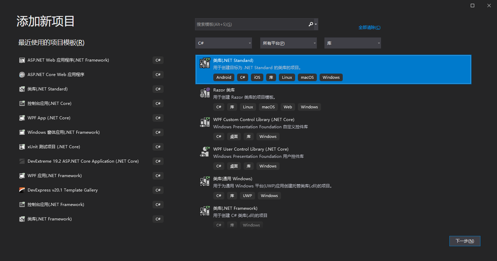
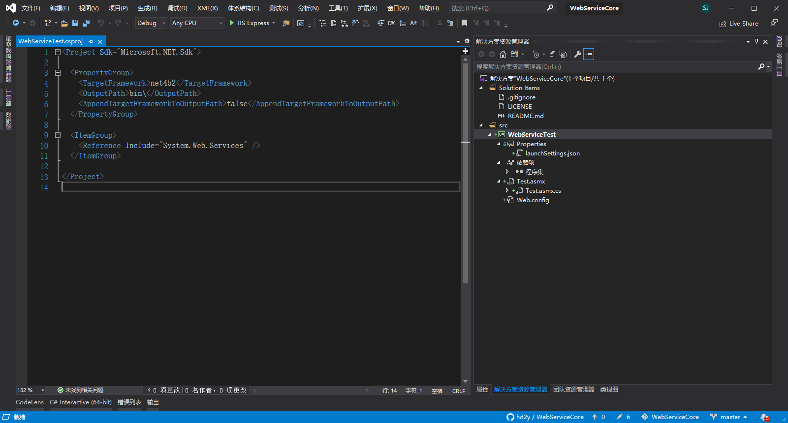
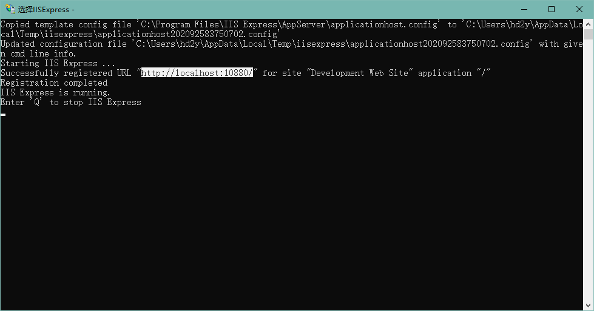
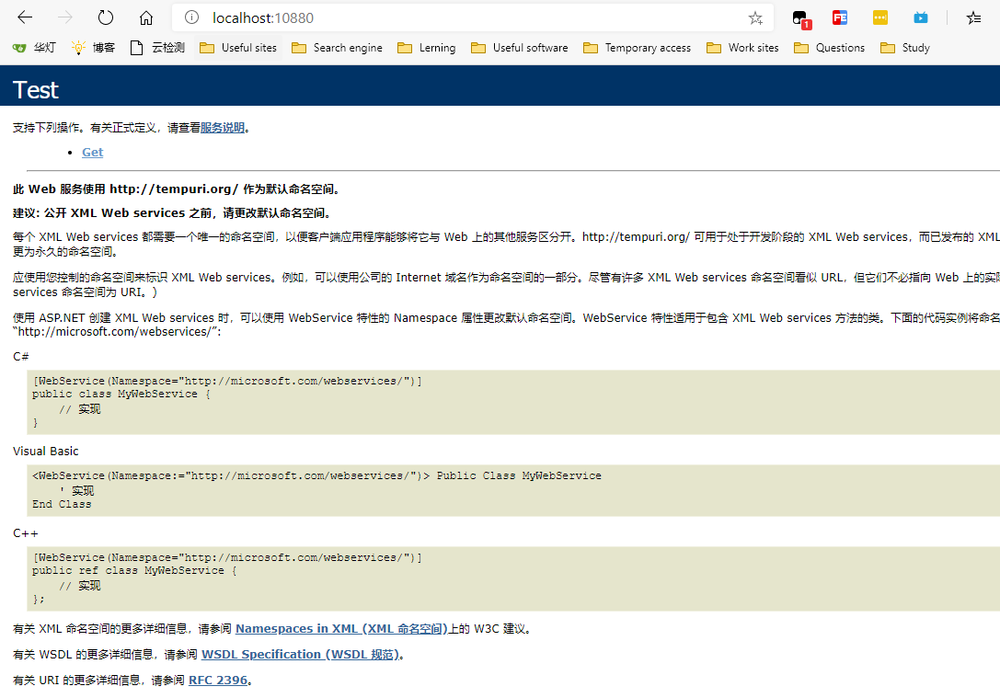
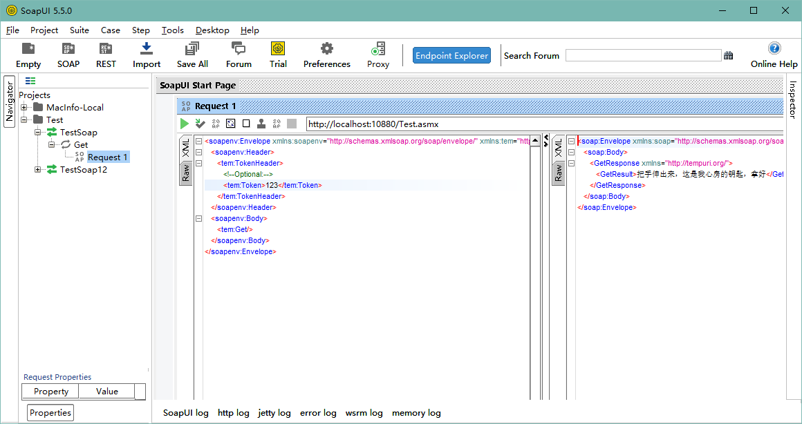

---
title: "迁移 Web Service 项目到 .NET Core"
date: "2020/09/25 17:59:53"
updated: "2020/09/25 18:27:57"
permalink: "dotnet-core-migration-web-service/"
tags:
 - WebService
 - WebApi
categories:
 - [开发, C#, "ASP.NET Core"]
---

目前公司产品由 `.NET Framework` 升级到 `.NET Core` 过程中，因一部分对内或对外界接口使用的是 `Web Service`。

为了保证这些接口在升级后正常提供服务，开始考虑过使用 [SoapCore](https://github.com/DigDes/SoapCore) 对这些接口进行实现。

但是尝试之后发现 `SoapHeader` 问题不好解决，所以暂时放弃将 `Web Service` 迁移到 `.NET Core`，而是将 `Web Service` 进行独立部署。

最终开发时决定使用的方案有以下两种：
1. “类库” 的目标框架调整为可供 `.NET Framework` 使用的 SDK，例如 `netstandard2.0`（使用 TargetFrameworks 指定多个依赖项也可），方便托管 Web Service 的 `ASP.NET Web` 网站使用；
2. `.NET Core` 中提供 `Web API` 接口，`Web Service` 的项目内不涉及具体业务，将请求转发到 `.NET Core` 的项目中处理。

> 考虑到如果采用方案一，每次发布要发布两套程序，即 `.NET Core` 与 `ASP.NET Web`，并且使用 `Web Service` 转发消息产生的延迟可以接受，所以最终采用方案二来进行实现。

接下来的内容最好了解一下 `*.csproj` 项目文件，可以参考：[理解 C# 项目 csproj 文件格式的本质和编译流程](https://blog.walterlv.com/post/understand-the-csproj.html)

## 创建项目并编辑项目文件

首先我们需要创建一个 `.NET Standard` 的类库项目：



创建以后需要编辑我们的 `csproj` 项目文件，内容如下：

```xml
<Project Sdk="Microsoft.NET.Sdk">

  <PropertyGroup>
    <TargetFramework>net452</TargetFramework>
    <OutputPath>bin\</OutputPath>
    <AppendTargetFrameworkToOutputPath>false</AppendTargetFrameworkToOutputPath>
  </PropertyGroup>

  <ItemGroup>
    <Reference Include="System.Web.Services" />
  </ItemGroup>

</Project>
```

配置文件中我们做了这些事情：
+ TargetFramework：指定目标框架为 `.NET Framework 4.5.2`；
+ OutputPath：指定了生成文件的目录；
+ AppendTargetFrameworkToOutputPath：指定不附加目标框架到生成目录，不指定目录会是 `bin\net452\*`；
+ Reference：添加了 `Web Service` 所依赖的程序集；

关于 `TargetFramework` 可以参考文档：[.NET Standard](https://docs.microsoft.com/en-us/dotnet/standard/net-standard)

## 增加 Web Service 文件

`Test.asmx` 文件内容：

```cshtml
<%@ WebService Language="C#" CodeBehind="Test.asmx.cs" Class="WebServiceTest.Test" %>
```

`Test.asmx.cs` 文件内容：

```csharp
using System.Net;
using System.Text;
using System.Web.Services;
using System.Web.Services.Protocols;

namespace WebServiceTest
{
    [WebService(Namespace = "http://tempuri.org/")]
    [WebServiceBinding(ConformsTo = WsiProfiles.BasicProfile1_1)]
    [System.ComponentModel.ToolboxItem(false)]
    public class Test : System.Web.Services.WebService
    {
        public TokenHeader TokenHeader { get; set; }

        [WebMethod]
        [SoapHeader("TokenHeader")]
        public string Get()
        {
            if (TokenHeader == null || TokenHeader.Token != "123")
            {
                return "Error";
            }
            else
            {
                using (WebClient client = new WebClient())
                {
                    var data = client.DownloadData("https://api.lovelive.tools/api/SweetNothings");
                    return Encoding.UTF8.GetString(data);
                }
            }
        }
    }

    public class TokenHeader : SoapHeader
    {
        public string Token { get; set; }
    }
}
```

以上 `Web Service` 添加了一个简单的 `Get` 方法，当请求该方法并传入了正确的 `token`，服务将转发请求到 `Web API`，并将结果返回。

> 可以直接从其他项目拷贝，因为没有模板，从项目中添加会稍麻烦一些。

## 添加 Web.config 文件

了解 `ASP.NET MVC` 的大佬们对这个配置文件应该都很熟悉：

```xml
<?xml version="1.0"?>
<configuration>
  <system.webServer>
    <defaultDocument>
      <files>
        <add value="Test.asmx"/>
      </files>
    </defaultDocument>
  </system.webServer>
  <system.web>
    <compilation debug="true" targetFramework="4.5.2"/>
    <httpRuntime targetFramework="4.5.2"/>
  </system.web>
</configuration>
```

稍稍调整了网站的默认文档为我们刚刚添加的 Web Service 服务，避免请求根目录出现 400 错误。

## 增加用于调试的配置文件

项目中增加 `Properties` 文件夹，并创建 `launchSetting.json` 文件，内容如下：

```json
{
  "iisSettings": {
    "windowsAuthentication": false,
    "anonymousAuthentication": true,
    "iisExpress": {
      "applicationUrl": "http://localhost:10880/",
      "sslPort": 0
    }
  },
  "profiles": {
    "IIS Express": {
      "commandName": "Executable",
      "executablePath": "C:\\Program Files\\IIS Express\\iisexpress.exe",
      "commandLineArgs": "/path:\"$(SolutionDir)src\\$(ProjectName)\" /port:10880",
      "launchBrowser": true,
      "launchUrl": "/",
      "environmentVariables": {
        "ASPNETCORE_ENVIRONMENT": "Development"
      }
    }
  }
}
```

该部分内容指定了 IIS Express 进行调试，因为我的解决方案中，Web 项目放在 `src` 文件夹下，所以命令行参数路径中加了 `src`，实际可能要根据自己的项目进行调整。

IIS Express 的命令行参数可以参考文档：[Running IIS Express from the Command Line](https://docs.microsoft.com/en-us/iis/extensions/using-iis-express/running-iis-express-from-the-command-line)

> 不是必须添加这个文件，发布到 IIS，通过附加到 `w3wp` 进程的方式进行调试也是可以的。

至此，托管了一个 Web Service 服务的网站项目就完成了：



## 测试

如果一切准备就绪后，无法正常运行调试，可能需要重启一下 VS。

正常开启调试以后，会弹出命令行：



这时我们在浏览器中可以通过 [http://localhost:10880/Test.asmx](http://localhost:10880/Test.asmx) 正常访问。



而通过 Soap UI 测试，Web Service 也可以正常的运行。



至此，这篇文章正文就结束了，虽然没有解决 `Web Service` 的迁移问题，但是也给大家提供了一个解决思路，希望对大家能有所帮助。

源码已经提交到 github：[https://github.com/hd2y/WebServiceCore](https://github.com/hd2y/WebServiceCore)

而接下来会出一篇使用将 `ASP.NET MVC` 的项目迁移到 `Microsoft.NET.Sdk` 的避坑说明。

虽然有些老项目不能快速迁移到 `ASP.NET Core MVC`，但是使用 `.NET Core SDK` 风格管理项目还是很香的。
