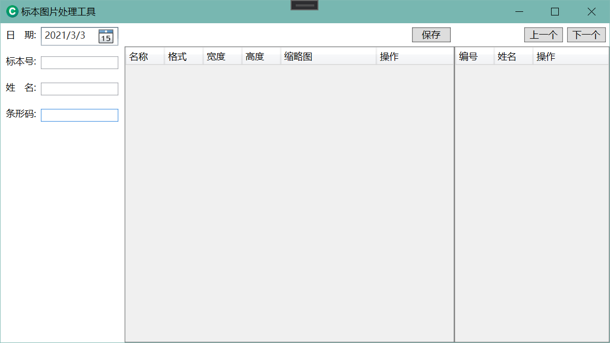
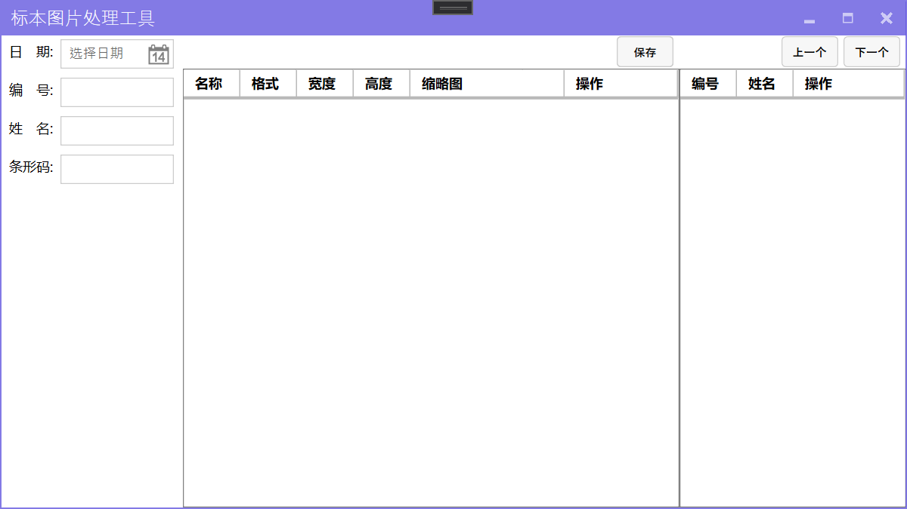
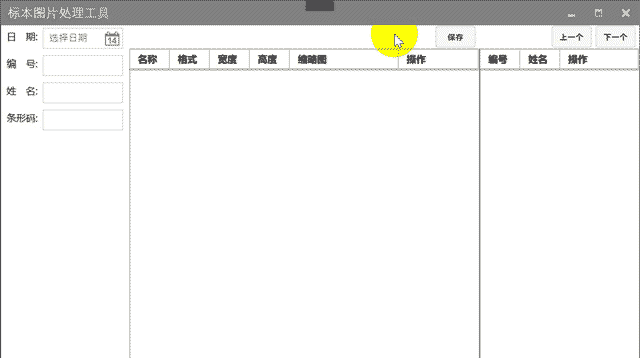
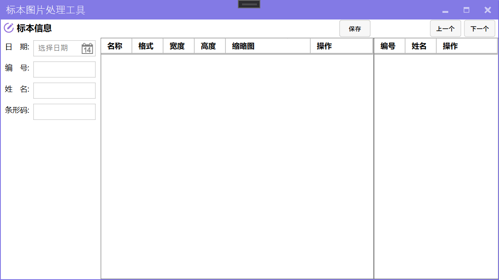

---
title: "WPF 系列教程：使用 MahApps.Metro 控件库"
date: "2020/04/04 19:32:43"
updated: "2020/04/04 19:34:23"
permalink: "wpf-tutorials-using-the-mahapps-metro-control-library/"
tags:
 - MahApps.Metro
 - UI
categories:
 - [开发, C#, WPF]
---

## 前言

近期需要开发一个编辑图片的小工具，所以借此机会继续补充一下之前的 `WPF` 教程。

后续内容只涉及几个常用库的使用，快速完成程序的开发以及打包发布，内容不会涉及底层的实现原理。

本次主要介绍使用 `MahApps.Metro` 控件库来美化程序。

## 创建项目

需要参考 [WPF 系列教程：从 WPF (.NET Core) 开始](/wpf-series-of-tutorials-from-wpf-dotnet-core-commencement/) 创建一个 WPF 的项目。

需要注意的是，要根据用户的使用场景来选择 `.NET Framework` 版本，我这里用户系统为 `Windows 7`，所以选择了 `.NET Framework 4.0`。

项目文件内容如下：

```xml
<Project Sdk="Microsoft.NET.Sdk.WindowsDesktop">

  <PropertyGroup>
    <OutputType>WinExe</OutputType>
    <TargetFrameworks>net40;net452</TargetFrameworks>
    <UseWPF>true</UseWPF>
    <ApplicationIcon>Resources\NotifyIconConnected.ico</ApplicationIcon>
    <ApplicationManifest>app.manifest</ApplicationManifest>
    <Platforms>AnyCPU;x86</Platforms>
  </PropertyGroup>

  <PropertyGroup Condition="'$(Configuration)|$(Platform)'=='Debug|AnyCPU'">
    <PlatformTarget>x86</PlatformTarget>
  </PropertyGroup>

  <ItemGroup>
    <Resource Include="Resources\HostStopped.png" />
    <Resource Include="Resources\HostStarted.png" />
    <Resource Include="Resources\NotifyIconConnected.ico" />
    <Resource Include="Resources\NotifyIconDisconnected.ico" />
    <Resource Include="Resources\NotifyIconError.ico" />
    <Resource Include="Resources\ServiceDisconnected.png" />
    <Resource Include="Resources\ServiceConnected.png" />
  </ItemGroup>

</Project>
```

以上指定了一个 WPF 应用程序，编译的目标平台为 `x86`（我这里是方便调用一些基于 `x86` 发布的动态链接库，如果没有类似需求可以不指定）。

`app.manifest` 指定程序必须以管理员身份运行（我这里是用了这个很 LOW 的方法，避免程序安装在系统盘后因为 `UAC` 的原因，无法正常读写根目录的数据文件），内容如下：

```xml
<?xml version="1.0" encoding="utf-8"?>
<assembly manifestVersion="1.0" xmlns="urn:schemas-microsoft-com:asm.v1">
  <assemblyIdentity version="1.0.0.0" name="MyApplication.app" />
  <trustInfo xmlns="urn:schemas-microsoft-com:asm.v2">
    <security>
      <requestedPrivileges xmlns="urn:schemas-microsoft-com:asm.v3">
        <requestedExecutionLevel level="requireAdministrator" uiAccess="false" />
      </requestedPrivileges>
      <applicationRequestMinimum>
        <defaultAssemblyRequest permissionSetReference="Custom" />
        <PermissionSet class="System.Security.PermissionSet" version="1" ID="Custom" SameSite="site" Unrestricted="true" />
      </applicationRequestMinimum>
    </security>
  </trustInfo>
  <compatibility xmlns="urn:schemas-microsoft-com:compatibility.v1">
    <application>
    </application>
  </compatibility>
</assembly>
```

## 基本布局

按常规标本检验配置一个界面，左侧为标本信息编辑区，中间为结果区域，右侧为标本列表区。

按需求调整 `MainWindow.xaml` 内容如下：

```xml
<Window x:Class="SampleImages.MainWindow"
        xmlns="http://schemas.microsoft.com/winfx/2006/xaml/presentation"
        xmlns:x="http://schemas.microsoft.com/winfx/2006/xaml"
        xmlns:d="http://schemas.microsoft.com/expression/blend/2008"
        xmlns:mc="http://schemas.openxmlformats.org/markup-compatibility/2006"
        mc:Ignorable="d"
        Title="标本图片处理工具" Height="450" Width="800">
    <Grid>
        <Grid.ColumnDefinitions>
            <ColumnDefinition Width="160"/>
            <ColumnDefinition Width="*"/>
            <ColumnDefinition Width="200"/>
        </Grid.ColumnDefinitions>
        <Grid>
            <Grid.RowDefinitions>
                <RowDefinition Height="200"/>
                <RowDefinition Height="*"/>
                <RowDefinition Height="50"/>
            </Grid.RowDefinitions>
            <StackPanel>
                <StackPanel Height="30" VerticalAlignment="Center" HorizontalAlignment="Left" Orientation="Horizontal" Margin="2">
                    <Label Width="50">日　期:</Label>
                    <DatePicker Width="100" VerticalAlignment="Center"></DatePicker>
                </StackPanel>
                <StackPanel Height="30" VerticalAlignment="Center" HorizontalAlignment="Left" Orientation="Horizontal" Margin="2">
                    <Label Width="50">编　号:</Label>
                    <TextBox Width="100" VerticalAlignment="Center"></TextBox>
                </StackPanel>
                <StackPanel Height="30" VerticalAlignment="Center" HorizontalAlignment="Left" Orientation="Horizontal" Margin="2">
                    <Label Width="50">姓　名:</Label>
                    <TextBox Width="100" VerticalAlignment="Center"></TextBox>
                </StackPanel>
                <StackPanel Height="30" VerticalAlignment="Center" HorizontalAlignment="Left" Orientation="Horizontal" Margin="2">
                    <Label Width="50">条形码:</Label>
                    <TextBox Width="100" VerticalAlignment="Center"></TextBox>
                </StackPanel>
            </StackPanel>
        </Grid>
        <Grid Grid.Column="1">
            <Grid.RowDefinitions>
                <RowDefinition Height="30"/>
                <RowDefinition Height="*"/>
            </Grid.RowDefinitions>
            <StackPanel Grid.Row="0" Orientation="Horizontal" VerticalAlignment="Center" HorizontalAlignment="Right" Margin="0 0 5 0">
                <Button Width="50">保存</Button>
            </StackPanel>
            <DataGrid Grid.Row="1" CanUserAddRows="False" SelectionMode="Single" AutoGenerateColumns="False" CanUserDeleteRows="False">
                <DataGrid.Columns>
                    <DataGridTemplateColumn Header="名称" Width="50">
                        <DataGridTemplateColumn.CellTemplate>
                            <DataTemplate>
                                <TextBlock TextWrapping="NoWrap" TextTrimming="CharacterEllipsis"></TextBlock>
                            </DataTemplate>
                        </DataGridTemplateColumn.CellTemplate>
                    </DataGridTemplateColumn>
                    <DataGridTextColumn Header="格式" Width="50" IsReadOnly="True" />
                    <DataGridTextColumn Header="宽度" Width="50" IsReadOnly="True" />
                    <DataGridTextColumn Header="高度" Width="50" IsReadOnly="True" />
                    <DataGridTextColumn Header="缩略图" Width="100" />
                    <DataGridTemplateColumn Header="操作" Width="*" >
                        <DataGridTemplateColumn.CellTemplate>
                            <DataTemplate>
                                <StackPanel Orientation="Horizontal">
                                    <Button Name="btnInput" Content="修改" Cursor="Hand">
                                        <Button.Template>
                                            <ControlTemplate TargetType="Button">
                                                <TextBlock TextDecorations="Underline" >  
                                                    <ContentPresenter />
                                                </TextBlock>
                                            </ControlTemplate>
                                        </Button.Template>
                                        <Button.Style>
                                            <Style TargetType="Button">
                                                <Setter Property="Foreground" Value="Blue" />
                                                <Style.Triggers>
                                                    <Trigger Property="IsMouseOver" Value="true">
                                                        <Setter Property="Foreground" Value="Red" />
                                                    </Trigger>
                                                </Style.Triggers>
                                            </Style>
                                        </Button.Style>
                                    </Button>
                                    <Button  Name="btnCancel" Content="删除" Margin="10 0 0 0" Cursor="Hand">
                                        <Button.Template>
                                            <ControlTemplate TargetType="Button">
                                                <TextBlock TextDecorations="Underline" >  
                                                    <ContentPresenter />
                                                </TextBlock>
                                            </ControlTemplate>
                                        </Button.Template>
                                        <Button.Style>
                                            <Style TargetType="Button">
                                                <Setter Property="Foreground" Value="Blue" />
                                                <Style.Triggers>
                                                    <Trigger Property="IsMouseOver" Value="true">
                                                        <Setter Property="Foreground" Value="Red" />
                                                    </Trigger>
                                                </Style.Triggers>
                                            </Style>
                                        </Button.Style>
                                    </Button>
                                </StackPanel>
                            </DataTemplate>
                        </DataGridTemplateColumn.CellTemplate>
                    </DataGridTemplateColumn>
                </DataGrid.Columns>
            </DataGrid>
        </Grid>
        <Grid Grid.Column="1">
            <Grid.RowDefinitions>
                <RowDefinition Height="30"/>
                <RowDefinition Height="*"/>
            </Grid.RowDefinitions>
            <StackPanel Grid.Row="0" Orientation="Horizontal" VerticalAlignment="Center" HorizontalAlignment="Right" Margin="0 0 5 0">
                <Button Width="50">保存</Button>
            </StackPanel>
            <DataGrid Grid.Row="1" CanUserAddRows="False" SelectionMode="Single" AutoGenerateColumns="False" CanUserDeleteRows="False" BorderBrush="Gray" BorderThickness="1">
                <DataGrid.Columns>
                    <DataGridTemplateColumn Header="名称" Width="50">
                        <DataGridTemplateColumn.CellTemplate>
                            <DataTemplate>
                                <TextBlock TextWrapping="NoWrap" TextTrimming="CharacterEllipsis"></TextBlock>
                            </DataTemplate>
                        </DataGridTemplateColumn.CellTemplate>
                    </DataGridTemplateColumn>
                    <DataGridTextColumn Header="格式" Width="50" IsReadOnly="True" />
                    <DataGridTextColumn Header="宽度" Width="50" IsReadOnly="True" />
                    <DataGridTextColumn Header="高度" Width="50" IsReadOnly="True" />
                    <DataGridTextColumn Header="缩略图" Width="*" />
                    <DataGridTemplateColumn Header="操作" Width="100" >
                        <DataGridTemplateColumn.CellTemplate>
                            <DataTemplate>
                                <StackPanel Orientation="Horizontal">
                                    <Button Name="btnInput" Content="修改" Cursor="Hand">
                                        <Button.Template>
                                            <ControlTemplate TargetType="Button">
                                                <TextBlock TextDecorations="Underline" >  
                                                    <ContentPresenter />
                                                </TextBlock>
                                            </ControlTemplate>
                                        </Button.Template>
                                        <Button.Style>
                                            <Style TargetType="Button">
                                                <Setter Property="Foreground" Value="Blue" />
                                                <Style.Triggers>
                                                    <Trigger Property="IsMouseOver" Value="true">
                                                        <Setter Property="Foreground" Value="Red" />
                                                    </Trigger>
                                                </Style.Triggers>
                                            </Style>
                                        </Button.Style>
                                    </Button>
                                    <Button  Name="btnCancel" Content="删除" Margin="10 0 0 0">
                                        <Button.Template>
                                            <ControlTemplate TargetType="Button">
                                                <TextBlock TextDecorations="Underline" >  
                                                    <ContentPresenter />
                                                </TextBlock>
                                            </ControlTemplate>
                                        </Button.Template>
                                        <Button.Style>
                                            <Style TargetType="Button">
                                                <Setter Property="Foreground" Value="Blue" />
                                                <Style.Triggers>
                                                    <Trigger Property="IsMouseOver" Value="true">
                                                        <Setter Property="Foreground" Value="Red" />
                                                    </Trigger>
                                                </Style.Triggers>
                                            </Style>
                                        </Button.Style>
                                    </Button>
                                </StackPanel>
                            </DataTemplate>
                        </DataGridTemplateColumn.CellTemplate>
                    </DataGridTemplateColumn>
                </DataGrid.Columns>
            </DataGrid>
        </Grid>
        <Grid Grid.Column="2">
            <Grid.RowDefinitions>
                <RowDefinition Height="30"/>
                <RowDefinition Height="*"/>
            </Grid.RowDefinitions>
            <StackPanel Grid.Row="0" Orientation="Horizontal" VerticalAlignment="Center" HorizontalAlignment="Right" Margin="0 0 5 0">
                <Button Width="50">上一个</Button>
                <Button Width="50" Margin="5 0 0 0">下一个</Button>
            </StackPanel>
            <DataGrid Grid.Row="1" CanUserAddRows="False" SelectionMode="Single" AutoGenerateColumns="False" CanUserDeleteRows="False" BorderBrush="Gray" BorderThickness="1">
                <DataGrid.Columns>
                    <DataGridTemplateColumn Header="编号" Width="50">
                        <DataGridTemplateColumn.CellTemplate>
                            <DataTemplate>
                                <TextBlock TextWrapping="NoWrap" TextTrimming="CharacterEllipsis"></TextBlock>
                            </DataTemplate>
                        </DataGridTemplateColumn.CellTemplate>
                    </DataGridTemplateColumn>
                    <DataGridTemplateColumn Header="姓名" Width="50">
                        <DataGridTemplateColumn.CellTemplate>
                            <DataTemplate>
                                <TextBlock TextWrapping="NoWrap" TextTrimming="CharacterEllipsis"></TextBlock>
                            </DataTemplate>
                        </DataGridTemplateColumn.CellTemplate>
                    </DataGridTemplateColumn>
                    <DataGridTemplateColumn Header="操作" Width="*" >
                        <DataGridTemplateColumn.CellTemplate>
                            <DataTemplate>
                                <StackPanel Orientation="Horizontal">
                                    <Button Name="btnInput" Content="修改" Cursor="Hand">
                                        <Button.Template>
                                            <ControlTemplate TargetType="Button">
                                                <TextBlock TextDecorations="Underline" >  
                                                    <ContentPresenter />
                                                </TextBlock>
                                            </ControlTemplate>
                                        </Button.Template>
                                        <Button.Style>
                                            <Style TargetType="Button">
                                                <Setter Property="Foreground" Value="Blue" />
                                                <Style.Triggers>
                                                    <Trigger Property="IsMouseOver" Value="true">
                                                        <Setter Property="Foreground" Value="Red" />
                                                    </Trigger>
                                                </Style.Triggers>
                                            </Style>
                                        </Button.Style>
                                    </Button>
                                    <Button  Name="btnCancel" Content="删除" Margin="10 0 0 0" Cursor="Hand">
                                        <Button.Template>
                                            <ControlTemplate TargetType="Button">
                                                <TextBlock TextDecorations="Underline" >  
                                                    <ContentPresenter />
                                                </TextBlock>
                                            </ControlTemplate>
                                        </Button.Template>
                                        <Button.Style>
                                            <Style TargetType="Button">
                                                <Setter Property="Foreground" Value="Blue" />
                                                <Style.Triggers>
                                                    <Trigger Property="IsMouseOver" Value="true">
                                                        <Setter Property="Foreground" Value="Red" />
                                                    </Trigger>
                                                </Style.Triggers>
                                            </Style>
                                        </Button.Style>
                                    </Button>
                                </StackPanel>
                            </DataTemplate>
                        </DataGridTemplateColumn.CellTemplate>
                    </DataGridTemplateColumn>
                </DataGrid.Columns>
            </DataGrid>
        </Grid>
    </Grid>
</Window>
```

预览效果如下：



## 开始美化

首先需要引用 `MahApps.Metro` 以及 `MahApps.Metro.IconPacks`，第二个是图标库，如果不需要可以不添加引用。

项目文件中添加如下内容（也可以通过 NuGet 包管理器查找引用到项目）：

```xml
<ItemGroup>
  <PackageReference Include="MahApps.Metro" Version="1.6.5" />
  <PackageReference Include="MahApps.Metro.IconPacks" Version="2.3.0" />
</ItemGroup>
```

控件包引用到项目后，需要绑定资源字典，修改 `App.Xaml` 文件中 `Application.Resources` 节点，添加以下内容：

```xml
<ResourceDictionary>
    <ResourceDictionary.MergedDictionaries>
        <!--MahApps.Metro resource dictionaries. Make sure that all file names are Case Sensitive!-->
        <ResourceDictionary Source="pack://application:,,,/MahApps.Metro;component/Styles/Controls.xaml" />
        <ResourceDictionary Source="pack://application:,,,/MahApps.Metro;component/Styles/Fonts.xaml" />
        <ResourceDictionary Source="pack://application:,,,/MahApps.Metro;component/Styles/Colors.xaml" />
        <!--Accent and AppTheme setting-->
        <ResourceDictionary Source="pack://application:,,,/MahApps.Metro;component/Styles/Accents/Purple.xaml" />
        <ResourceDictionary Source="pack://application:,,,/MahApps.Metro;component/Styles/Accents/BaseLight.xaml" />
    </ResourceDictionary.MergedDictionaries>
</ResourceDictionary>
```

然后调整 `MainWindow` 的继承，修改 `MainWindow.xaml.cs` 文件，将继承由 `Window` 修改为 `MetroWindow`。

同样的修改 `MainWindow.xaml` 文件，增加命名空间 `xmlns:Controls="clr-namespace:MahApps.Metro.Controls;assembly=MahApps.Metro"`，修改父节点 `Window` 为 `Controls:MetroWindow`。

此时基本的美化已经完成了，可以运行程序查看美化后的效果：



以上内容可以参考官方文档：[MahApps.Metro - Quick Start](https://mahapps.com/docs/guides/quick-start)，可以看到更详细的说明。

## 其他

### 使用弹窗

`MahApps.Metro` 提供了多种弹窗方式，包括加载中提示、消息提示、输入框弹窗、登录弹窗等。

需要注意的是，使用这些功能需要使用 `async/await` 关键字，因为项目使用的是 `.NET Framework 4.0`，这个版本还不支持这两个关键字，所以需要引用 `AsyncBridge`。

> 选用 `AsyncBridge` 而不是官方提供的 `Microsoft.Bcl.Async`，是因为官方提供的包还需要为 `Windows XP` 以及 `Windows 7` 系统打补丁(KB2468871)才可以使用。

我们为 `保存` 按钮增加一个点击事件，用于演示此功能，点击事件绑定方法内容如下：

```csharp
private async void Button_Click(object sender, RoutedEventArgs e)
{
    // 输入框
    string name = await this.ShowInputAsync("注册", "请输入注册用户名！");

    // 登录框
    var data = await this.ShowLoginAsync("注册", "请输入注册用户名以及密码！", new LoginDialogSettings { InitialUsername = name, AffirmativeButtonText = "注册" });

    // 弹窗提示
    if (string.IsNullOrWhiteSpace(data.Username) || string.IsNullOrWhiteSpace(data.Password))
    {
        await this.ShowMessageAsync("警告s", $"注册用户名称与密码不能为空！");
    }

    // 加载提示
    var controller = await this.ShowProgressAsync("请稍候", $"正在获取用户[{data.Username}]注册结果！", true);
    controller.SetIndeterminate();

    // 绑定取消关闭加载
    controller.Canceled += new EventHandler(async (obj, args) =>
    {
        await controller.CloseAsync();
        await this.ShowMessageAsync("提示", $"您已取消了用户注册！");
    });
}
```

最终实现的效果如下：



### 使用图标

前文已经引用了 `MahApps.Metro.IconPacks`，但是如果想要使用，还需要添加命名空间：`xmlns:iconPacks="http://metro.mahapps.com/winfx/xaml/iconpacks"`。

使用图标可以丰富页面内容，如本程序中在标本信息编辑区增加一个说明信息。

```xml
<Controls:MetroHeader Margin="5" Header="TextBox Header" Grid.ColumnSpan="2">
    <Controls:MetroHeader.HeaderTemplate>
        <DataTemplate>
            <StackPanel VerticalAlignment="Center" Orientation="Horizontal">
                <iconPacks:PackIconMaterial VerticalAlignment="Center" Kind="CircleEditOutline" Foreground="MediumPurple" />
                <TextBlock Margin="5 0 0 0" VerticalAlignment="Center" FontWeight="Bold" Text="标本信息" />
            </StackPanel>
        </DataTemplate>
    </Controls:MetroHeader.HeaderTemplate>
</Controls:MetroHeader>
```


